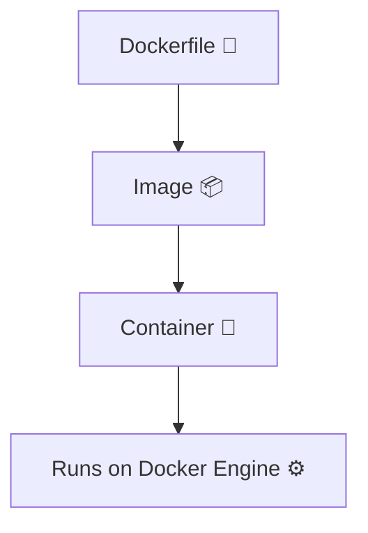
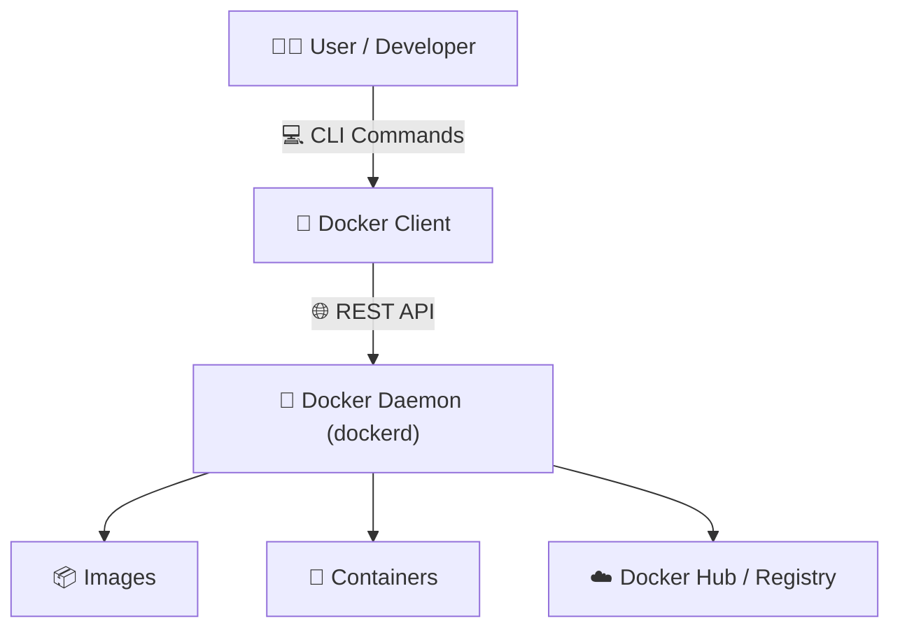
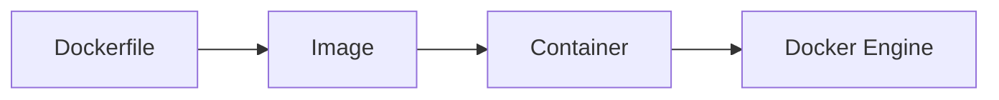
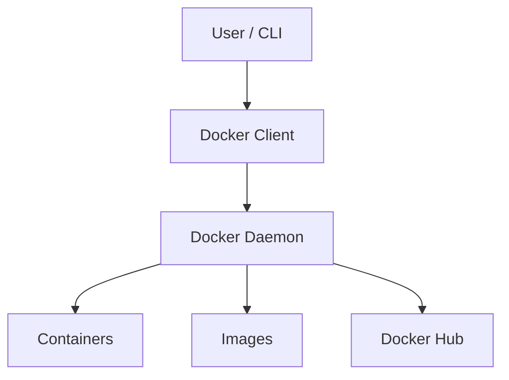

# 🐳 DevOps Lecture 10 — Docker


---

## 📚 DETAILED LEARNING NOTES

---

### 🧠 What is Docker?

Docker is an **open-source platform** that allows you to package your applications and their dependencies into lightweight, portable units called **containers**.  
It ensures your app runs **the same** on any machine — no matter the OS or setup.

---

### 🧩 Virtualization Concept

#### 💡 Problem:
> Your code works on your computer but fails on another system due to OS or dependency differences.

#### 💡 Solution: Docker
Docker creates a **virtual box (container)** that holds:
- Your application code  
- All dependencies  
- Required OS libraries

You can run this same container anywhere, and it will behave identically.

---

### 🖥️ What are VirtualBox & VMware?

They use a **Hypervisor** to create full **Virtual Machines (VMs)** that emulate entire operating systems.

#### 🧱 Difference between VM and Docker

| Feature | Virtual Machine | Docker Container |
|----------|------------------|------------------|
| OS | Each VM has its own OS | Shares host OS kernel |
| Speed | Heavy & slow to boot | Lightweight & fast |
| Size | Several GBs | Usually MBs |
| Startup Time | Minutes | Seconds |
| Isolation | Strong | Process-level |

---

### 🐳 Why Use Docker?

✅ **Lightweight** – Uses less RAM & disk than full VMs  
✅ **Reusable** – Same image runs anywhere  
✅ **Portable** – Works across OS, cloud, or servers  
✅ **Scalable** – Can easily replicate containers  

---

### ⚙️ How Docker Works

When we install Docker, it adds:
- **Docker Engine** (the heart of Docker)
  - `dockerd` → background process that manages containers
  - `docker-client` → command-line interface (`docker run`, `docker ps`, etc.)

> ⚠️ Docker does *not* use a hypervisor directly — it uses OS-level virtualization via the Linux kernel.

---

### 🧰 Docker Installation (Ubuntu)

```bash
sudo apt install docker.io
````

Or go to the official Docker website and follow the guide for your OS.

---

### 🧍‍♂️ Fixing Permission Denied

If you get `permission denied` on `docker ps`, add your user to the Docker group:

```bash
sudo usermod -a -G docker $USER
reboot
```

➡️ After reboot, you can use Docker without `sudo`.

---

### 💡 Real-world Use Case

Suppose you have 3 different OS machines and need MySQL on each.
Instead of installing MySQL separately on each OS,
just **run one MySQL container** on all — same command, same result ✅

---

### 🧩 Docker Lifecycle Diagram



---

### 🧱 Dockerfile → Image → Container Flow

1️⃣ **Dockerfile** — Script defining app setup (OS, dependencies, etc.)

2️⃣ **Image** — Built from Dockerfile; blueprint for containers

3️⃣ **Container** — Running instance of an image

---

### 🐬 Example: Install MySQL using Docker

#### Step 1: Pull MySQL Image

```bash
docker pull mysql
```

#### Step 2: Create a Container

```bash
docker run -it --name my-db -e MYSQL_ROOT_PASSWORD=test@123 mysql:latest
```

* `-it` → interactive terminal
* `--name my-db` → name of container
* `-e` → set environment variable
* `mysql:latest` → image:tag

#### Step 3: View Containers

```bash
docker ps        # running containers
docker ps -a     # all containers
```

#### Step 4: Remove a Container

```bash
docker rm <container_id>
```

---

### ⚙️ Run Jenkins in Docker

#### Step 1: Run Jenkins

```bash
docker run -d --name jenkins-server-docker -p 8080:8080 jenkins/jenkins:latest
```

#### Step 2: Verify Running

```bash
docker ps
```

#### Step 3: Access Jenkins

👉 Open `http://localhost:8080` in your browser.

---

### 🧰 Docker Commands Overview

| Command                     | Description             |
| --------------------------- | ----------------------- |
| `docker ps`                 | List running containers |
| `docker ps -a`              | List all containers     |
| `docker images`             | List downloaded images  |
| `docker rm <id>`            | Remove container        |
| `docker rmi <id>`           | Remove image            |
| `docker stop <id>`          | Stop container          |
| `docker start <id>`         | Start container         |
| `docker exec -it <id> bash` | Enter container shell   |
| `docker logs <id>`          | View logs of container  |

---

### 🧱 Building Your Own Dockerfile (Example: Django App)

#### Step 1: Requirements

```bash
cat requirements.txt
```

Example:

```
python==3.9
Django==3.0.3
djangorestframework==3.11.0
```

#### Step 2: Create Dockerfile

```dockerfile
FROM python:3.9

COPY . .

RUN pip install -r requirements.txt

EXPOSE 8000

CMD ["python", "manage.py", "runserver", "0.0.0.0:8000"]
```

#### Step 3: Build Image

```bash
docker build . -t django-app
```

#### Step 4: Run Container

```bash
docker run -d --name django-app-server -p 8000:8000 django-app:latest
```

#### Step 5: Verify

```bash
docker ps
```

Then visit 👉 `http://localhost:8000`

---

### 🧠 Docker Architecture Diagram



---

### 🪄 Common Issues

| Issue                        | Fix                                |
| ---------------------------- | ---------------------------------- |
| Permission denied            | Add user to docker group           |
| Port already in use          | Stop old container using same port |
| Container exited immediately | Check environment variables        |
| No logs visible              | Use `docker logs <id>`             |

---

### 🎯 Key Takeaways

* Docker ensures **environment consistency**
* Containers are **lightweight & portable**
* `Dockerfile → Image → Container` is the core lifecycle
* You can run **databases, CI/CD tools (Jenkins)**, or even **apps** in containers

---

---

## 🧾 CLEAN & PROFESSIONAL SUMMARY

---

### 🐳 Docker — Quick Overview

**Docker** is an open-source containerization platform used to package and deploy applications consistently across environments.

---

### ⚙️ Core Components

| Component         | Description                 |
| ----------------- | --------------------------- |
| **Dockerfile**    | Script defining app setup   |
| **Image**         | Blueprint for container     |
| **Container**     | Running instance of image   |
| **Docker Engine** | Runs and manages containers |

---

### 📦 Lifecycle



---

### 🧠 Key Commands

| Command                     | Use                    |
| --------------------------- | ---------------------- |
| `docker pull <image>`       | Download image         |
| `docker run <image>`        | Run container          |
| `docker ps -a`              | List containers        |
| `docker rm <id>`            | Remove container       |
| `docker build . -t <name>`  | Build image            |
| `docker exec -it <id> bash` | Access container shell |

---

### 🧩 Common Containers

| Tool       | Port | Usage        |
| ---------- | ---- | ------------ |
| MySQL      | 3306 | Database     |
| Jenkins    | 8080 | CI/CD Server |
| Django App | 8000 | Web App      |

---

### 💡 Example Command Flow

```bash
docker pull mysql
docker run -d --name db -e MYSQL_ROOT_PASSWORD=pass mysql:latest
docker exec -it db bash
```

---

### 🚀 Benefits

✅ Portable
✅ Lightweight
✅ Fast startup
✅ Easy scaling
✅ Works across OS and clouds

---

### ⚡ Troubleshooting

* `permission denied` → Add user to Docker group
* `port already allocated` → Stop old container using same port
* `container exits` → Check `docker logs <id>`

---

### 🧭 Quick Visual: Docker Architecture



---

> 🏁 *Docker simplifies development, testing, and deployment — making “it works on my machine” a thing of the past.*

```
