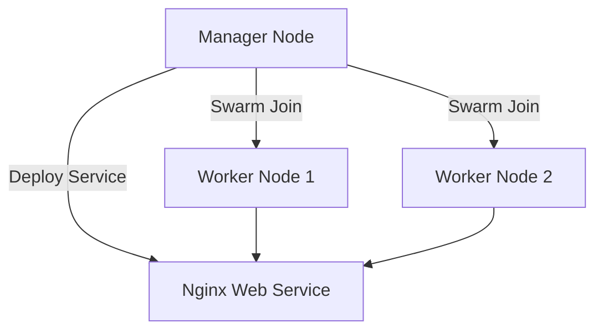

# 🐳  DevOps 12 — From Image Build to Swarm Deployment


---

## 🧠 Overview

This document covers everything I practiced while learning Docker:

- Building and tagging Docker images  
- Pushing images to Docker Hub  
- Running containers  
- Using Docker Compose  
- Creating a simulated multi-node cluster using Docker-in-Docker (dind)  
- Initializing Docker Swarm and deploying services  

---

## 🧱 Step 1 — Build Docker Image

```bash
docker build . -t django-app
````

**Explanation:**

* `.` → current directory (context)
* `-t django-app` → tags the image as `django-app:latest`

List all images:

```bash
docker images
```

---

## 🔑 Step 2 — Login to Docker Hub

```bash
docker login
```

You’ll be asked for your Docker Hub username and password.

---

## 🏷️ Step 3 — Tag the Image for DockerHub

```bash
docker tag django-app ophidev/django-app-image
```

**Syntax:**

```
docker tag <local-image> <dockerhub-username>/<repository>:<tag>
```

Example:

```
docker tag django-app ophidev/django-app-image:latest
```

---

## 📤 Step 4 — Push the Image to Docker Hub

```bash
docker push ophidev/django-app-image
```

You’ll see logs showing each layer being uploaded.
If layers already exist → Docker will skip uploading them.

---

## 📥 Step 5 — Pull the Image (to test)

```bash
docker pull ophidev/django-app-image
```

Confirm by running:

```bash
docker run -d -p 8000:8000 ophidev/django-app-image
```

Now your app runs on **[http://localhost:8000](http://localhost:8000)**

---

## 🐳 Step 6 — Practice Docker Swarm on a Single Machine

We use **Docker-in-Docker (dind)** to simulate multiple nodes.

### ✅ Create Nodes

```bash
docker run --privileged -d --name manager docker:dind
docker run --privileged -d --name worker1 docker:dind
docker run --privileged -d --name worker2 docker:dind
```

> Each container runs its own Docker Engine, acting as a node.

---

### 🔗 Connect to Manager Node

```bash
docker exec -it manager docker swarm init
```

It will output something like:

```
docker swarm join --token <token> <manager-ip>:2377
```

Copy this join command.

---

### 🧩 Join Worker Nodes

Now execute inside each worker:

```bash
docker exec -it worker1 docker swarm join --token <token> <manager-ip>:2377
docker exec -it worker2 docker swarm join --token <token> <manager-ip>:2377
```

---

### 📋 Verify Nodes

Run inside manager:

```bash
docker exec -it manager docker node ls
```

You’ll see a list like:

| ID | HOSTNAME | STATUS | AVAILABILITY | MANAGER STATUS |
| -- | -------- | ------ | ------------ | -------------- |
| x1 | manager  | Ready  | Active       | Leader         |
| x2 | worker1  | Ready  | Active       |                |
| x3 | worker2  | Ready  | Active       |                |

---

## ⚙️ Step 7 — Deploy a Service

Example: run Nginx in Swarm mode.

```bash
docker exec -it manager docker service create --name webapp -p 8080:80 nginx
```

Check services:

```bash
docker exec -it manager docker service ls
```

Inspect tasks (containers created on workers):

```bash
docker exec -it manager docker service ps webapp
```

Scale service:

```bash
docker exec -it manager docker service scale webapp=3
```

---

## 🌐 Step 8 — Visual Overview (Mermaid Diagram)



---

## 🧹 Step 9 — Clean Up Everything

```bash
docker service rm webapp
docker swarm leave --force
docker rm -f manager worker1 worker2
```

---

## 📝 Key Takeaways

* Docker Swarm is **built-in orchestration** (no external tool required).
* `docker:dind` helps simulate multiple hosts on a single machine.
* Tagging and pushing images helps you reuse them across nodes or clusters.
* Scaling services is as simple as `docker service scale <name>=<count>`.

---

## 📚 Extra Notes

* Dockerfile defines **how to build your app image**
* Docker Compose defines **how multiple containers run together**
* Docker Swarm defines **how to orchestrate containers across multiple nodes**

---

**✨ Summary:**
You’ve successfully learned Docker fundamentals, built and pushed an image, and simulated a multi-node Docker Swarm cluster — all on a single machine!

---

```

---
