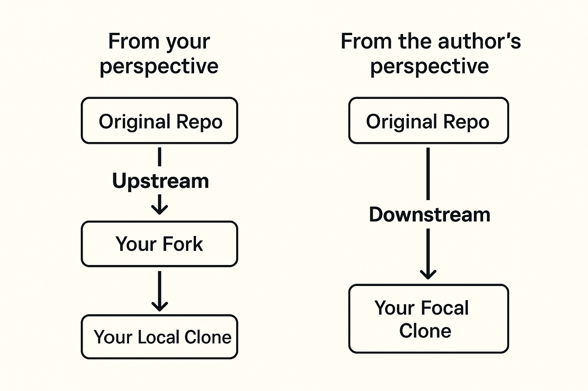
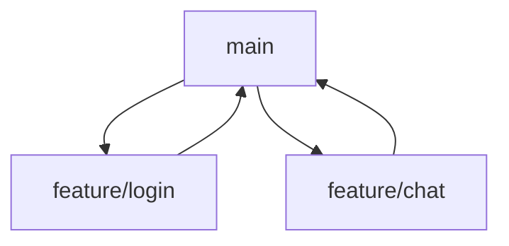
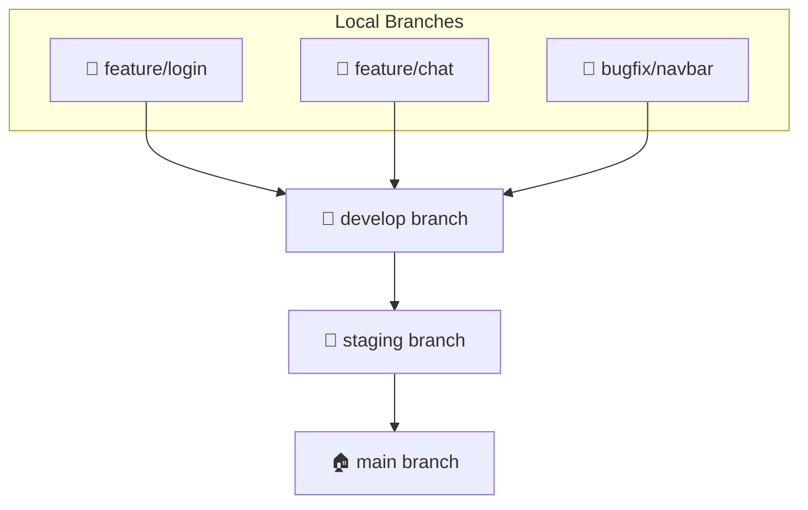

# 🌟 DevOps 07: Git & GitHub

## 📝 Key Concepts

### 1️⃣ Git

* Git is a **tool for version control** of files, folders, and code.
* It **stores every version** of a file/folder and generates a **unique hash code (ID)** for each change.
* Allows you to **retrieve any previous version**, even if files were deleted or someone else modified them.

---

### 2️⃣ GitHub, GitLab, Bitbucket

* **GitHub**: Platform to store code, files, folders online; built on **Git**.
* **GitLab**: Similar to GitHub, allows collaboration with others.
* **Bitbucket**: Like GitHub, stores code and files; built on **Git**.

> 💡 Tip: Think of these platforms like **Instagram or LinkedIn for Storing code but the underline Technology is git**.

---

## 🧩 Version Control Systems (VCS)

### CVCS — Centralized Version Control System

* **All versions stored in one central server.**
* Developers **connect to the server** to commit or pull updates.
* If server is down → **nobody can commit or get latest changes**.
* Analogy: **Single Google Doc** — everyone edits the same file on one server.

---

### DVCS — Distributed Version Control System

* **Every developer has a full copy** of the repository, including full history.
* Work **offline**, make local commits, and later **sync with others**.
* Collaboration happens by sharing changes between local copies.
* Example: GitHub repo can be cloned, deleted locally, restored from history if available.

> ⚡ Used in companies for safe and collaborative development.

---

## 🛠 Setting Up Git

### 1️⃣ Make a folder a Git repository

```bash
git init
```

### 2️⃣ Git Three-Stage Architecture

#### a) Working Directory

* Where you create and edit files.
* Check status:

```bash
git status
```

* **Red file** = Untracked (not added to Git yet).

#### b) Staging Area

* Add files to staging:

```bash
git add .        # all files
git add fileName # specific file
```

* Check status → file appears **green** (ready to commit).

#### c) Git Directory (Repository)

* Commit changes:

```bash
git commit -m "message: added new file"
```

* File is now in Git Directory, tracked, with history.

#### 🔄 Recover Deleted Files

```bash
git status         # check deleted files
git log            # see commit history with hash codes
git restore filename_or_foldername  # restore file
```

---

### 3️⃣ Configure Git User

```bash
git config --global user.name "yourUsername"
git config --global user.email "youremail@example.com"
```

> ⚡ Tip: Setting `--global` makes it default for all repos; setting inside repo only affects that repo.

---

### 4️⃣ Clone GitHub Repository

```bash
git clone <HTTPS_LINK>
```

### 5️⃣ Push Local Repository to GitHub

```bash
git status
git add .
git commit -m "message..."
git remote add origin <REMOTE_URL>  # link local repo to GitHub
git remote -v                       # verify remote URL
git push origin <branch_name>
```

### 6️⃣ GitHub Access Token

* Replace password authentication with **Access Token** for easier push:

```bash
git remote set-url origin https://<YOUR_TOKEN>@github.com/<USERNAME>/<REPO_NAME>.git
```

---

## 🍴 Fork vs Clone

| Term      | Description                                                            |
| --------- | ---------------------------------------------------------------------- |
| **Fork**  | Personal copy of someone else’s repo on GitHub. Make changes freely.   |
| **Clone** | Copy of repo on your **local machine**. Work locally and push changes. |

### 🔄 Upstream vs Downstream
```
💻 Your Local Clone
       │
       ▼ Push changes
   Your Fork on GitHub
       │
       ▼ Pull Request
🌊 Original Repo (Downstream for author)
```

> ⚡ Upstream = source of truth, keep your fork updated from here.


---

## 🌿 Git Branch – Visual Guide

### 1️⃣ What is a Branch?

* **Separate timeline** of your project.
* Work **safely without affecting main code**.

### 2️⃣ Why Use Branches?

* Work on new features 🔧
* Fix bugs 🐞
* Collaborate 🤝
* Merge back when ready 🚀

### 3️⃣ Common Branches

| Branch Name       | Purpose                       |
| ----------------- | ----------------------------- |
| `main` / `master` | Stable, production-ready code |
| `feat/login`      | New login feature             |
| `feature/chat`    | Chat feature                  |
| `bugfix/navbar`   | Fixing navbar bug             |

### 4️⃣ Branch Commands

```bash
git branch                     # list branches
git branch feature/login       # create branch
git checkout feature/login     # switch branch
git switch feature/login       # new method to switch
git checkout -b feature/login # create + switch
git merge feature/login        # merge into main
git branch -d feature/login   # delete branch after merge
```

---

### 5️⃣ Branch Visualization



> 🌳 Branch = independent line of development

---

## 🏗 Git Branch Flow: `develop → staging → main`



### Quick Summary

| Branch    | Purpose                | Who Works Here  | Deploys To        |
| --------- | ---------------------- | --------------- | ----------------- |
| `develop` | Active development     | Developers      | Dev environment   |
| `staging` | QA / Client testing    | QA / Testers    | Staging server    |
| `main`    | Stable production code | Release Manager | Production server |

> ⚡ **Golden Rules**

* Never code directly in `main`. 🏠
* Start new tasks from `develop`. 💻
* Test everything in `staging`. 🧪
* Merge to `main` only when perfect. 🚀

> One line summary:
> 💻 Develop → 🧪 Test → 🚀 Deploy

---

---

✅ **Notes Summary**

* Full explanation of Git, GitHub, DVCS/CVCS, branches.
* Commands, tips, flow diagrams, and branch visualizations included.
* Fun emojis and clear structure for revision.
* Fork/Clone/Upstream explained with diagrams.

---

