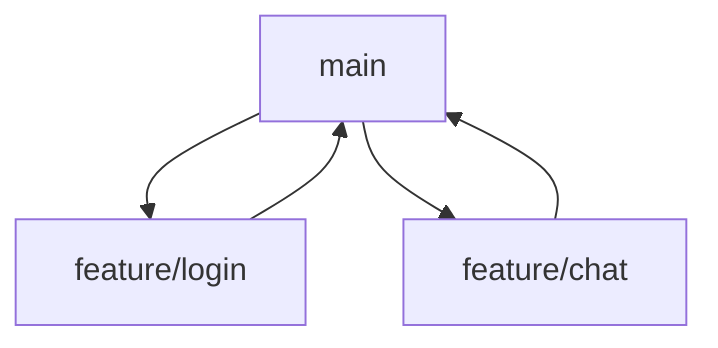
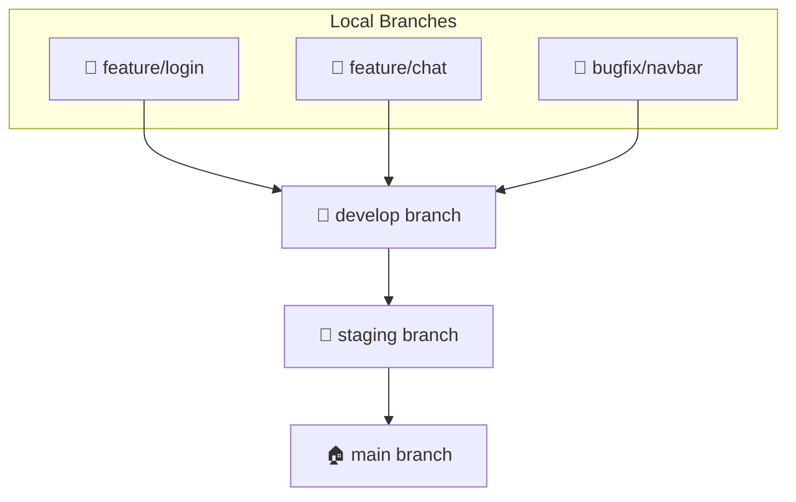

# 🌟 DevOps 07: Git & GitHub

## 📝 Key Concepts

### 1️⃣ Git

* Git is a **tool for version control** of files, folders, and code.
* It **stores every version** of a file/folder and generates a **unique hash code (ID)** for each change.
* Allows you to **retrieve any previous version**, even if files were deleted or someone else modified them.

---

### 2️⃣ GitHub, GitLab, Bitbucket

* **GitHub**: Platform to store code, files, folders online; built on **Git**.
* **GitLab**: Similar to GitHub, allows collaboration with others.
* **Bitbucket**: Like GitHub, stores code and files; built on **Git**.

> 💡 Tip: Think of these platforms like **Instagram or LinkedIn for Storing code but the underline Technology is git**.

---

## 🧩 Version Control Systems (VCS)

### CVCS — Centralized Version Control System

* **All versions stored in one central server.**
* Developers **connect to the server** to commit or pull updates.
* If server is down → **nobody can commit or get latest changes**.
* Analogy: **Single Google Doc** — everyone edits the same file on one server.

---

### DVCS — Distributed Version Control System

* **Every developer has a full copy** of the repository, including full history.
* Work **offline**, make local commits, and later **sync with others**.
* Collaboration happens by sharing changes between local copies.
* Example: GitHub repo can be cloned, deleted locally, restored from history if available.

> ⚡ Used in companies for safe and collaborative development.

---

## 🛠 Setting Up Git

### 0 Git install for windows

```bash
install git bash it will install git with bash for you
which is a CLI 
```

### 0.1 Add your Auther name  (GITHUB account)

```bash
git config --global user.name "yourUserName"
git config --global user.email "yourUserEmail"
git config --list -> FOR CHECKING CONFIG
```

### 1️⃣ Make a folder a Git repository

```bash
git init
```

### 2️⃣ Git Three-Stage Architecture

#### a) Working Directory

* Where you create and edit files.
* Check status:

```bash
git status
```

* **Red file** = Untracked (not added to Git yet).

#### b) Staging Area

* Add files to staging:

```bash
git add .        # all files
git add fileName # specific file
```

* Check status → file appears **green** (ready to commit).

#### c) Git Directory (Repository)

* Commit changes:

```bash
git commit -m "message: added new file"
```

* File is now in Git Directory, tracked, with history.

#### 🔄 Recover Deleted Files

```bash
git status         # check deleted files
git log            # see commit history with hash codes
git restore filename_or_foldername  # restore file
```

---

### 3️⃣ Configure Git User

```bash
git config --global user.name "yourUsername"
git config --global user.email "youremail@example.com"
```

> ⚡ Tip: Setting `--global` makes it default for all repos; setting inside repo only affects that repo.

---

### 4️⃣ Clone GitHub Repository

```bash
git clone <HTTPS_LINK>
```

### 5️⃣ Push Local Repository to GitHub

```bash
git status
git add .
git commit -m "message..."
git branch #checking the names of the branches
git branch -M main #changing the name of default branch to main
git remote add origin <REMOTE_URL>  # link local repo to GitHub
git remote -v                       # verify remote URL
git push origin <branch_name> #push branch data to remote origin
if ERROR 
git pull --rebase origin main #getting all the update commits in the local of main branch to handle conflict
git push origin <branch_Name>
```

### 6️⃣ GitHub Access Token

* Replace password authentication with **Access Token** for easier push:

```bash
git remote set-url origin https://<YOUR_TOKEN>@github.com/<USERNAME>/<REPO_NAME>.git
```

---

## 🍴 Fork vs Clone

| Term      | Description                                                            |
| --------- | ---------------------------------------------------------------------- |
| **Fork**  | Personal copy of someone else’s repo on GitHub. Make changes freely.   |
| **Clone** | Copy of repo on your **local machine**. Work locally and push changes. |

### 🔄 Upstream vs Downstream
```
💻 Your Local Clone
       │
       ▼ Push changes
   Your Fork on GitHub
       │
       ▼ Pull Request
🌊 Original Repo (Downstream for author)
```

> ⚡ Upstream = source of truth, keep your fork updated from here.


---

## 🌿 Git Branch – Visual Guide

### 1️⃣ What is a Branch?

* **Separate timeline** of your project.
* Work **safely without affecting main code**.

### 2️⃣ Why Use Branches?

* Work on new features 🔧
* Fix bugs 🐞
* Collaborate 🤝
* Merge back when ready 🚀

### 3️⃣ Common Branches

| Branch Name       | Purpose                       |
| ----------------- | ----------------------------- |
| `main` / `master` | Stable, production-ready code |
| `feat/login`      | New login feature             |
| `feature/chat`    | Chat feature                  |
| `bugfix/navbar`   | Fixing navbar bug             |

### 4️⃣ Branch Commands

```bash
git branch                     # list branches
git branch -m main             # safe rename
git branch -M main             # force rename (overwrites existing 'main' branch)
git branch feature/login       # create branch
git checkout feature/login     # switch branch
git switch feature/login       # new method to switch
git checkout -b feature/login  # create + switch
git merge feature/login        # merge into main
git branch -d feature/login    # delete branch after merge
```

---

### 5️⃣ Branch Visualization



> 🌳 Branch = independent line of development

---

## 🏗 Git Branch Flow: `develop → staging → main`



### Quick Summary

| Branch    | Purpose                | Who Works Here  | Deploys To        |
| --------- | ---------------------- | --------------- | ----------------- |
| `develop` | Active development     | Developers      | Dev environment   |
| `staging` | QA / Client testing    | QA / Testers    | Staging server    |
| `main`    | Stable production code | Release Manager | Production server |

> ⚡ **Golden Rules**

* Never code directly in `main`. 🏠
* Start new tasks from `develop`. 💻
* Test everything in `staging`. 🧪
* Merge to `main` only when perfect. 🚀

> One line summary:
> 💻 Develop → 🧪 Test → 🚀 Deploy

---

---

✅ **Notes Summary**

* Full explanation of Git, GitHub, DVCS/CVCS, branches.
* Commands, tips, flow diagrams, and branch visualizations included.
* Fun emojis and clear structure for revision.
* Fork/Clone/Upstream explained with diagrams.

---


# 🧠 Git Branch & Push – Complete Explanation

A detailed explanation of all commands used for renaming branches, pushing to GitHub, and resolving push conflicts — with flag meanings (`-M`, `-u`, etc.).

---

## ⚙️ Initial Setup Commands

### **1. Check Git Version**
```bash
git --version
````

**Purpose:**
Checks if Git is installed and shows its version.

---

### **2. Configure Git Identity**

```bash
git config --global user.name "Your Name"
git config --global user.email "your_email@example.com"
```

**Purpose:**
Sets your global username and email for commits.

**Flags used:**

* `--global`: Applies configuration globally (for all repositories).
  Without `--global`, it applies only to the current project.

---

## 🪶 Branch Management

### **3. Rename Branch**

```bash
git branch -M main
```

**Purpose:**
Renames the current branch to `main`.

**Flags used:**

* `-M`: Force rename.
  If a branch with the target name already exists, it overwrites it.
* `-m`: Normal rename (fails if target branch exists).

**Example:**

* `git branch -m main` → Safe rename
* `git branch -M main` → Force rename (overwrite if exists)

---

### **4. View All Branches**

```bash
git branch
```

**Purpose:**
Lists all local branches.
The branch with an asterisk `*` is your current branch.

---

## 🌍 Working with Remote Repository

### **5. Add a Remote**

```bash
git remote add origin https://github.com/username/repo.git
```

**Purpose:**
Links your local repository to a remote (GitHub) repository.

* `origin` → The default name Git gives to your remote repository.
* You can verify it with:

  ```bash
  git remote -v
  ```

---

### **6. Change Remote URL**

```bash
git remote set-url origin https://github.com/username/repo.git
```

**Purpose:**
Changes the existing remote URL if you need to update it (e.g., switching from HTTPS to SSH).

---

## 🚀 Pushing Code to GitHub

### **7. Push Branch to GitHub**

```bash
git push -u origin main
```

**Purpose:**
Pushes your local branch to the remote repository and sets the **upstream** link.

**Flags used:**

* `-u` or `--set-upstream`:
  Tells Git to remember the remote branch for this local branch.
  After setting once, you can just use `git push` or `git pull` without arguments.

**Example:**

```bash
git push -u origin main
# next time
git push
```

---

### **8. Force Push (use with caution)**

```bash
git push -u origin main --force
```

**Purpose:**
Forcibly updates the remote branch to match your local branch — even if it overwrites commits.

**Flags used:**

* `--force`: Overwrites remote history.
  Use carefully — it can delete other people’s commits.

---

## 📥 Pulling Updates from Remote

### **9. Pull with Rebase**

```bash
git pull --rebase origin main
```

**Purpose:**
Fetches changes from the remote branch and rebases your local commits on top of them — creating a cleaner commit history.

**Flags used:**

* `--rebase`: Avoids a merge commit by replaying your commits on top of the updated remote branch.

**Example without rebase:**

```bash
git pull origin main
```

Creates a merge commit (messy history).

**Example with rebase:**

```bash
git pull --rebase origin main
```

Replays your commits neatly on top of remote commits.

---

## 🧹 Cleaning and Checking Repository

### **10. Check Remote URLs**

```bash
git remote -v
```

**Purpose:**
Shows the URLs for fetch and push operations for your remote.

---

### **11. Check Current Branch**

```bash
git status
```

**Purpose:**
Displays:

* Current branch name
* Untracked/modified files
* Commit status relative to the remote

---

### **12. Delete Remote Branch**

```bash
git push origin --delete master
```

**Purpose:**
Deletes a remote branch (e.g., if you’ve renamed `master` → `main` and no longer need the old one).

---

## 🧩 Summary Table

| Command                           | Purpose                                    | Important Flags               |
| --------------------------------- | ------------------------------------------ | ----------------------------- |
| `git branch -M main`              | Rename current branch to `main`            | `-M`: Force rename            |
| `git push -u origin main`         | Push & set tracking branch                 | `-u`: Set upstream            |
| `git pull --rebase origin main`   | Pull remote commits and reapply local ones | `--rebase`: Clean history     |
| `git remote set-url origin <url>` | Change remote URL                          | —                             |
| `git push -u origin main --force` | Force overwrite remote branch              | `--force`: Overwrite          |
| `git config --global user.name`   | Set username globally                      | `--global`: Apply system-wide |
| `git config --list` |check the config set list| 


---

## 🧠 Notes

* After `git push -u origin main`, future pushes only need:

  ```bash
  git push
  ```

* If your repo was initialized with a `main` branch on GitHub but `master` locally, use:

  ```bash
  git branch -M main
  ```

  to align both.

* Avoid `--force` unless you know what you’re overwriting.

---

### ✅ Example Workflow (Quick Recap)

```bash
# Rename branch to main
git branch -M main

# Link to remote repository
git remote set-url origin https://github.com/username/repo.git

# Pull latest commits (if any)
git pull --rebase origin main

# Push branch and set tracking
git push -u origin main
```

---

🧾 **End of File**

```

---


