# 🌳 Git Merge — Complete Guide

Merging is a core Git feature that lets you **combine changes from one branch into another** safely and clearly.  
This guide explains **everything about merging**, including **how commits behave**, **conflicts**, and **visual diagrams** to make it crystal clear.

---

## 🧠 What is `git merge`?

> The `git merge` command combines the history and changes from another branch into your current branch.  

- Does **not delete or move commits**  
- Creates a **merge commit** if necessary  
- Updates **HEAD** to the new merge commit  
- Keeps the other branch (source) untouched

---

## 🎯 Example Scenario

Branches:
- 🟢 `master` → main stable branch  
- 🧪 `dev` → development branch with new features  

Goal: Merge `dev` into `master`.

---

## ⚙️ Steps to Merge

### 1️⃣ Switch to the branch where you want changes
```bash
git switch master
````

> Always merge **into the current branch**.

### 2️⃣ Merge the branch

```bash
git merge dev
```

---

## 🔍 How Git Merge Works

1. Git finds the **common ancestor** of both branches
2. It applies **all commits from `dev` that are missing in `master`**
3. Creates a **new merge commit** tying histories together

---

## 🧬 Commit Behavior After Merge

Before merge:

```
master: A --- D
dev:    A --- B --- C
```

After merge:

```
master: A --- D --- M
                  / 
dev:    A --- B --- C
```

* `M` = Merge commit
* Commits `B` and `C` are **now in master’s history** through `M`
* `dev` branch is **untouched**, still pointing to `C`

✅ **Key:** Merge combines histories, it does **not move or delete commits**.

---

## 🔹 Mermaid Diagram — Commit History

```mermaid
gitGraph
   commit id: "A" tag: "common ancestor"
   branch dev
   commit id: "B" tag: "dev commit 1"
   commit id: "C" tag: "dev commit 2"
   checkout master
   commit id: "D" tag: "master commit 1"
   merge dev id: "M" tag: "Merge commit"
```

* Master now contains `B` and `C` through `M`
* Dev remains intact
* HEAD of master points to `M`

---

## ⚠️ Merge Conflicts

Sometimes, both branches edit the same lines. Git cannot automatically decide which version to keep.

Git will show:

```
CONFLICT (content): Merge conflict in <file>
Automatic merge failed; fix conflicts and then commit the result.
```

---

### 🧩 Steps to Resolve Conflicts

1. Check conflicted files:

```bash
git status
```

2. Open conflicted file(s) and edit manually. Example conflict markers:

```diff
<<<<<<< HEAD
console.log("Hello from master");
=======
console.log("Hello from dev");
>>>>>>> dev
```

* Keep HEAD version, incoming version, or combine both
* Remove the conflict markers

3. Mark file as resolved:

```bash
git add <filename>
```

4. Complete the merge:

```bash
git commit -m "Resolved merge conflict"
```

5. If you want to cancel merge instead:

```bash
git merge --abort
```

---

## ⚙️ Git Merge Options

| Option        | Description                                                       |
| ------------- | ----------------------------------------------------------------- |
| `--no-commit` | Merge changes but do not create a commit automatically            |
| `--no-ff`     | Force creation of a merge commit even if fast-forward is possible |
| `--abort`     | Cancel ongoing merge and restore previous branch state            |
| `-v`          | Verbose output, showing merge details                             |

---

## 🪄 Fast-Forward vs Merge Commit

### Fast-Forward

If master has no new commits since branching:

```mermaid
gitGraph
   commit id: "A"
   branch dev
   commit id: "B"
   checkout master
   merge dev
```

* Master simply moves pointer forward
* No merge commit is created

### Merge Commit

If both branches have new commits:

* Git creates a **merge commit** to tie both histories together
* Ensures full traceability

---

## 💡 Tips for Safe Merging

* Commit or stash changes before merging
* Use `git log --graph --oneline` to visualize merge history
* Use `--no-ff` in team projects for clearer history
* `git merge --abort` can undo a merge if needed

---

## 🖼️ Visualization — Sequence Diagram

```mermaid
sequenceDiagram
    participant You
    participant Git
    You->>Git: git switch master
    You->>Git: git merge dev
    Git-->>You: Finds common ancestor 🧠
    Git-->>You: Applies missing commits 🔁
    Git-->>You: Creates merge commit M 🆕
    You->>Git: git commit -m "Resolved conflicts"
    Git-->>You: Merge complete ✅
```



---

## 🌈 Summary

* `git merge <branch>` combines another branch into your current branch
* Master now contains all dev commits through the merge commit
* Dev branch remains **untouched** and independent with its commits history.
* HEAD of master points to the new merge commit
* Conflicts must be resolved manually if they occur

* `git log -3` => last 3 commits
* `git log --prety=oneline` => all commits with their full hash in one line
* `git log --oneline` => all commits with their short hash in one line
---

> 🎯 **In short:**
> Git merge **connects separate lines of development** into a single, unified history — safe, visual, and clear! 🚀

```

---

