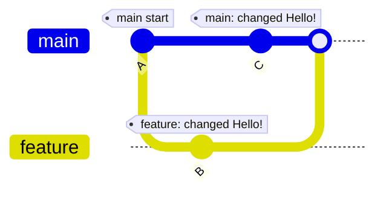
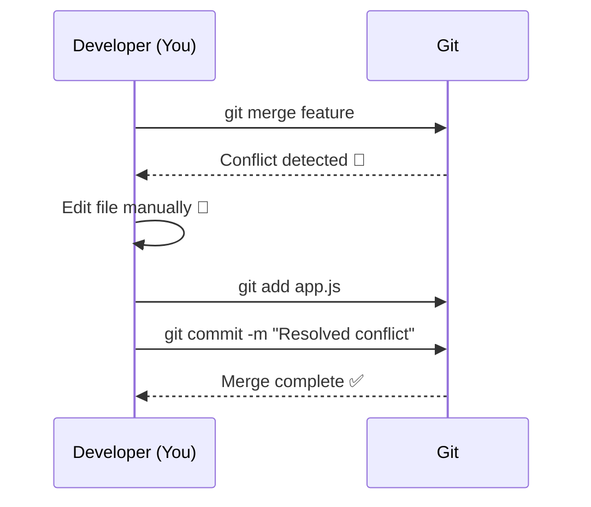

* What conflicts are 💥
* When and why they occur ⚠️
* How to resolve them 🧩
* All commands explained with examples
* Mermaid diagrams to visualize the process 🌳
* Emoji-based clarity ✨

---

# ⚔️ GIT CONFLICT & RESOLUTION GUIDE  

Learn how to understand, handle, and resolve conflicts in Git confidently!  
This guide explains each possible conflict scenario (merge, pull, cherry-pick, revert, rebase) and how to fix them — with visuals and command explanations.

---

## 🧠 What is a Conflict in Git?

A **conflict** occurs when Git tries to **combine changes** (during merge, rebase, pull, etc.) but finds that the **same part of a file was modified differently** in two commits.

In such a situation, Git becomes **confused about which version to keep**, and you must resolve it manually.

---

### 💡 Example Scenario

You have two branches: `main` and `feature`.

#### `main` branch:
```txt
console.log("Hello, World!");
````

#### `feature` branch:

```txt
console.log("Hello, Git!");
```

Now, when you try to merge `feature` into `main`, Git detects conflicting changes to the same line.

---

## 🌳 Visual Representation



🔺 **Conflict occurs** at merge time because both branches modified the same line in the same file.

---

## ⚠️ When Can Conflicts Occur?

| Situation          | Description                                                               |
| ------------------ | ------------------------------------------------------------------------- |
| 🪢 **Merge**       | When merging two branches with overlapping edits                          |
| 🌐 **Pull**        | When fetching updates from remote and merging into your local branch      |
| 🍒 **Cherry-pick** | When applying a commit from another branch that touches conflicting lines |
| 🔁 **Rebase**      | When replaying commits on top of another branch with different changes    |
| ⏪ **Revert**       | When undoing a commit that has since been modified differently            |

---

## 🔍 Checking for Conflicts

After a conflict occurs, Git will pause and display a message:

```bash
CONFLICT (content): Merge conflict in app.js
Automatic merge failed; fix conflicts and then commit the result.
```

You can list conflicted files using:

```bash
git status
```

Output:

```
both modified:   app.js
```

---

## 🧩 Understanding Conflict Markers

Open the conflicted file; you’ll see something like this:

```diff
<<<<<<< HEAD
console.log("Hello from main branch");
=======
console.log("Hello from feature branch");
>>>>>>> feature
```

These markers indicate:

* `<<<<<<< HEAD` → your current branch version
* `=======` → separator
* `>>>>>>> feature` → the incoming branch version

You must decide which version (or both) to keep.

---

## 🪄 How to Resolve a Conflict (Step-by-Step)

### 1️⃣ Identify the Conflict

```bash
git status
```

Shows which files are conflicted.

---

### 2️⃣ Edit the File

Open the conflicted file(s), manually fix differences, and remove conflict markers:

```js
console.log("Hello from both branches!");
```

---

### 3️⃣ Mark as Resolved

After editing:

```bash
git add <filename>
```

Example:

```bash
git add app.js
```

---

### 4️⃣ Complete the Operation

| Operation    | Command to finish                         |
| ------------ | ----------------------------------------- |
| Merge / Pull | `git commit -m "Resolved merge conflict"` |
| Cherry-pick  | `git cherry-pick --continue`              |
| Rebase       | `git rebase --continue`                   |
| Revert       | `git revert --continue`                   |

---

### 5️⃣ (Optional) Cancel the Operation

If you want to stop and undo everything:

| Operation   | Command                   | Description                                              |
| ----------- | ------------------------- | -------------------------------------------------------- |
| Merge       | `git merge --abort`       | Cancels the merge and restores branch to pre-merge state |
| Rebase      | `git rebase --abort`      | Stops the rebase and returns to previous branch state    |
| Cherry-pick | `git cherry-pick --abort` | Cancels the cherry-pick operation                        |
| Revert      | `git revert --abort`      | Cancels the revert in progress                           |

---

## ⚙️ Command Explanations & Options

### 🧩 `git add`

Adds modified files to the staging area.

```bash
git add <file>
```

You use it after resolving conflicts to tell Git the file is fixed.

---

### 📝 `git commit`

Creates a new commit with your resolved changes.

```bash
git commit -m "Resolved conflict"
```

#### Options:

| Option     | Description                                              |
| ---------- | -------------------------------------------------------- |
| `-m "msg"` | Adds a commit message directly                           |
| `-v`       | Shows the diff of changes being committed in your editor |

---

### 🪢 `git merge`

Combines another branch into the current one.

```bash
git merge <branch-name>
```

#### Options:

| Option        | Description                                       |
| ------------- | ------------------------------------------------- |
| `--abort`     | Cancels the current merge and restores the branch |
| `--continue`  | Completes the merge after fixing conflicts        |
| `--no-commit` | Merges changes but doesn’t auto-create a commit   |

---

### 🔁 `git rebase`

Moves or replays commits from one branch onto another.

```bash
git rebase <branch-name>
```

#### Options:

| Option       | Description                                             |
| ------------ | ------------------------------------------------------- |
| `--continue` | Resume rebase after resolving conflicts                 |
| `--abort`    | Stop rebase and return to previous state                |
| `--skip`     | Skip the current conflicting commit and continue rebase |

---

### 🍒 `git cherry-pick`

Applies a specific commit from another branch.

```bash
git cherry-pick <commit-hash>
```

#### Options:

| Option               | Description                                        |
| -------------------- | -------------------------------------------------- |
| `--continue`         | Continue cherry-pick after fixing conflicts        |
| `--abort`            | Abort cherry-pick and revert to clean state        |
| `-n` / `--no-commit` | Apply changes without committing                   |
| `-x`                 | Add a reference note in the commit message         |
| `-e` / `--edit`      | Edit the commit message before creating the commit |

---

### ⏪ `git revert`

Creates a new commit that undoes the effect of a previous commit.

```bash
git revert <commit-hash>
```

#### Options:

| Option               | Description                                  |
| -------------------- | -------------------------------------------- |
| `--continue`         | Continue revert after resolving conflicts    |
| `--abort`            | Abort revert operation                       |
| `-n` / `--no-commit` | Revert changes but do not commit immediately |
| `-e` / `--edit`      | Edit the revert commit message before saving |

---

## 🧠 Summary

| Operation   | Purpose             | Can cause conflict? | How to finish                |
| ----------- | ------------------- | ------------------- | ---------------------------- |
| Merge       | Combine branches    | ✅ Yes               | `git commit`                 |
| Pull        | Fetch + Merge       | ✅ Yes               | `git commit`                 |
| Rebase      | Replay commits      | ✅ Yes               | `git rebase --continue`      |
| Cherry-pick | Apply single commit | ✅ Yes               | `git cherry-pick --continue` |
| Revert      | Undo a commit       | ✅ Yes               | `git revert --continue`      |

---

## 🌈 Final Visualization



---

### ✅ Pro Tips

* Always **commit or stash** your changes before merging or rebasing.
* Use `git diff` to review conflicts visually.
* Use VS Code or a GUI tool to simplify conflict resolution.
* Practice conflicts to get comfortable — they’re a normal part of teamwork!

---

> 🧭 **In short:**
> A Git conflict just means “Git needs your help.”
> Fix it, mark it resolved, and continue — and you’re good to go 🚀

```

---


