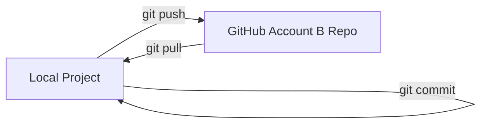

---

# 🐙 GitHub Multi-Account Setup on Windows

A complete guide to using **two GitHub accounts** on the same PC using **HTTPS for default account** and **SSH for a second account**.

---

## 🎯 Goal

* Use **Account A** (default/global) with HTTPS
* Use **Account B** (secondary) with SSH
* Push and pull without conflicts or changing global config
* Handle errors like `Permission denied (publickey)` and `unrelated histories`

---

## 📂 Folder Structure

```text
C:\Users\bhatt\.ssh\
├─ config             # SSH config for secondary account
├─ id_ed25519_second  # Private key for second account
├─ id_ed25519_second.pub  # Public key for second account
├─ known_hosts
```

---

## 🔑 Step 1: Generate SSH Key for Second Account

```powershell
ssh-keygen -t ed25519 -C "bhattadi60@gmail.com" -f H:\.ssh\id_ed25519_second
```

* `-t ed25519` → Key type (modern & secure)
* `-C` → Comment (email to identify key)
* `-f` → Path/filename for the key (H: drive here)
* Press Enter twice if no passphrase is needed

**Check keys:**

```powershell
ls H:\.ssh
```

---

## 📋 Step 2: Add Public Key to GitHub (Account B)

```powershell
type H:\.ssh\id_ed25519_second.pub
```

* Copy output
* GitHub → Settings → SSH and GPG Keys → New SSH Key → Paste

---

## 📝 Step 3: SSH Config File

File location: `C:\Users\bhatt\.ssh\config`

```text
# Second GitHub account (Account B)
Host github-second
    HostName github.com
    User git
    IdentityFile H:\.ssh\id_ed25519_second
    IdentitiesOnly yes
```

> Note: Account A uses HTTPS, no SSH needed.

**Rename file correctly** if using Notepad (`config.txt` → `config`).

---

## 🔧 Step 4: Test SSH Connection

```powershell
ssh -T git@github-second
```

Expected output:

```
Hi AdityaBhatt37! You've successfully authenticated, but GitHub does not provide shell access.
```

> SSH test for Account A will fail (Permission denied) because it uses HTTPS.

---

## 📦 Step 5: Cloning Repos

### ✅ Default Account (Account A) → HTTPS

```powershell
git clone https://github.com/usernameA/repo.git
```

* Uses global Git config (`git config --global user.name/email`)
* Authenticate via username + Personal Access Token (PAT)

### ✅ Second Account (Account B) → SSH

```powershell
git clone git@github-second:usernameB/repo.git
```

* Uses SSH key specified in `config`
* Optional: set **local Git config** for this repo:

```powershell
cd repo-for-accountB
git config user.name "Aditya Bhatt"
git config user.email "bhattadi60@gmail.com"
```

---

## ⚡ Step 6: Pushing Existing Local Project to Second Account

If you already have a local project and want to push it to Account B:

1. **Set local Git config** in your project folder:

```powershell
cd path\to\your\project
git init  # if not already a Git repo
git config user.name "Aditya Bhatt"
git config user.email "bhattadi60@gmail.com"
```

2. **Add the remote using SSH alias**:

```powershell
git remote add origin git@github-second:AdityaBhatt37/repo-name.git
```

* If a remote already exists:

```powershell
git remote set-url origin git@github-second:AdityaBhatt37/repo-name.git
```

3. **Add and commit files**:

```powershell
git add .
git commit -m "Initial commit"
```

4. **Push to GitHub**:

```powershell
git push -u origin main
```

---

## ⚠️ Handling Errors

### 1️⃣ Permission denied (publickey)

* Happens if remote is `git@github.com:` and no SSH key is configured for Account A.
* **Solution:** Use your **SSH alias** (`git@github-second:`) for Account B.

### 2️⃣ Non-fast-forward / Remote has commits

* Error:

```
! [rejected] main -> main (non-fast-forward)
```

* **Solution:** Pull remote changes first and merge:

```powershell
git pull origin main --allow-unrelated-histories
```

* `--allow-unrelated-histories` → Allows merging two repos that started independently (local & remote)
* Resolve any merge conflicts, then commit

```powershell
git add .
git commit -m "Merge remote changes"
```

### 3️⃣ Push after merging

```powershell
git push -u origin main
```

* Should succeed now
* Future pushes will be normal

---

## 🌀 Workflow Diagram



---

## 📌 Command Summary with Explanations

| Command                                            | Purpose                                                   | Notes                                         |
| -------------------------------------------------- | --------------------------------------------------------- | --------------------------------------------- |
| `git init`                                         | Initialize Git repo                                       | Only if repo doesn’t exist locally            |
| `git config user.name/email`                       | Set local Git user                                        | Overrides global config per repo              |
| `git remote add origin <url>`                      | Add remote repo                                           | Use SSH alias for Account B                   |
| `git remote set-url origin <url>`                  | Update remote URL                                         | Use SSH alias for Account B                   |
| `git add .`                                        | Stage files                                               | All files ready for commit                    |
| `git commit -m "msg"`                              | Commit files                                              | Local commit with message                     |
| `git pull origin main --allow-unrelated-histories` | Merge remote with local repo ignoring unrelated histories | Useful for new repo vs existing local project |
| `git push -u origin main`                          | Push commits to GitHub                                    | Sets upstream tracking                        |

---

## 🎉 Result

* Local projects can now be pushed to **Account B** using SSH
* Errors like **Permission denied** and **unrelated histories** are handled
* Account A continues on HTTPS with global config
* Both accounts coexist seamlessly on the same PC
