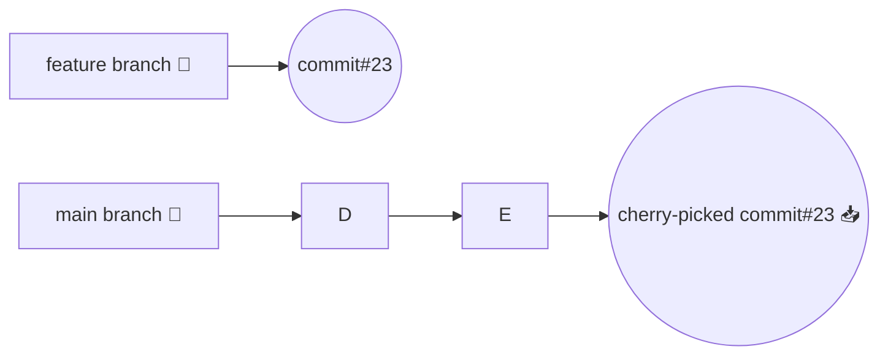
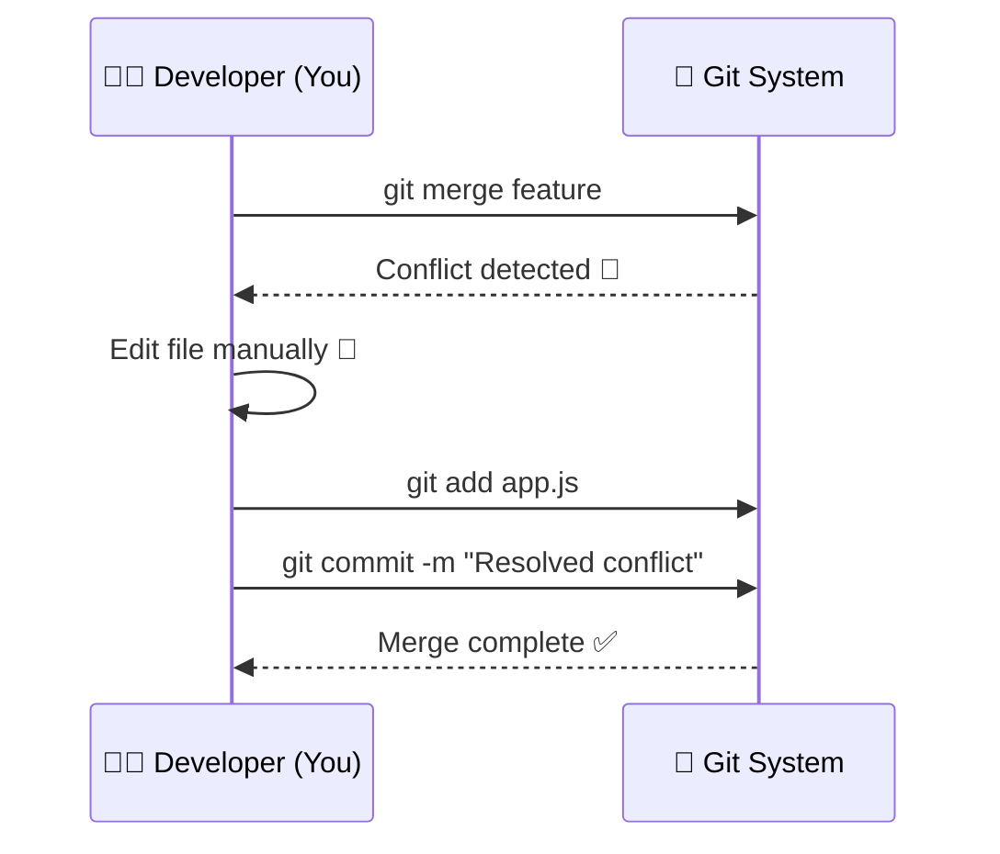
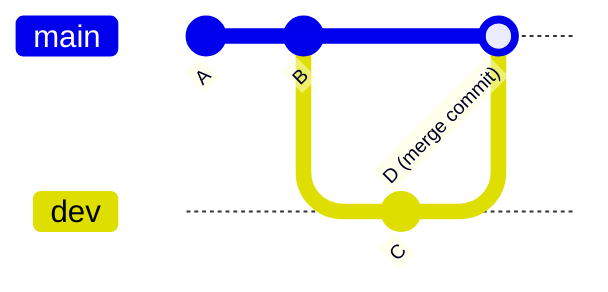
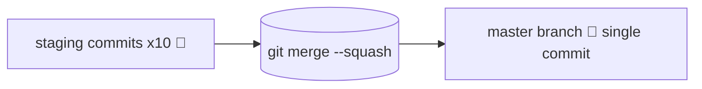

# 🌟 DevOps 07 — Git & GitHub (Part 2)
### 🚀 Advanced Git Topics  
> _Branching • Restore • Revert • Reset • Cherry-pick • Conflict Resolve • Merge vs Rebase • Squash Commit_

---

## 🧭 Overview
These are **advanced Git concepts** that make you powerful at controlling your code history — understanding them means you can fix, revert, or combine changes confidently.

---

## 🧠 HEAD in Git

- `HEAD` always points to the **latest commit** in your current branch.
- It represents **the current state of your working directory**.
- Every branch has its own `HEAD`.

👉 Think of it like a **bookmark** 📘 showing “where you are” in your project’s history.

```mermaid
flowchart LR
    A[Commit 1] --> B[Commit 2] --> C[Commit 3]
    C --> D[HEAD ➡ points here 🧭]
````

✨ **Tip:**
You can move `HEAD` by checking out another branch or commit:

```bash
git checkout <branch-name>
```

---

## ⚙️ Restore, Revert & Reset

### 🧩 `git diff`

Shows what’s changed between your working directory and the last commit:

```bash
git diff
```

* Red = removed lines
* Green = added lines

---

### 🔄 `git restore`

Undo changes in working directory (like **Ctrl + Z before commit**).

Scenario:

> You edited files but didn’t commit yet, and now you want to discard changes.

```bash
git restore <fileName>
```

✅ After restoring, `git diff` will show *no differences*.

---

### ⏪ `git revert`

Used **after committing** changes — creates a **new commit** that undoes the effects of a previous one.

```bash
git revert <commit-hash>
```

🧠 Steps:

1. Find the commit hash with:

   ```bash
   git log --oneline
   ```
2. Run revert command
3. A text editor (like Nano) opens → save and exit to confirm revert

✅ Each revert = a **new commit** (safe for public branches).

---

### 🧹 `git reset`

Goes back to a previous commit (removes commits after it).

```bash
git reset --soft <commit-hash>
git reset --hard <commit-hash>
```

| Option   | Description                                            |
| -------- | ------------------------------------------------------ |
| `--soft` | Moves `HEAD` to target commit but keeps changes staged |
| `--hard` | Moves `HEAD` and deletes all changes after that commit |

⚠️ **Caution:**
`--hard` permanently removes your later commits. Use it carefully! 😬

---

## 🍒 Cherry-pick

```bash
git cherry-pick <commit-hash>
```

👉 Picks a **specific commit** from another branch and applies it on top of your current branch.

* Keeps the original commit in its place.
* Creates a **new commit** with the same changes in your branch.

📘 **Difference from Revert:**

> `git revert` = *undo a commit*
> `git cherry-pick` = *copy a commit*



✨ **Pro Tip:**
Use cherry-pick to quickly bring a bug fix or small feature to another branch without merging everything.

---

## ⚔️ Conflict Resolve

### ❓ What is a Conflict?

A **conflict** happens when Git tries to merge or rebase branches, but:

* The **same part of a file** has **different changes** in both branches
* Git cannot automatically decide which version to keep 🤔

---

### 🔥 When Can Conflicts Occur?

| Scenario        | Example                    | Cause                                       |
| --------------- | -------------------------- | ------------------------------------------- |
| **Merge**       | `git merge feature-branch` | Both branches modified same line            |
| **Pull**        | `git pull`                 | Local and remote branches differ            |
| **Cherry-pick** | `git cherry-pick <commit>` | Selected commit overlaps with local changes |
| **Rebase**      | `git rebase main`          | Replay of commits overlaps                  |
| **Revert**      | `git revert <commit>`      | Old commit modified lines changed again     |

💡 **So yes**, conflicts can occur *even on the same branch* (local vs remote)!

---

## 🪄 Resolving a Conflict — Step by Step

### 1️⃣ Identify the conflict

```bash
git status
```

Shows which files are conflicted 🔍

---

### 2️⃣ Open the file and fix it

Git marks conflict areas like this:

```text
<<<<<<< HEAD
console.log("Hello from main branch!");
=======
console.log("Hello from feature branch!");
>>>>>>> feature-branch
```

👉 Manually edit and keep the correct version:

```js
console.log("Hello from both branches!");
```

---

### 3️⃣ Mark as resolved

```bash
git add <filename>
```

Example:

```bash
git add app.js
```

---

### 4️⃣ Complete the operation

| Operation    | Command                                   |
| ------------ | ----------------------------------------- |
| Merge / Pull | `git commit -m "Resolved merge conflict"` |
| Cherry-pick  | `git cherry-pick --continue`              |
| Rebase       | `git rebase --continue`                   |
| Revert       | `git revert --continue`                   |

---

### 5️⃣ (Optional) Cancel the operation

| Operation   | Command                   | What it does                            |
| ----------- | ------------------------- | --------------------------------------- |
| Merge       | `git merge --abort`       | Cancels merge & restores previous state |
| Rebase      | `git rebase --abort`      | Stops rebase, goes back                 |
| Cherry-pick | `git cherry-pick --abort` | Cancels cherry-pick                     |
| Revert      | `git revert --abort`      | Cancels revert                          |

---

## ⚙️ Common Commands Explained

### 🧩 `git add`

Add resolved file to staging:

```bash
git add <file>
```

---

### 📝 `git commit`

Commit after resolving:

```bash
git commit -m "Resolved conflict"
```

| Option | Description                 |
| ------ | --------------------------- |
| `-m`   | Add commit message inline   |
| `-v`   | Show diff before committing |

---

### 🪢 `git merge`

Merge another branch into current:

```bash
git merge <branch-name>
```

| Option        | Meaning                         |
| ------------- | ------------------------------- |
| `--abort`     | Cancel merge                    |
| `--continue`  | Continue after fixing conflicts |
| `--no-commit` | Merge but don’t auto-commit     |

---

### 🔁 `git rebase`

Replay commits on another branch:

```bash
git rebase <branch>
```

| Option       | Meaning                        |
| ------------ | ------------------------------ |
| `--continue` | Continue rebase after conflict |
| `--abort`    | Stop rebase                    |
| `--skip`     | Skip current commit            |

---

### 🍒 `git cherry-pick`

Apply one commit:

```bash
git cherry-pick <commit-hash>
```

| Option             | Description                       |
| ------------------ | --------------------------------- |
| `--continue`       | Resume after conflict             |
| `--abort`          | Cancel cherry-pick                |
| `-n / --no-commit` | Don’t create commit automatically |
| `-x`               | Add reference to original commit  |
| `-e / --edit`      | Edit commit message               |

---

### ⏪ `git revert`

Undo a specific commit (safely):

```bash
git revert <commit-hash>
```

| Option             | Description                |
| ------------------ | -------------------------- |
| `--continue`       | Resume after conflict      |
| `--abort`          | Cancel revert              |
| `-n / --no-commit` | Don’t commit automatically |
| `-e / --edit`      | Edit message               |

---

## 🧠 Summary Table

| Operation   | Purpose          | Creates new commit? | Can cause conflict? | Resume Command               |
| ----------- | ---------------- | ------------------- | ------------------- | ---------------------------- |
| Merge       | Combine branches | ✅                   | ✅                   | `git commit`                 |
| Pull        | Fetch + merge    | ✅                   | ✅                   | `git commit`                 |
| Rebase      | Replay commits   | ❌                   | ✅                   | `git rebase --continue`      |
| Cherry-pick | Copy a commit    | ✅                   | ✅                   | `git cherry-pick --continue` |
| Revert      | Undo commit      | ✅                   | ✅                   | `git revert --continue`      |

---

## 🌈 Conflict Visualization



---

## 🔀 Merge vs Rebase

### 🪢 Merge

Combines histories of two branches.

```bash
git merge dev
```

* Keeps both commit histories intact
* Creates a **merge commit**



👉 Both branches now share same HEAD.

---

### 🔁 Rebase

Replays commits from one branch on top of another.

```bash
git rebase master
```

* Cleans up commit history
* Avoids extra merge commits
* Useful for a **linear history**


✨ **Remember:**

* Merge = history preserved (non-linear)
* Rebase = history rewritten (linear and clean)

---

## 🎯 Squash Commits

When a developer made **multiple small commits** on a single file and you want to merge them into one meaningful commit:

```bash
git merge --squash staging
git commit -m "Squashed all commits from staging"
```

🧠 Use-case:
Merging staging into master, but you want to combine 10 unnecessary commits into 1 clean commit.



✨ **Pro Tip:**
Squashing is great before merging feature branches to main — keeps history clean and readable!

---

## 💡 Pro Tips & Tricks

✅ Always **stash or commit** before rebasing or merging.
✅ Use GUI tools (like VS Code merge editor) for easy conflict resolution.
✅ Run `git diff` before committing to understand your changes.
✅ Practice conflict resolution — it’s part of teamwork! 💪

---


> 🧭 **In Short:**
> A Git conflict just means *Git needs your help*.
> Fix it, mark it resolved, and continue — you’re good to go 🚀

---

          

## 🧭 Merge vs Rebase vs Squash — Visual Summary

> A picture speaks louder than 100 commits 💬  
> This diagram helps you visualize how each command affects your Git history.


---


