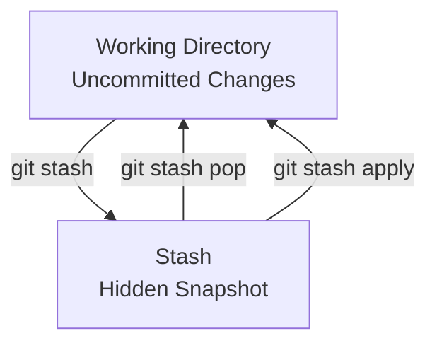

# 🧳 Git Stash — Complete Notes

> **Goal:** Understand what `git stash` is, why it exists, where it stores data,  
> and how to use it safely in real projects.

---

## 🌟 What is `git stash`?

**`git stash` temporarily saves your uncommitted changes and cleans your working directory.**

In simple words:

> 🧠 *“Save my unfinished work somewhere safe and give me a clean repo.”*

---

## 🤔 Why does `git stash` exist?

Git does **not like switching branches with uncommitted changes**.

Typical problems:
- You want to switch branches quickly
- Your code is half-done
- You don’t want to commit yet

👉 `git stash` solves this cleanly.

---

## 🧩 What happens when you run `git stash`?

```bash
git stash push -m "WIP: my feature"
````

Git does **two things**:

1. 📦 Saves your current changes in a **stash**
2. 🧹 Resets your working directory to last commit

After that:

```bash
git status
# working tree clean
```

⚠️ This is **EXPECTED behavior**.

---

## 📦 Where does Git store the stash?

* ✅ Inside your **local repository**
* ❌ Not in any visible file
* ❌ Not pushed to GitHub

📍 Location (internally):

```
.git/refs/stash
```

Think of a stash as:

> 🧠 **A hidden commit that Git manages for you**

---

## 🗄️ Mental Model (Very Important)

```
Working Directory  ── git stash ──▶  Stash (hidden)
       ▲                               │
       └──────── git stash pop ◀───────┘
```

---

## 🔀 Branch + Stash relationship

* Stash is **NOT tied to a branch**
* It is **global to the repo**

That means:

* You can stash on branch `b1`
* Apply it later on branch `b2`

⚠️ This is why **naming stashes is important**

---

## 🏷️ Always name your stash (Best Practice)

```bash
git stash push -m "WIP: button-based pagination solution"
```

Without name ❌:

```
stash@{0}: WIP on b1
```

With name ✅:

```
stash@{0}: WIP: button-based pagination solution
```

---

## 📋 Useful stash commands

### 🔍 List all stashes

```bash
git stash list
```

---

### 👀 See what’s inside a stash

```bash
git stash show stash@{0}
```

Full diff:

```bash
git stash show -p stash@{0}
```

---

### 🔁 Restore stash (and delete it)

```bash
git stash pop
```

---

### 🔁 Restore stash (keep it)

```bash
git stash apply
```

---

### ❌ Delete a stash manually

```bash
git stash drop stash@{0}
```

---

### 🧹 Delete all stashes

```bash
git stash clear
```

---

## ❓ Why are stashed changes NOT visible in `git status`?

Because stash is:

* ❌ not working tree
* ❌ not staged
* ❌ not committed

It lives in a **separate hidden area**.

🧠 Analogy:

> You packed clothes in a suitcase.
> The room looks empty — but clothes are not gone.

---

## 🧪 Real-life example (very common)

### Situation:

* Branch: `b1`
* Uncommitted work exists
* Need to switch to `b2`

### Correct steps:

```bash
git checkout b1
git stash push -m "WIP: pagination experiment"
git checkout b2
```

✔ Safe
✔ Clean
✔ No accidental code mixing

---

## ❌ What `git stash` is NOT

| Myth                         | Reality |
| ---------------------------- | ------- |
| Stash is a commit            | ❌ No    |
| Stash goes to GitHub         | ❌ No    |
| Stash is permanent           | ❌ No    |
| Stash changes show in status | ❌ No    |

---

## 🧠 When should I use `git stash`?

Use stash when:

* You are experimenting
* You are switching branches
* You are not ready to commit
* You want a clean working tree

❌ Don’t use stash for long-term work
👉 Use commits instead

---

## 🔁 Stash vs Commit

| Feature            | Stash | Commit |
| ------------------ | ----- | ------ |
| Temporary          | ✅     | ❌      |
| Shared with team   | ❌     | ✅      |
| Visible in history | ❌     | ✅      |
| Safe long-term     | ❌     | ✅      |

---

## 🧭 Mermaid Diagram — Git Stash Flow



---

## ⚠️ Important Warnings

* Stash is **local only**
* Deleting repo deletes stash
* Cloning repo does NOT bring stash

📌 If work matters → **commit it**

---

## 🏁 Final One-Liner to Remember

> **`git stash` safely hides your unfinished work so you can move freely between branches.**

---

## ✅ Recommended Workflow for Experiments

```bash
git stash push -m "WIP: experiment"
git checkout other-branch
# explore / test
git checkout original-branch
git stash pop
```

---
