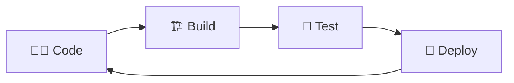
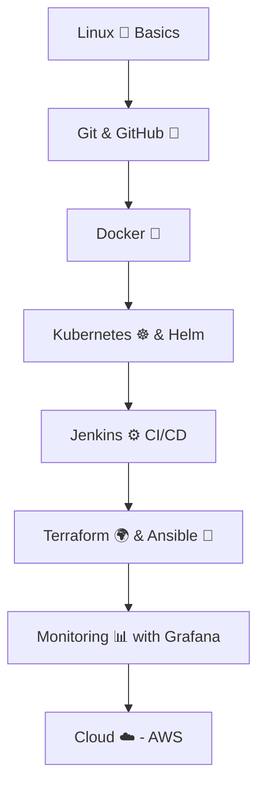

---

# 🌟 Lecture Notes: DevOps 1

## 📝 What is DevOps?

* **Formal definition**:
  DevOps is a **methodology** that bridges the gap between **developers (who write code)** and **operations teams (who manage deployment and infrastructure)**.
  It uses **tools, processes, software, cloud services, and open-source technologies** to make application development, deployment, and maintenance **faster and more efficient**.

* **Easy definition**:
  👉 DevOps is a way for developers and operations teams to **work together** using tools and processes to deliver software **faster, smoother, and more reliably** 🚀.

* **In simple words**:
  A DevOps engineer ensures that whatever the developer has built:

  * ✅ Gets tested properly
  * ✅ Doesn’t break when deployed
  * ✅ Reaches all users successfully

✨ Extra Tip: Think of DevOps as a “teamwork + automation” combo that never stops.

---

## 🔁 The DevOps Lifecycle

* The infinity ♾️ symbol represents a **continuous process** that never ends.
* Stages of the cycle:

✨ Remember: After deployment, feedback from users comes back to developers → new code → build → test → deploy… and the cycle continues!

---

## 🛠️ Skills & Tools Needed for a DevOps Engineer

To become a DevOps engineer, you should learn the following (step-by-step roadmap 🛣️):

1. **Linux 🐧**

   * Foundation of servers and cloud.
   * Learn commands, file system, networking, permissions.

2. **Git & GitHub 🔗**

   * For version control and collaboration.
   * Helps track code changes and work with teams.

3. **Docker 🐳**

   * For containerization (packaging apps + dependencies together).
   * Makes apps run the same everywhere.

4. **Kubernetes & Helm ☸️**

   * Kubernetes = container orchestration (managing lots of containers).
   * Helm = package manager for Kubernetes (like npm for Node.js).

5. **Jenkins ⚙️**

   * Continuous Integration/Continuous Delivery (CI/CD) tool.
   * Automates build, test, and deployment pipelines.

6. **Infrastructure as Code (IaC)**

   * **Terraform 🌍** → Create & manage cloud infrastructure automatically.
   * **Ansible 🤖** → Automate configuration and app deployments.

7. **Monitoring & Visualization**

   * **Grafana 📊** → Dashboard for metrics and logs.
   * Helps monitor system health and performance.

8. **Cloud Platforms ☁️**

   * Start with **AWS (Amazon Web Services)**.
   * Learn EC2 (servers), S3 (storage), IAM (users), RDS (databases), etc.

✨ Extra Tip: Learn step by step. Don’t try to master all tools at once!

---

## 📊 Diagram: DevOps Roadmap

---

---

## 💡 Key Reminders

* DevOps = Collaboration + Automation.
* Infinity loop ♾️ = Continuous improvement.
* Tools are just helpers → focus on **concepts first**, then practice with tools.
* Start small → Linux + Git → then move step by step.

✨ Mnemonic for the cycle → **C-B-T-D** (Code → Build → Test → Deploy).
👉 Remember it as “**Cool Boys Test Daily**” 😄

---

