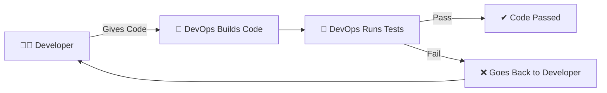
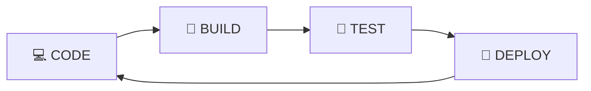
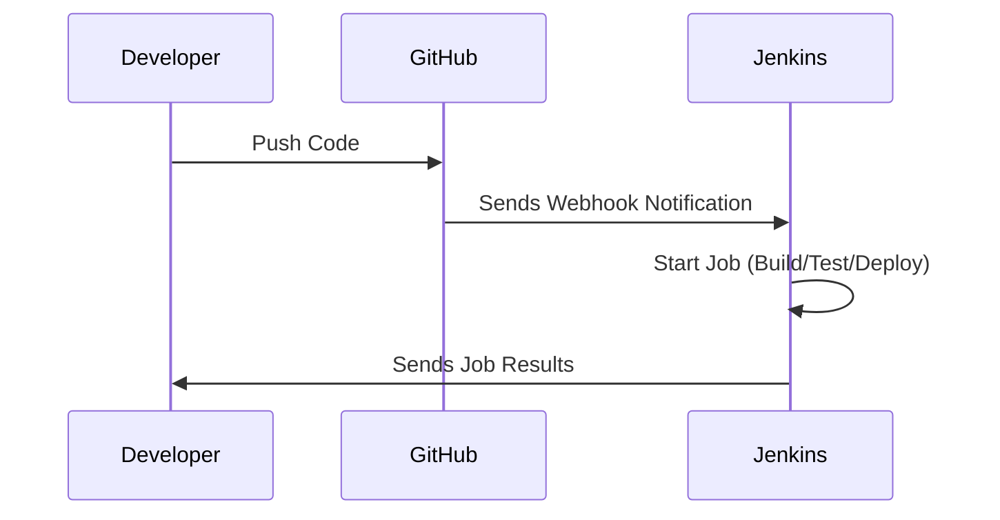
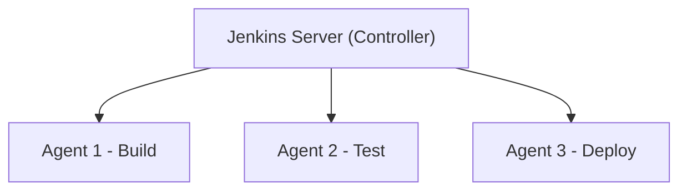
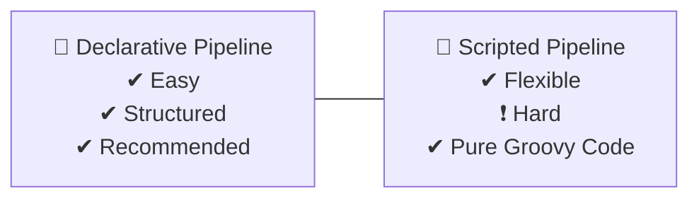

# 🌟 DevOps 14 – Jenkins, CI/CD & Pipelines

*“Life is All about black Screen And full OF Errors”*
*“The screen is black and full of Errors”*

---

# 🚀 **What is Jenkins?**

* Jenkins is an **open-source tool** built on **Java**.
* Because Jenkins is built on Java → **You must install Java** before running Jenkins.
* Jenkins is a **Build Automation Tool** used for **CI/CD pipelines**.
* **CI/CD = Continuous Integration + Continuous Delivery (or Continuous Deployment)**

---

# 🔁 **What is Continuous Integration (CI)?**

### CI means:

* Developer writes/gives code
* DevOps Engineer **builds that code**
* Then DevOps Engineer **tests that code**
* If tests **pass → success**
* If tests **fail → code returns to developer**, developer fixes → CI repeats until it passes

### Tools used in CI:

* **Git + GitHub + Docker** → for code, version control & building
* **Testing:**

  * DevOps Engineer **does NOT write test cases**
  * Tests are written by **developers + testing team**
  * DevOps must know **how to run test commands**

---

# 📘 CI Flow (Diagram)



---

# 🚚 **What is Continuous Delivery / Continuous Deployment?**

## 📦 **Continuous Delivery**

* Some **manual intervention** is needed
* Example: Someone must click “Deploy” OR the user manually updates the app

## 🤖 **Continuous Deployment**

* **No manual intervention**
* Fully automatic
* When production code is pushed to GitHub →
  a **pipeline** automatically updates or deploys the application

### 🌀 DevOps Loop (as in the DevOps symbol):

```
CODE → BUILD → TEST → DEPLOY → CODE → ...
```

➡ This entire process is called a **Job**.

---

# 🔁 CI/CD Loop Diagram



---

# ⚙️ **Installing Jenkins**

Official Documentation:
👉 [http://jenkins.io/doc/book/installing/linux/](http://jenkins.io/doc/book/installing/linux/)

### Important Notes:

* Jenkins runs on **port 8080**
* You can access Jenkins by:

  * `localhost:8080`
  * or `VM-IP:8080`

### 🔐 Jenkins Initial Admin Password

During installation, Jenkins shows the path:

```
/var/lib/jenkins/secrets/initialAdminPassword
```

To view password:

```
sudo cat /var/lib/jenkins/secrets/initialAdminPassword
```

---

# 🔌 Jenkins = ALL ABOUT PLUGINS

* Jenkins **does what you tell it** using **plugins**
* Almost every capability in Jenkins comes from plugins
* Plugins are made by **open-source contributors**
* Plugins teach Jenkins things like:

  * How to install Node.js
  * How to work with GitHub
  * How to create pipelines
  * How to integrate Docker

### Next step → Click **“Install Recommended Plugins”**

Then Jenkins is ready to use.

---

# 🏗 **Creating Jobs in Jenkins**

1️⃣ **Create a Delivery Job (FreeStyle Job)**
Manually build & test code.

2️⃣ **Create a Deployment Job (FreeStyle Job)**
For this → you must use **GitHub WebHooks**

To enable webhook:
GitHub Repo → Settings → Webhooks

---

# 🔔 **What is a WebHook?**

### Simple Definition:

> A webhook is GitHub **sending you a message** when an event happens — instead of you checking GitHub again and again.

### Example:

* You push code
* GitHub immediately sends webhook to Jenkins
* Jenkins automatically starts the job

---

# 📡 Webhook Diagram



---

# 🛠 **Jenkins Pipeline**

A pipeline in Jenkins is an **architecture** with steps/stages:

```
CODE → BUILD → TEST → DEPLOY
```

### Pipeline Behavior:

* Each step is called a **Stage**
* If **any stage fails → pipeline stops**
* More than one stage = **Multi-stage Pipeline**
* Jenkins Pipeline uses **Groovy syntax**
* Pipelines run on **agents**

---

# 🖥 What is an Agent?

* Jenkins server = **Controller**
* Actual application runs on **Agents**

Why?
Because Jenkins server is a **dedicated machine** only for running jobs.
Application is executed on other machines called **agents**.

---

# 🔌 Jenkins Master-Agent Diagram



---

# ✅ **1. Declarative Pipeline (Easy Version)**

Declarative Pipeline is:

* Structured
* Clean
* Beginner friendly
* Recommended by Jenkins
* Uses fixed syntax

### ⭐ Features:

✔ Easy to learn
✔ Easy to read
✔ Less errors
✔ Clear format

---

## 🎯 Declarative Pipeline Example

```groovy
pipeline {
    agent any

    stages {
        stage('Build') {
            steps {
                echo 'Building the project...'
            }
        }

        stage('Test') {
            steps {
                echo 'Running tests...'
            }
        }

        stage('Deploy') {
            steps {
                echo 'Deploying the application...'
            }
        }
    }
}
```

### 🔍 Explanation (Very Easy)

* `pipeline { }` → Starts the Declarative Pipeline
* `agent any` → Run on any node
* `stages { }` → Contains multiple stages
* `steps { }` → Commands run inside each stage
* Very clean, very predictable

---

# ✅ **2. Scripted Pipeline (Older + Flexible)**

Scripted Pipeline is:

* Older syntax
* Pure Groovy code
* Very flexible
* More powerful but harder

### ⭐ Features:

✔ Good for complex logic
❗ Not beginner-friendly
❗ More coding
❗ Less structured

---

## 🎯 Scripted Pipeline Example

```groovy
node {
    stage('Build') {
        echo 'Building the project...'
    }

    stage('Test') {
        echo 'Running tests...'
    }

    stage('Deploy') {
        echo 'Deploying the application...'
    }
}
```

### 🔍 Explanation

* `node { }` → Runs pipeline on a Jenkins node
* You manually create each stage
* You manually write all code
* Full Groovy control

---

# 🆚 **Declarative vs Scripted Diagram**



---

# 🎉 **Final Summary**

* Jenkins = Automation tool for CI/CD
* CI = Build + Test loop
* CD (Delivery) = Manual deploy
* CD (Deployment) = Auto deploy
* Webhooks = GitHub → Jenkins notifications
* Pipelines = Stages (Build/Test/Deploy)
* Declarative Pipeline = Easy, recommended
* Scripted Pipeline = Complex, advanced

---

