# 🚀 Jenkins Agent-Node Architecture Complete Guide

### What we are going to learn in this chapter

In this Jenkins learning we are going to learn about -:

* Agent and Nodes
* RBAC
* Distributed Builds
* Labels
* SSH Authentication
* Public/Private Key Authentication
* authorized_keys
* How Jenkins Controller connects to Agent
* Why Controller/Master should remain clean
* How to configure Agent from Jenkins UI
* How to run pipeline on labelled agent

---


---

# 📖 Table of Contents

1. Introduction
2. Agent-Node Architecture
3. What are Agents and Nodes?
4. Why Distributed Builds Exist
5. Built-in Node Warning in Jenkins
6. Production Architecture
7. Our Local Lab Architecture
8. RBAC
9. Understanding SSH
10. Understanding SSH Authentication
11. Public & Private Keys
12. Where to Generate Key in Master
13. authorized_keys Explained
14. How Jenkins Connects to Agents
15. Lab Setup
16. Why sshd Failed Initially
17. Why mkdir -p
18. SSH Key Setup
19. Jenkins Agent Configuration
20. Labels and Pipeline Targeting
21. Why Controller/Master Must Stay Clean
22. Exact Jenkins UI Steps
23. Restarting Everything Next Day
24. Interview Questions
25. Final Takeaway

---

# Chapter 1 — Introduction

In this Jenkins learning we are going to learn about -:

* Agent and nodes
* RBAC
* What are Agents and nodes
* Distributed Builds
* SSH
* Public/Private Key Authentication
* Label Based Job Scheduling

So, basically their will be one Master Node/ Master Agent of Jenkins which will be a server.

Its work will be:

* to manage Jenkins
* to schedule jobs
* to run jobs on labeled agent
* to delegate the jobs to the labelled agent

Agents are machines who receives task from master node/agent.

Instead of using AWS EC2 instances we built everything locally.

This allows us to understand every moving part of the system.

---

# Chapter 2 — Agent-Node Architecture

Historically Jenkins used:

```text
Master
Slave
```

Modern Jenkins uses:

```text
Controller
Agent
```

But in many places, many people still speak in old terminology like:

```text
Master Node
Slave Node
```

or

```text
Master Agent
Labeled Agent
```

So if you hear those words, understand the mapping:

| Old Term     | Modern Term |
| ------------ | ----------- |
| Master       | Controller  |
| Slave        | Agent       |
| Slave Node   | Agent Node  |
| Built-in Node| Controller Node |

---

## Terminology

| Term       | Meaning                                      |
| ---------- | -------------------------------------------- |
| Controller | Brain of Jenkins                             |
| Agent      | Worker Machine                               |
| Node       | Any machine connected to Jenkins             |
| Label      | Tag assigned to a node                       |
| Executor   | Number of jobs a node can run simultaneously |

---

# Chapter 3 — What are Agents and Nodes?

What are Agents and nodes - so, basically their will be one Master Node/ Master Agent of Jenkins which will be a server and it's work will be to run jobs on labeled agent also called slaves or labeled nodes.

So the master node work will be to delegate the jobs to the labelled agent.

So agents will be machine who receives task from master node/agent.

Think about a company having:

* 100 developers
* Hundreds of repositories
* Hundreds of builds every day

If everything runs on one machine:

```text
Build
Test
Docker Build
Security Scan
Deployment
```

all consume CPU and RAM.

Eventually Jenkins becomes slow.

---

## Controller and Agent Responsibility

Controller responsibilities:

* Manage Jenkins UI
* Manage Jobs
* Manage Plugins
* Manage Credentials
* Manage Agents
* Decide on which labelled agent job should run

Agent responsibilities:

* Execute build
* Run tests
* Build Docker image
* Perform deployment
* Run scripts
* Do the actual pipeline work

---

## Visual Understanding

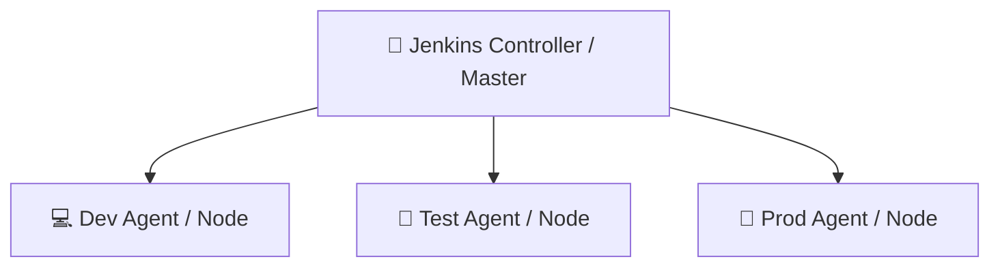

---

# Chapter 4 — Why Distributed Builds Exist

Why this Master/slave kind of architecture?

Because in production we not use only one machine for Jenkins which will going to run pipeline etc.

If only one machine does everything, then there will be load on that machine.

That is why we divide machines.

We create:

* one machine just for Jenkins master
* other machine(s) as Jenkins agents
* jobs actually run on agents

Master will decide based on labelled like:

```text
prod
dev
test
```

on which what job will going to be run.

---

## Single Machine Problem

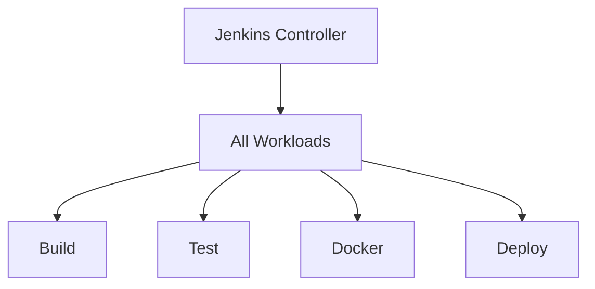

Problems:

❌ CPU overload

❌ RAM overload

❌ Slow builds

❌ Single point of failure

❌ Poor scalability

---

## Distributed Approach

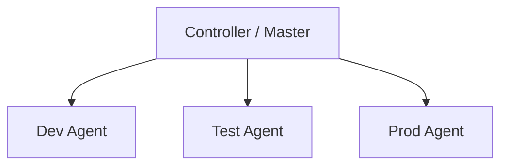

Advantages:

✅ Faster builds

✅ Better scalability

✅ Better resource utilization

✅ Environment isolation

✅ Better workload distribution

---

# Chapter 5 — Built-in Node Warning in Jenkins

STEP 1) go the master Jenkins page open Jenkins setting you will see something like this -:

```text
Building on the built-in node can be a security issue. You should set up distributed builds. See the documentation.
```

Meaning of above sentence is:

in general master node is also called:

```text
built-in node
```

and you are running workload on your built-in node.

Jenkins is saying:

```text
setup distributed agents
```

This means Jenkins does not recommend using the Controller machine for actual heavy workload.

Because Controller should mainly manage Jenkins, not run builds.

---

# Chapter 6 — Production Architecture

Typical Production Setup:

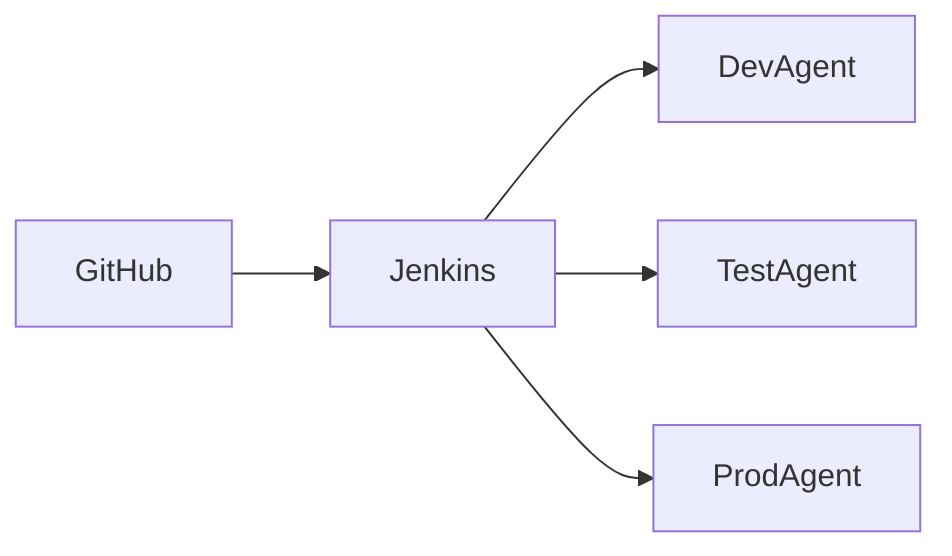

---

Example labels:

```text
Agent Label = dev
Agent Label = test
Agent Label = prod
```

Controller decides where jobs run.

For example:

* Development jobs run on `dev`
* Testing jobs run on `test`
* Production deployment jobs run on `prod`

---

# Chapter 7 — Our Local Lab Architecture

Instead of AWS:

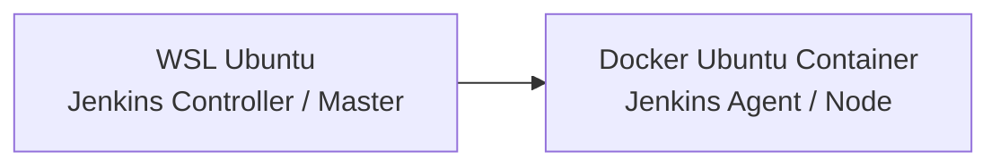

---

This mimics:

```text
EC2 Instance ---> EC2 Instance
```

but locally.

So our local lab is still teaching the same real architecture:

* one Jenkins master/controller
* one remote agent/node
* connection using SSH
* label based execution

---

# 📷 Screenshot 

Insert: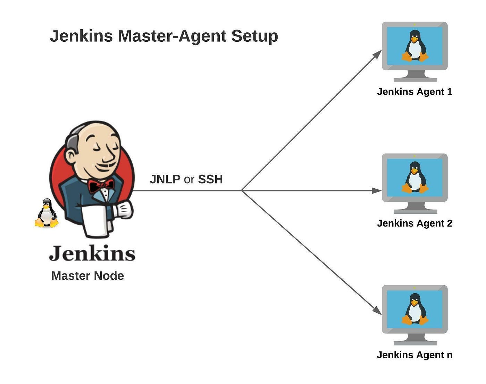
**Jenkins Controller → Multiple Agents Diagram**

(Your first screenshot)

---


---

# Chapter 8 — Understanding SSH

SSH = Secure Shell

Used to securely access another machine.

Example:

```bash
ssh ubuntu@192.168.1.10
```

Meaning:

```text
Login to machine
as user ubuntu
```

Without SSH:

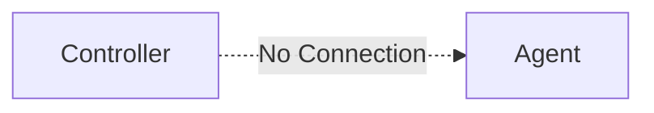

With SSH:

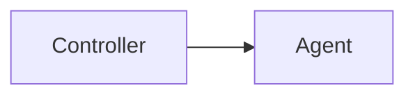

Controller can:

* Execute commands
* Copy files
* Start Jenkins Agent

---

# Chapter 9 — Understanding SSH Authentication

Initially:

```bash
ssh jenkinsAgent1@localhost -p 2222
```

asks:

```text
Password:
```

Authentication flow:

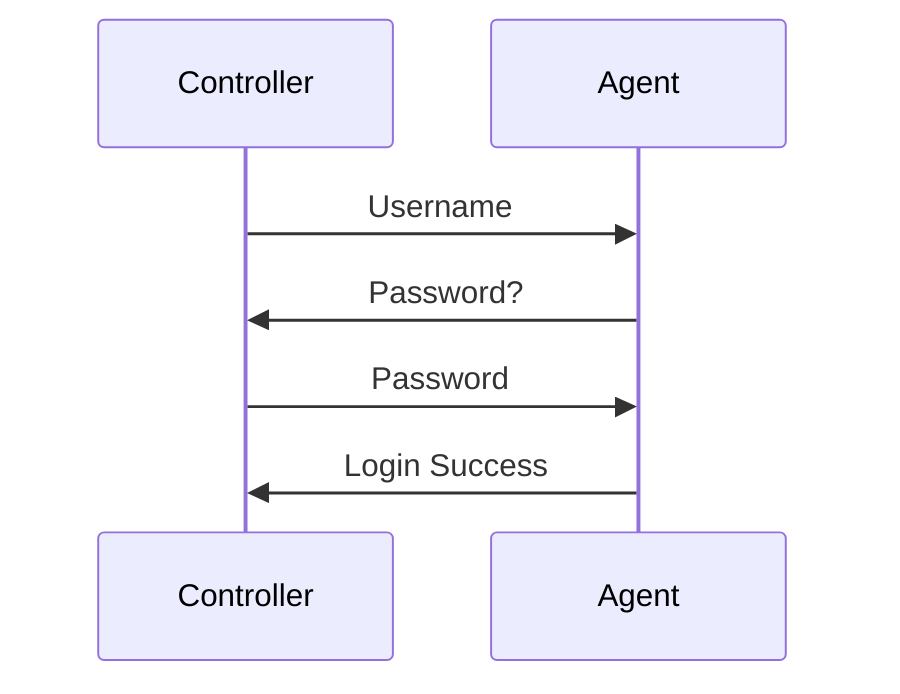

Works.

But not suitable for automation.

Because Jenkins should connect automatically, not wait for manual password typing every time.

---

# Chapter 10 — Public & Private Keys

Instead of passwords:

```text
Private Key
Public Key
```

are used.

Generated by:

```bash
ssh-keygen -t ed25519
```

Generated files:

```text
jenkins_agent1_key
jenkins_agent1_key.pub
```

---

## Golden Rule

```text
Private Key → Controller / Master
Public Key → Agent
```

Never reverse this.

---

## Why?

Think:

```text
Private Key = House Key
Public Key = Lock
```

Lock can be public.

Key must remain secret.

---

# Chapter 11 — Where to Generate Key in Master

This part is very important and often missing.

You asked specially where to generate key in master.

## Answer

Generate the SSH key on the Jenkins master/controller machine.

In our local lab, Jenkins master is running on:

```text
WSL Ubuntu
```

So key should be generated in master machine, not inside agent container.

---

## Example

Go to the master/controller terminal and create one dedicated folder:

```bash
mkdir -p ~/jenkins-agent-key
cd ~/jenkins-agent-key
```

Now generate key here:

```bash
ssh-keygen -t ed25519 -f ~/jenkins-agent-key/jenkins_agent1_key
```

This creates:

```text
~/jenkins-agent-key/jenkins_agent1_key
~/jenkins-agent-key/jenkins_agent1_key.pub
```

Here:

* Private key stays in master/controller
* Public key will be copied to agent

---

## Why generate key in Master?

Because Jenkins controller will use private key to connect to remote agent.

So Jenkins should have access to the private key.

That is why key generation should be done on master side.

---

## Important Folder Permission Note

We faced issue because key folder permissions were wrong.

Problem directory permissions:

```text
drw-------
```

Missing:

```text
x
```

Without execute permission on directory, system cannot enter directory properly.

Correct it using:

```bash
chmod 700 ~/jenkins-agent-key
```

---

# Chapter 12 — authorized_keys Explained

File:

```bash
~/.ssh/authorized_keys
```

Contains:

```text
Allowed Public Keys
```

Example:

```text
ssh-ed25519 AAAAC3...
```

Authentication process:

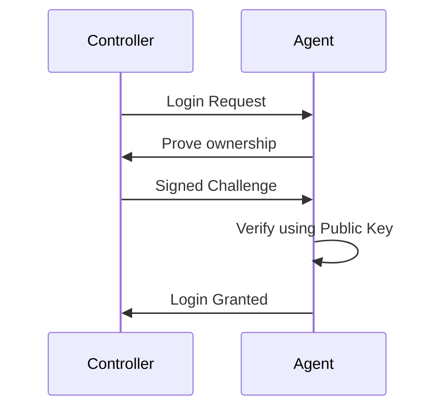

If public key exists in:

```bash
~/.ssh/authorized_keys
```

login succeeds.

Otherwise:

```text
Permission denied
```

---

# Chapter 13 — How Jenkins Connects to Agents

Many beginners think Jenkins magically connects.

Reality:

When clicking:

```text
Launch Agent
```

Jenkins performs:

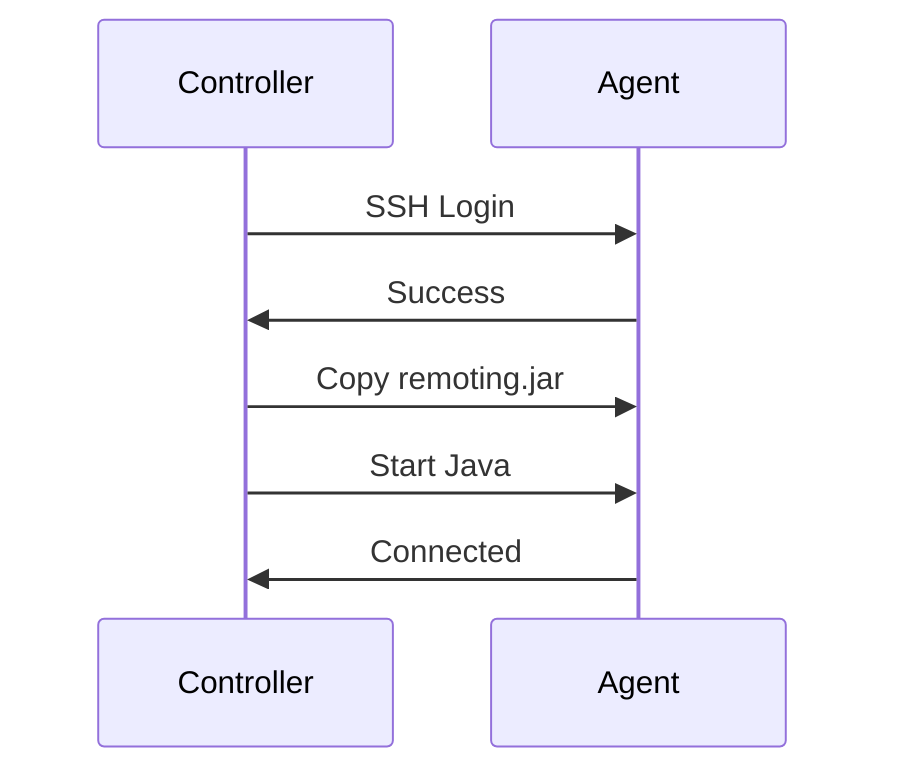

Internally it is like:

```bash
ssh agent
scp remoting.jar
java -jar remoting.jar
```

So for successful Jenkins agent connection we need:

* network connectivity
* SSH working
* correct username
* correct private key
* public key in authorized_keys
* Java installed on agent

---

# Chapter 14 — Lab Setup

## Step 1 Pull Ubuntu Image

```bash
docker pull ubuntu:24.04
```

---

## Step 2 Create Container

```bash
docker run -itd \
--name jenkins-agent1 \
-p 2222:22 \
ubuntu:24.04
```

---

### Why Port Mapping?

```text
Host 2222 -> Container 22
```

SSH Server listens on:

```text
22
```

Host connects on:

```text
2222
```

---

## Step 3 Enter Container

```bash
docker exec -it jenkins-agent1 bash
```

---

## Step 4 Install Java

```bash
apt update
apt install openjdk-17-jdk -y
```

Verify:

```bash
java -version
```

### Why Java?

Jenkins Agent is a Java application.

Without Java:

```text
Agent Launch Fails
```

---

## Step 5 Install SSH Server

```bash
apt install openssh-server -y
```

Verify:

```bash
dpkg -l | grep openssh-server
```

---

## Step 6 Create User

```bash
useradd -m -s /bin/bash jenkinsAgent1
```

### What does -m mean?

Creates:

```text
/home/jenkinsAgent1
```

### What does -s mean?

Sets login shell:

```bash
/bin/bash
```

---

## Step 7 Set Password

```bash
passwd jenkinsAgent1
```

Our Lab Credentials:

```text
root
Password:
jenkinsAgentRoot1
```

```text
jenkinsAgent1
Password:
jenkins123
```

---

# Chapter 15 — Why sshd Failed Initially

We executed:

```bash
/usr/sbin/sshd
```

Error:

```text
Missing privilege separation directory: /run/sshd
```

## Why?

Normal Ubuntu VM boots using systemd.

System boot creates:

```text
/run
/run/sshd
```

Docker does not perform full OS boot.

Therefore directory was missing.

## Solution

```bash
mkdir -p /run/sshd
```

Then:

```bash
/usr/sbin/sshd
```

started successfully.

---

# Chapter 16 — Why mkdir -p

Without:

```bash
mkdir demo
```

Running again:

```bash
mkdir demo
```

causes:

```text
File exists
```

With:

```bash
mkdir -p demo
```

Linux:

```text
Create if missing
Ignore if already exists
```

This property is called:

# Idempotency

Very important in:

* Terraform
* Ansible
* Shell Scripting
* Jenkins

---

# Chapter 17 — SSH Key Setup

Generate key on master/controller:

```bash
mkdir -p ~/jenkins-agent-key
cd ~/jenkins-agent-key
ssh-keygen -t ed25519 -f ~/jenkins-agent-key/jenkins_agent1_key
```

Now display public key:

```bash
cat ~/jenkins-agent-key/jenkins_agent1_key.pub
```

Copy this public key.

Now go inside agent container and configure:

```bash
mkdir -p /home/jenkinsAgent1/.ssh
```

Paste copied public key into:

```bash
/home/jenkinsAgent1/.ssh/authorized_keys
```

For example:

```bash
cat > /home/jenkinsAgent1/.ssh/authorized_keys
```

paste key, then save.

Now fix ownership and permissions:

```bash
chown -R jenkinsAgent1:jenkinsAgent1 /home/jenkinsAgent1/.ssh
chmod 700 /home/jenkinsAgent1/.ssh
chmod 600 /home/jenkinsAgent1/.ssh/authorized_keys
```

Also fix key directory permission on master:

```bash
chmod 700 ~/jenkins-agent-key
chmod 600 ~/jenkins-agent-key/jenkins_agent1_key
chmod 644 ~/jenkins-agent-key/jenkins_agent1_key.pub
```

---

## Test SSH from Master

From the master/controller machine test connection:

```bash
ssh -i ~/jenkins-agent-key/jenkins_agent1_key -p 2222 jenkinsAgent1@localhost
```

If successful, then Jenkins can also use same private key.

---

# Chapter 18 — Jenkins Agent Configuration

📷 Insert: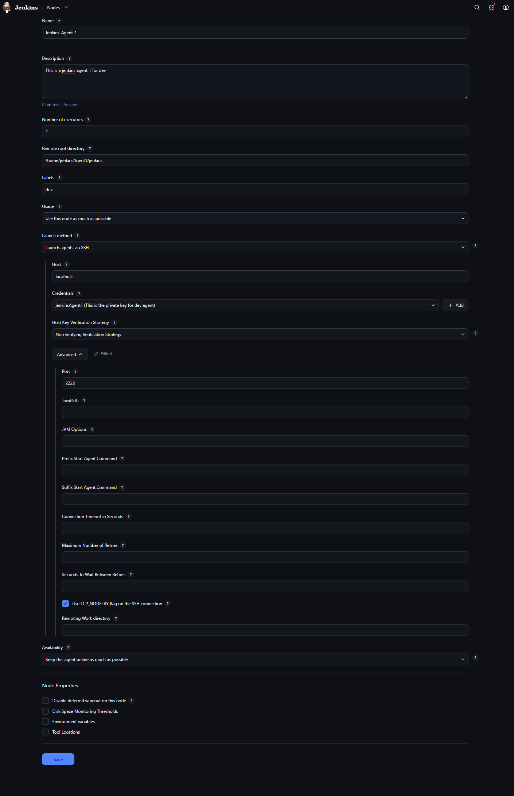

**Your Jenkins Agent Configuration Screenshot**

---

Configuration:

```text
Name:
Jenkins-Agent-1
```

```text
Remote Root:
 /home/jenkinsAgent1/jenkins
```

```text
Label:
dev
```

```text
Host:
localhost
```

```text
Port:
2222
```

```text
Launch Method:
Launch Agent via SSH
```

```text
Credential:
SSH Username with Private Key
```

---

## What Remote Root means?

This is the working directory on agent machine where Jenkins keeps:

* workspace
* temporary files
* remoting files
* job related data

Example:

```text
/home/jenkinsAgent1/jenkins
```

---

# Chapter 19 — Labels and Pipeline Targeting

Our Agent:

```text
Label = dev
```

Pipeline earlier may have:

```groovy
agent any
```

But now you have to add label over there.

Use:

```groovy
pipeline {
    agent {
        label 'dev'
    }

    stages {
        stage('Build') {
            steps {
                sh 'echo Hello'
            }
        }
    }
}
```

Meaning:

```text
Run only on agent having label dev
```

This is exactly how master/controller decides on which labelled node job should run.

---

# Chapter 20 — Why Controller/Master Must Stay Clean

Also remember that the server on which Jenkins master is running it should be clean.

The only work of that server/machine/node should be that only run Jenkins master.

Controller responsibilities:

* Manage Jobs
* Manage Plugins
* Manage Credentials
* Manage Agents
* Schedule work

Controller SHOULD NOT:

* Build Docker Images
* Run Heavy Tests
* Run Deployments
* Run actual heavy pipeline workload

Reason:

```text
Controller = Brain
Agents = Workers
```

If controller machine becomes overloaded, entire Jenkins can become slow or unstable.

---

# Chapter 21 — Exact Jenkins UI Steps

You told to keep the steps exactly the same, so below they are clearly.

## STEP 1

go the master Jenkins page open Jenkins setting you will see something like this -:

```text
Building on the built-in node can be a security issue. You should set up distributed builds. See the documentation.
```

Meaning of above sentence is in general master node is also called:

```text
built-in node
```

and you are running workload on your built-in node Jenkins is saying setup distributed agents.

---

## STEP 2

start on setup agent then write agent name fill the form

Typical form details:

```text
Name: Jenkins-Agent-1
Remote root directory: /home/jenkinsAgent1/jenkins
Labels: dev
Launch method: Launch agents via SSH
Host: localhost
Port: 2222
Credentials: SSH Username with Private Key
```

In credentials:

* Username = `jenkinsAgent1`
* Private Key = contents of `~/jenkins-agent-key/jenkins_agent1_key`

---

## STEP 3

now your agent will be offline click on the agent it will be in sync and online now

If not online, verify:

* container is running
* sshd is running
* Java is installed
* key is correct
* authorized_keys is correct
* label is configured
* port 2222 is mapped

---

## STEP 4

in the pipeline syntax you have written:

```groovy
agent any
```

now you have to add label over there like:

```groovy
agent {
    label 'dev'
}
```

or full pipeline:

```groovy
pipeline {
    agent {
        label 'dev'
    }

    stages {
        stage('Build') {
            steps {
                sh 'echo Hello from dev agent'
            }
        }
    }
}
```

---

# Chapter 22 — Restarting Everything Next Day

Start Container:

```bash
docker start jenkins-agent1
```

Enter as root:

```bash
docker exec -u root -it jenkins-agent1 bash
```

Start SSH:

```bash
mkdir -p /run/sshd
/usr/sbin/sshd
```

Verify:

```bash
ps aux | grep sshd
```

Test from master:

```bash
ssh \
-i ~/jenkins-agent-key/jenkins_agent1_key \
-p 2222 \
jenkinsAgent1@localhost
```

Then launch agent from Jenkins.

---

# 🎯 Interview Questions

### Why use Jenkins Agents?

To distribute workload and improve scalability.

---

### Why install Java on Agent?

Jenkins Agent is a Java application.

---

### Why use SSH keys instead of passwords?

Automation and security.

---

### What is authorized_keys?

File containing allowed public keys.

---

### Why should Controller remain clean?

Controller manages Jenkins.
Agents execute workloads.

---

### Difference between Controller and Agent?

Controller schedules work.

Agent performs work.

---

### What is built-in node in Jenkins?

Built-in node usually refers to the controller/master machine itself.

---

### What is label in Jenkins?

A label is a tag used by Jenkins to decide on which node/agent a job should run.

---

### What is RBAC in Jenkins?

RBAC means Role Based Access Control, used to give different users different permissions.

---

# 🏆 Final Takeaway

You successfully built a real-world Jenkins Agent-Node architecture locally.

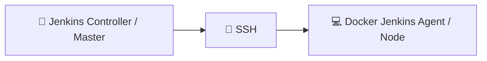

The only difference between your lab and production is:

```text
AWS EC2 → Docker Container
```