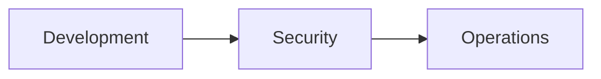
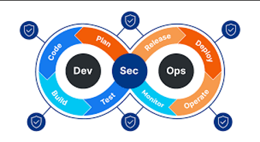
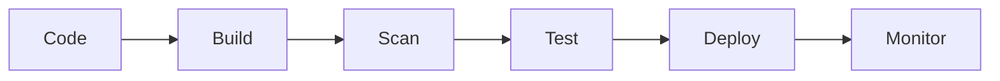
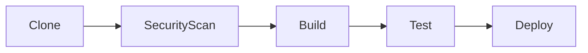
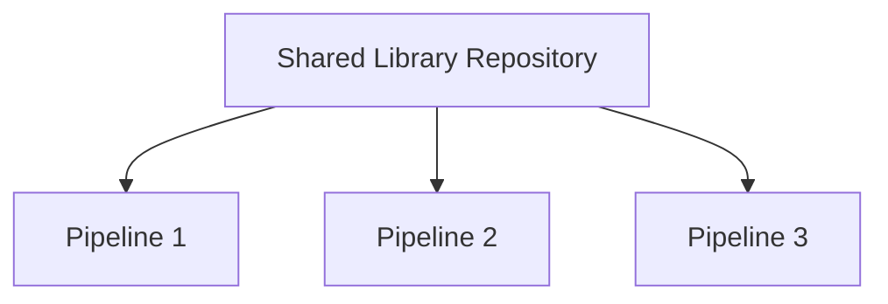
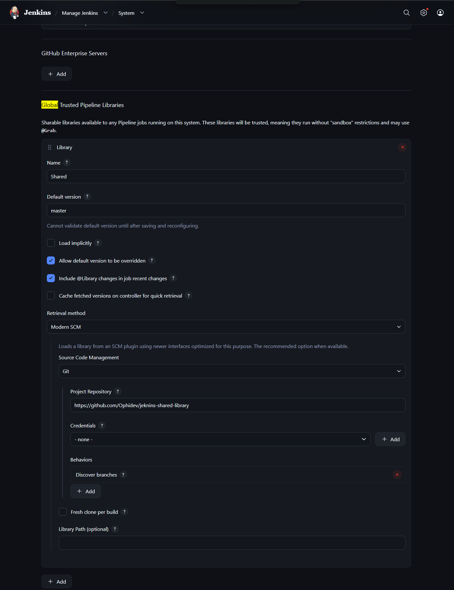
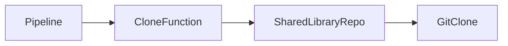
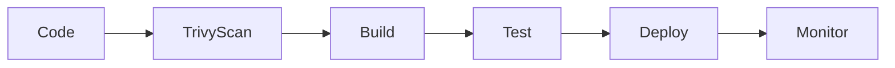

# 🚀 Jenkins Part 2 — DevSecOps & Shared Libraries


---

# 📖 What We Are Going To Learn

In this chapter we are going to learn:

* What is DevSecOps
* Why Security is Important in CI/CD
* RBAC (Role Based Access Control)
* File System Scanning using Trivy
* Docker Image Scanning using Docker Scout
* Dependency Scanning using OWASP Dependency Check
* Integrating Security Scans into Jenkins Pipeline
* Email Notification with Security Reports
* Jenkins Shared Libraries
* DRY Principle in Jenkins
* Reusable Pipeline Functions using Groovy

---

# 📚 Table of Contents

1. Introduction to DevSecOps
2. Security in CI/CD Pipeline
3. Security Tools Overview
4. Trivy File System Scanning
5. Jenkins Integration with Trivy
6. Email Notification with Security Reports
7. Introduction to Shared Libraries
8. Shared Library Architecture
9. Creating First Shared Library
10. Configuring Shared Library in Jenkins
11. Using Shared Library in Pipeline
12. Benefits of Shared Libraries
13. Interview Questions
14. Final Takeaway

---

# Chapter 1 — Introduction to DevSecOps

Traditionally software development followed:

```text
Development → Operations
```

which later became:

```text
DevOps
```

But modern applications also require security checks throughout the software lifecycle.

This introduced:

```text
Development → Security → Operations
```

or simply:

```text
DevSecOps
```

---

## Visual Understanding



---

# DevSecOps Architecture


---

# Chapter 2 — Security in CI/CD Pipeline

Security is not a separate phase anymore.

It becomes part of every stage of the CI/CD pipeline.



Security checks happen continuously.

---

## Common Security Practices

### RBAC

RBAC stands for:

```text
Role Based Access Control
```

Used to control who can:

* Create Jobs
* Delete Jobs
* Configure Jenkins
* Access Credentials
* Manage Agents

---

### Code Scanning

Tools such as SonarQube help identify:

* Code Smells
* Bugs
* Security Vulnerabilities
* Maintainability Issues

---

### File System Scanning

Important files can be compromised:

```text
Dockerfile
Jenkinsfile
docker-compose.yml
README.md
Makefile
```

These files should be scanned before deployment.

---

# Chapter 3 — Security Tools Overview

| Security Area         | Tool                   |
| --------------------- | ---------------------- |
| Source Code Analysis  | SonarQube              |
| File System Scanning  | Trivy                  |
| Docker Image Scanning | Docker Scout           |
| Dependency Scanning   | OWASP Dependency Check |
| Access Control        | RBAC                   |

---

# Chapter 4 — Trivy File System Scanning

Trivy is an open-source vulnerability scanner developed by Aqua Security.

It can scan:

* File Systems
* Docker Images
* Kubernetes Resources
* Git Repositories

---

## Install Trivy

### Method 1

```bash
sudo apt-get install trivy
```

---

### Method 2

```bash
sudo apt-get install wget apt-transport-https gnupg lsb-release -y

wget -qO - https://aquasecurity.github.io/trivy-repo/deb/public.key | sudo apt-key add -

echo deb https://aquasecurity.github.io/trivy-repo/deb $(lsb_release -sc) main | sudo tee -a /etc/apt/sources.list.d/trivy.list

sudo apt-get update -y

sudo apt-get install trivy -y
```

---

## Scan Current Directory

Move to your project directory and execute:

```bash
trivy fs .
```

This will scan the complete file system of the project.

---

## Export Report

```bash
trivy fs . -o results.json
```

Generated file:

```text
results.json
```

contains the complete vulnerability report.

---

# Chapter 5 — Integrating Trivy with Jenkins

Security scans should become part of the pipeline.

A common approach is:



---

## Jenkins Stage

```groovy
stage ("Trivy file system scan") {
    steps {
        sh "trivy fs -o results.json ."
    }
}
```

---

### Why Before Build?

We want vulnerabilities to be detected as early as possible.

```text
Earlier Detection = Lower Cost of Fixing
```

---

# Chapter 6 — Email Notification with Security Reports

After the scan completes we can send the generated report through email.

---

## Attach Trivy Report

```groovy
failure {
    script {
        emailext attachlog: true,
        attachmentsPattern: 'results.json',
        to: 'example@gmail.com',
        body: 'Build failed. Please find the Trivy security report attached.',
        subject: 'Build failed - Security Scan Report'
    }
}
```

---

## Complete Example Pipeline

```groovy
pipeline {
    agent any

    stages {

        stage ("Clone") {
            steps {
                git branch: "master",
                url: "https://github.com/AdityaBhatt37/FlinalProject-ObysAgency-.git"
            }
        }

        stage ("Trivy file system scan") {
            steps {
                sh "trivy fs -o results.json ."
            }
        }

        stage ("build") {
            steps {
                sh "docker build -t obys-agency:latest ."
            }
        }

        stage ("test") {
            steps {
                echo "No test cases!!"
            }
        }

        stage ("deploy") {
            steps {
                sh "docker rm -f obys-container || true"
                sh "docker run -d --name obys-container -p 8081:80 obys-agency:latest"
            }
        }
    }

    post {

        success {
            script {
                emailext from: 'MyJenkins@gmail.com',
                to: 'bhattadi60@gmail.com',
                body: 'Build success',
                subject: 'Build success'
            }
        }

        failure {
            script {
                emailext attachlog: true,
                attachmentsPattern: 'results.json',
                to: 'bhattadi60@gmail.com',
                body: 'Build failed. Please find the Trivy security report attached.',
                subject: 'Build failed - Security Scan Report'
            }
        }
    }
}
```

---

# Chapter 7 — Introduction to Shared Libraries

One important principle in software engineering is:

# DRY

```text
Don't Repeat Yourself
```

Imagine having:

```text
20 Pipelines
```

and every pipeline contains:

```groovy
git clone
docker build
docker push
email notification
```

repeated again and again.

This creates duplication.

To solve this Jenkins provides:

# Shared Libraries

---

## Definition

A Jenkins Shared Library is:

> A collection of reusable pipeline code stored in a Git repository and shared across multiple Jenkins pipelines.

---

# Chapter 8 — Shared Library Architecture



---

Instead of writing the same code repeatedly:

```text
Write Once
Reuse Everywhere
```

---

# Chapter 9 — Creating First Shared Library

Create repository:

```text
jenkins-shared-library
```

---

## Recommended Structure

```text
jenkins-shared-library
│
└── vars
    │
    └── clone.groovy
```

---

## clone.groovy

```groovy
def call(String gitBranchName, String gitRepoUrl) {

    git branch: "${gitBranchName}",
        url: "${gitRepoUrl}"

}
```

---

## Why call() ?

Inside Shared Libraries:

```groovy
def call()
```

makes the file behave like a function.

Example:

```text
clone.groovy
```

becomes

```groovy
clone()
```

inside Jenkins pipelines.

---

# Chapter 10 — Configuring Shared Library in Jenkins

Navigate to:

```text
Manage Jenkins
        ↓
System
        ↓
Global Trusted Pipeline Libraries
```

Click:

```text
Add
```

---

**Shared Library Configuration Screenshot Here**


---

## Configuration

```text
Name:
Shared
```

```text
Default Version:
master
```

```text
Retrieval Method:
Modern SCM
```

```text
Source Code Management:
Git
```

```text
Repository:
https://github.com/Ophidev/jenkins-shared-library
```

---

After configuration:

```text
Apply
Save
```

---

# Chapter 11 — Using Shared Library

Import Library:

```groovy
@Library("Shared") _
```

---

## Example Pipeline

```groovy
@Library("Shared") _

pipeline {

    agent any

    stages {

        stage ("Clone") {

            steps {

                script {

                    clone(
                        "master",
                        "https://github.com/AdityaBhatt37/FlinalProject-ObysAgency-.git"
                    )

                }
            }
        }
    }
}
```

---

## How It Works

```groovy
@Library("Shared") _
```

Imports the library.

---

```groovy
clone()
```

refers to:

```text
vars/clone.groovy
```

---

```groovy
call()
```

inside the file becomes the function body.

---

Flow:



---

# Chapter 12 — Benefits of Shared Libraries

### Reusability

Write once and use everywhere.

---

### Consistency

All pipelines follow the same implementation.

---

### Easier Maintenance

Fix code once.

All pipelines automatically use the updated version.

---

### Cleaner Jenkinsfiles

Instead of:

```groovy
100+ lines
```

you may only have:

```groovy
clone()
build()
test()
deploy()
```

---

### Better Team Collaboration

DevOps teams can maintain standard pipeline logic centrally.

---

# 🎯 Interview Questions

### What is DevSecOps?

DevSecOps is the practice of integrating security into every phase of the DevOps lifecycle.

---

### Why use Trivy?

To scan file systems, Docker images, repositories and detect vulnerabilities.

---

### Why perform security scans before build?

To detect vulnerabilities early and reduce remediation cost.

---

### What is DRY?

Don't Repeat Yourself.

A principle that encourages reusable code instead of duplication.

---

### What is Jenkins Shared Library?

A reusable collection of pipeline code stored in a Git repository.

---

### Why use Shared Libraries?

* Reusability
* Maintainability
* Consistency
* Cleaner Pipelines

---

### Why is `call()` used in Groovy Shared Libraries?

It allows a Groovy file to behave like a function directly inside Jenkins pipelines.

---

### Where are reusable functions generally stored?

Inside:

```text
vars/
```

directory of the shared library repository.

---

# 🏆 Final Takeaway

You have now enhanced your Jenkins knowledge from simple CI/CD pipelines to:

```text
Jenkins
        ↓
DevSecOps
        ↓
Security Scanning
        ↓
Trivy Integration
        ↓
Email Reporting
        ↓
Shared Libraries
        ↓
Reusable Enterprise Pipelines
```



This is the foundation used in modern DevSecOps pipelines where security, automation, and reusability become first-class citizens.

---
