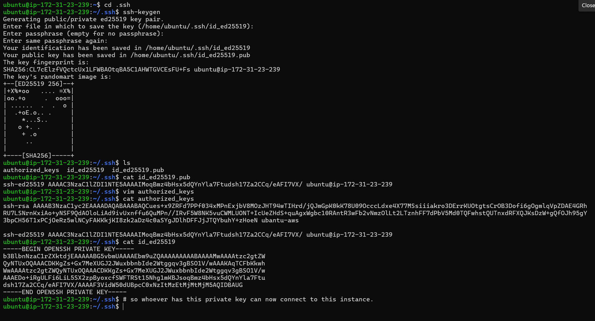
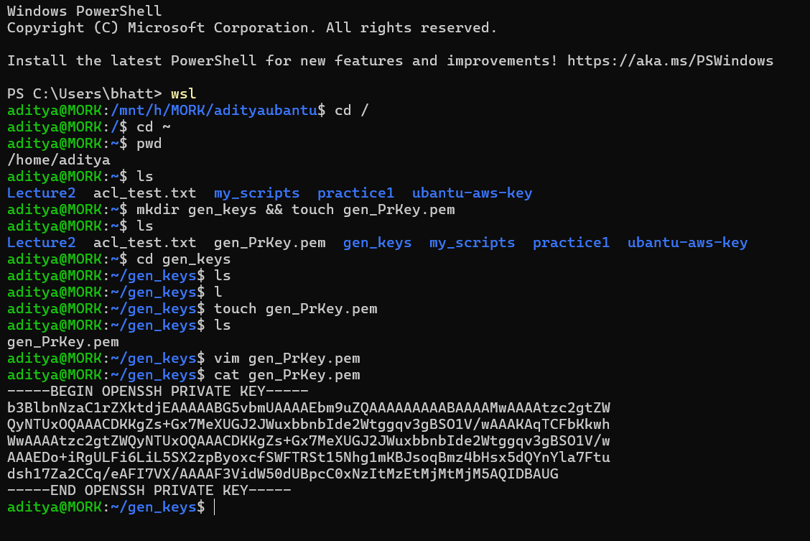
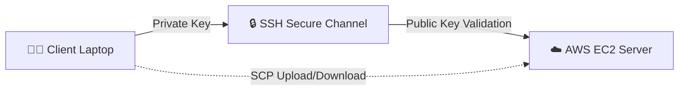
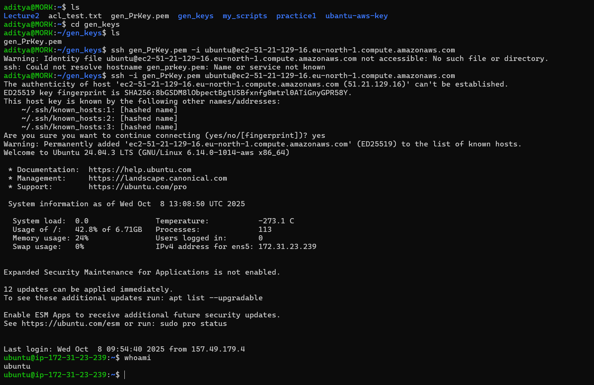
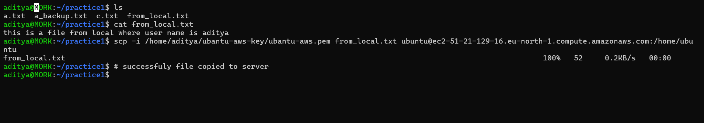
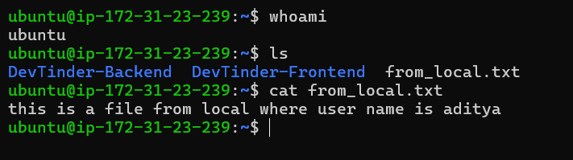
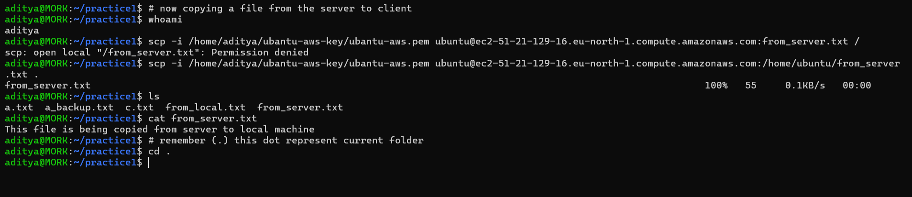

Perfect ✅ Thanks, Aditya!
Here’s your beautifully formatted and complete Markdown lecture notes file — based fully on your understanding, screenshots, and explanations.

---

# 🌐 SSH and SCP — Secure Communication Between Client and Server

## 🧠 Introduction

Hey there 👋!
Today’s lecture was all about **SSH (Secure Shell)** and **SCP (Secure Copy Protocol)** — two powerful tools that help us **securely connect and transfer files** between a **client (your computer)** and a **remote server (like an AWS EC2 instance)**.

These are the backbone of DevOps, Cloud, and Linux server management.
Let’s break everything down simply and visually 👇

---

## 🔑 What is SSH?

**SSH (Secure Shell)** is a **secure network protocol** used to:

* Log in remotely into another system 🖥️
* Execute commands on that system
* Transfer files securely
* Tunnel or forward network traffic

It uses **asymmetric encryption (public/private key pairs)** to establish a **trusted and encrypted communication** channel.

---

## ⚙️ SSH Client Setup on Ubuntu / WSL

### 💡 Step 1: Check SSH Availability

Linux already comes with SSH installed.
To verify, just run:

```bash
ssh
```

If you see a list of options or help text, SSH is installed ✅

---

### 💡 Step 2: Locate Your `.pem` Key

When you launch an AWS EC2 instance, AWS generates a **key pair** for you:

* **Public key** → stored in the instance (under `.ssh/authorized_keys`)
* **Private key (.pem)** → downloaded to your local system

This pair ensures **only you** can access the instance securely.

---

### 💡 Step 3: Connect to Your AWS Instance

From AWS Console → **Connect → SSH Client Tab**
You’ll see something like:

```bash
ssh -i "your-key.pem" ubuntu@ec2-xx-xx-xx-xx.eu-north-1.compute.amazonaws.com
```

If everything’s correct, you’ll see:

```bash
Welcome to Ubuntu 24.04.3 LTS (GNU/Linux 6.14.0-1011-aws x86_64)
ubuntu@ip-172-31-23-239:~$
```

🎉 Congrats! You’re inside your EC2 instance.

---

## 🧩 How SSH Actually Works

SSH uses **asymmetric cryptography** to connect two computers securely.

### 🗝️ The Key Pair:

* **Public Key:** Stored in the server’s `~/.ssh/authorized_keys`
* **Private Key:** Stored on your local machine and never shared

### 🔐 Authentication Flow:

1. The **client** sends a connection request.
2. The **server** checks if the client’s private key matches one of its authorized public keys.
3. If matched, the session is established securely.


✨ **Tip:**
If you ever get `Permission denied (publickey)` — it means your **private key doesn’t match** the server’s public key.

---

## 🧪 Generating Your Own SSH Keys

You can generate your own SSH key pair using:

```bash
ssh-keygen
```

Then you’ll see:

```bash
Generating public/private ed25519 key pair.
Enter file in which to save the key (/home/ubuntu/.ssh/id_ed25519):
```

Press Enter to use default values.

📸 **Screenshot Reference:**

After generation:

```bash
ls ~/.ssh
# authorized_keys  id_ed25519  id_ed25519.pub
```

* The `.pub` file → public key
* The file without `.pub` → private key

Add your **public key** into the server’s `authorized_keys` file:

```bash
cat id_ed25519.pub >> ~/.ssh/authorized_keys
```

Now you can connect using your **newly generated private key**.

---

## 💾 Working with Private Keys in WSL

When you want to connect from Windows Subsystem for Linux (WSL):

1. Create a new folder for your keys.
2. Create a `.pem` file and paste your **private key** content.

```bash
mkdir gen_keys && cd gen_keys
touch gen_PrKey.pem
vim gen_PrKey.pem
```

📸 **Screenshot Reference:**


Now connect to your AWS instance:

```bash
ssh -i gen_PrKey.pem ubuntu@ec2-51-21-129-16.eu-north-1.compute.amazonaws.com
```

If everything is correct, you’ll log in successfully ✅

---

## 🧰 SSH Files Summary

| File Name         | Location              | Description                             |
| ----------------- | --------------------- | --------------------------------------- |
| `authorized_keys` | `~/.ssh/` (on server) | Contains public keys allowed to connect |
| `id_ed25519`      | `~/.ssh/` (local)     | Private key file                        |
| `id_ed25519.pub`  | `~/.ssh/` (local)     | Public key file                         |
| `known_hosts`     | `~/.ssh/` (local)     | List of trusted remote hosts            |

---

## 📂 SCP (Secure Copy Protocol)

### 🚀 What is SCP?

SCP = **Secure Copy Protocol**, used for **securely transferring files** between:

* Client ↔ Server
* Or Server ↔ Server

It also uses **SSH** for encryption and authentication.

---

### 📤 Upload File (Client → Server)

```bash
scp -i key.pem file.txt ubuntu@ec2-51-20-63-119.eu-north-1.compute.amazonaws.com:/home/ubuntu/
```

Explanation:

* `scp` → secure copy command
* `-i key.pem` → use private key for authentication
* `file.txt` → file you want to upload
* `ubuntu@...` → user + instance
* `/home/ubuntu/` → destination path on server

---

### 📥 Download File (Server → Client)

```bash
scp -i key.pem ubuntu@ec2-51-20-63-119.eu-north-1.compute.amazonaws.com:/home/ubuntu/file.txt ~/Downloads/
```

Explanation:

* Same syntax but reversed direction.

---

### ⚡ Quick Difference Between SSH & SCP

| Feature    | SSH                             | SCP                                           |
| ---------- | ------------------------------- | --------------------------------------------- |
| Purpose    | Connect to a remote system      | Transfer files between systems                |
| Encryption | Yes 🔒                          | Yes 🔒                                        |
| Uses       | Remote login, command execution | File copy (upload/download)                   |
| Example    | `ssh -i key.pem ubuntu@server`  | `scp -i key.pem file.txt ubuntu@server:/path` |

---

## 💡 Extra Tip: Remember the Flow

> “SSH = Speak securely 🗣️”
> “SCP = Send securely 📦”

Both depend on **key-based authentication** for encryption and trust.

---

## 🧩 Quick Recap Diagram



✨ **Mnemonic:**
“Public stays on server 🖥️, Private stays with you 💼 — never share it!”

---

## 📸 Screenshot Summary

* 🖼️ **SSH Keygen Process:**


* 🖼️ **Private Key Setup in WSL:**


* 🖼️ **Successful SSH Connection:**



---

## ✅ Summary

| Concept           | Description                                   |
| ----------------- | --------------------------------------------- |
| SSH               | Secure connection protocol for remote systems |
| SCP               | Secure file transfer protocol using SSH       |
| Public Key        | Stored on server to validate connections      |
| Private Key       | Kept on client for authentication             |
| `.pem` file       | Your private key file                         |
| `authorized_keys` | Stores allowed public keys on the server      |

---

✨ **Final Tip:**
Always keep your **private key safe** — if someone gets it, they can access your instance directly!
Use correct permissions (`chmod 400 key.pem`) and never upload your private key anywhere.

---

Would you like me to export this into a downloadable `.md` file (`SSH_and_SCP_Lecture_Notes.md`) now?
