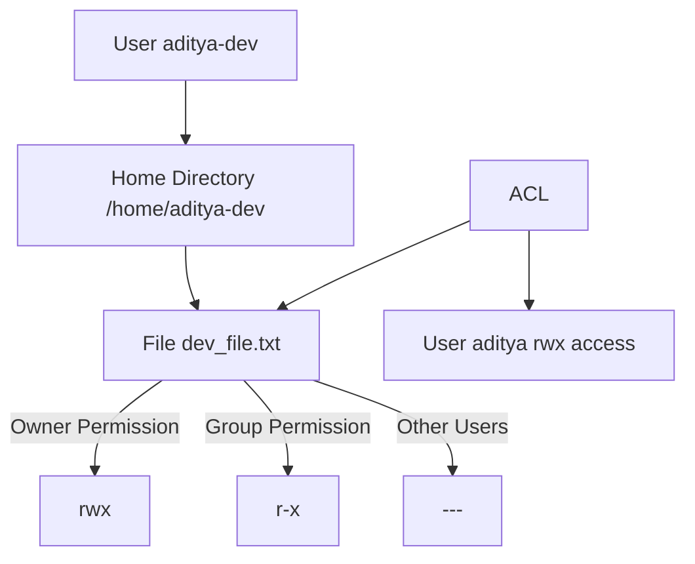

# 🌟 DEVOPS 3 – Linux & Shell Scripting

In this lecture, we are going to learn about the following topics:

1. User Management 👤
2. User Groups 👥
3. Sudo 🛡️
4. grep 🔍
5. awk 📄
6. ACL (Access Control List) 🔑
7. SSH (Secure Shell) & SCP (Server Copy) 🖥️
8. System CTC ⚙️

---

## 📝 1️⃣ User Management

### Creating a New User

```bash
aditya@MORK:/mnt/h/MORK/adityaubantu$ whoami
aditya

aditya@MORK:/mnt/h/MORK/adityaubantu$ useradd ayush-dev -m
useradd: Permission denied.
useradd: cannot lock /etc/passwd; try again later.
````

* `-m` → Creates `/home/username` directory for the new user.
* Normal users **cannot** create users. You must be a **superuser** (root).
* `/etc/passwd` → Contains all user information.

✅ **Correct way using sudo:**

```bash
sudo useradd ayush-dev -m
sudo cat /etc/passwd
```

* Example `/etc/passwd` output shows all users on the machine.

### Setting Password for User

```bash
sudo passwd ayush-dev
```

* Now user `ayush-dev` has a password set.

### Switching Users

```bash
su ayush-dev
whoami
cd /home/ayush-dev
mkdir dev_files
cd dev_files
touch dev_file.txt
ls
exit
```

* `su` → Switch to another user.
* `exit` → Returns to original user.
* **Linux security:** Users cannot access other users’ home directories by default.

---

### Creating Multiple Users

```bash
sudo useradd aditya-dev
sudo passwd aditya-dev
sudo useradd aditya-tester
sudo passwd aditya-tester
sudo useradd aditya-devops
sudo passwd aditya-devops
```

* Use `sudo cat /etc/passwd` to see all users.

---

## 📝 2️⃣ User Groups

### Creating a Group

```bash
sudo groupadd devops
sudo cat /etc/group
```

* Linux treats each user as a group by default.
* Groups are used to **share resources** among users.

### Adding Users to Groups

```bash
# Add a single user
sudo gpasswd -a aditya-dev devops

# Add multiple users (overwrites group members)
sudo gpasswd -M aditya-devops,ayush-dev devops

# Append users without overwriting
sudo gpasswd -a aditya devops
```

**Tip:** Use `-a` to append users. Use `-M` carefully — it overwrites existing members.

**Current devops group:**

```
devops:x:1005:aditya-dev,ayush-dev,aditya-devops,aditya
```

---

## 📝 3️⃣ Sudo

* `/etc/sudoers` → Configuration file for system permissions.
* `%sudo ALL=(ALL:ALL) ALL` → Members of sudo group can execute any command.
* Adding our devops group:

```text
%devops ALL=(ALL) ALL
```

* `%` → Indicates a **group**.
* All members of `devops` now have root privileges.

✨ **Tip:** After editing `/etc/sudoers`, reboot with:

```bash
sudo reboot
```

---

## 📝 4️⃣ File Permissions & chmod

* File permissions: User | Group | Other
* Example:

```bash
ls -la
-rw-rw-r-- 1 aditya-dev aditya-dev 0 dev_file.txt
```

* `chmod 700` → Full permission to user, none to group/others.
* `chmod 750` → User rwx, group r-x, others none.

```bash
chmod 750 dev_file.txt
ls -la
```

---

## 📝 5️⃣ ACL (Access Control List)

### Installing ACL

```bash
sudo apt-get install acl
```

* ACL allows **specific permissions** for specific users without changing ownership.

### Commands

```bash
# Get ACL of a file
getfacl dev_file.txt

# Set ACL for user
sudo setfacl -m u:aditya:rwx dev_file.txt
```

* `getfacl` → Get current permissions.
* `setfacl` → Set permissions for specific users.

```bash
whoami
echo "user Aditya is writing in dev_file.txt" > dev_file.txt
cat dev_file.txt
```

* ACL allows `aditya` to read/write/execute without changing owner.

---

## 📝 6️⃣ grep (Global Regular Expression Print)

* Search for string/pattern in file(s):

```bash
# Recursive search in folder
grep -r "devops" /home

# Search in a specific file
grep "devops" /home/aditya-dev/dev_files/dev_file.txt

# Case-insensitive search
grep -ri "devops" /home/aditya-dev/dev_files
```

✅ **Tip:** Use grep to check if a user exists:

```bash
sudo grep aditya-dev /etc/passwd
```

---

## 📝 7️⃣ find Command

* Find files based on conditions:

```bash
# Example: find files with 777 permissions
find /home -type f -perm 777

# Example : Find files ending with .log:**

find /home -type f -name "*.log"

```

* Useful for locating files quickly.

---

## 📝 8️⃣ Log Files & awk

* Log files contain system/app info.
* `awk` → Powerful tool to **filter, format, extract** data.

```bash
# Print ERROR lines with row number and specific columns
awk '/ERROR/ {print NR,$1,$2,$4}' log_file.txt

# Filter rows NR>1 && NR<10
awk 'NR>1 && NR<10 && /ERROR/ {print NR}' log_file.txt

# Save filtered output
touch Error_upto_50.txt
awk 'NR>0 && NR<51 && /ERROR/ {print NR,$1,$2,$4,$5,$6}' log_file.txt > Error_upto_50.txt
```

* `NR` → Number of the row
* `$1, $2, $3...` → Columns

---

## 📊 Diagram: User & Group Permissions



✨ **Tip:** Think of ACL as a “VIP pass” — it grants specific users access without changing ownership.

---

## 📌 Summary Tips

* **User management:** `useradd`, `passwd`, `su`
* **Groups:** `groupadd`, `gpasswd -a/-M`
* **Sudo:** `/etc/sudoers`, group permissions
* **Permissions:** `chmod`, numbers 0-7
* **ACL:** `getfacl`, `setfacl`
* **Search & logs:** `grep`, `find`, `awk`
* Always reboot after major permission changes: `sudo reboot` 🔄

---

## 🖼️ Image Placeholders

*  – For screenshots or board notes
*  – Postman / Terminal screenshots

---


