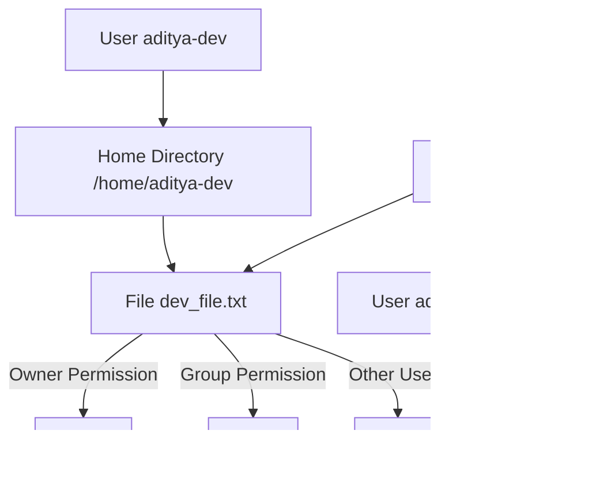

# 🌟 DEVOPS 3 – Linux & Shell Scripting

In this lecture, we are going to learn about the following topics:

1. User Management 👤
2. User Groups 👥
3. Sudo 🛡️
4. grep 🔍
5. awk 📄
6. ACL (Access Control List) 🔑
7. SSH (Secure Shell) & SCP (Server Copy) 🖥️
8. System CTC ⚙️

---

## 📝 1️⃣ User Management

### Creating a New User

```bash
aditya@MORK:/mnt/h/MORK/adityaubantu$ whoami
aditya

aditya@MORK:/mnt/h/MORK/adityaubantu$ useradd ayush-dev -m
useradd: Permission denied.
useradd: cannot lock /etc/passwd; try again later.
````

* `-m` → Creates `/home/username` directory for the new user.
* Normal users **cannot** create users. You must be a **superuser** (root).
* `/etc/passwd` → Contains all user information.

✅ **Correct way using sudo:**

```bash
sudo useradd ayush-dev -m
sudo cat /etc/passwd
```

* Example `/etc/passwd` output shows all users on the machine.

### Setting Password for User

```bash
sudo passwd ayush-dev
```

* Now user `ayush-dev` has a password set.

### Switching Users

```bash
su ayush-dev
whoami
cd /home/ayush-dev
mkdir dev_files
cd dev_files
touch dev_file.txt
ls
exit
```

* `su` → Switch to another user.
* `exit` → Returns to original user.
* **Linux security:** Users cannot access other users’ home directories by default.

---

### Creating Multiple Users

```bash
sudo useradd aditya-dev
sudo passwd aditya-dev
sudo useradd aditya-tester
sudo passwd aditya-tester
sudo useradd aditya-devops
sudo passwd aditya-devops
```

* Use `sudo cat /etc/passwd` to see all users.

---

## 📝 2️⃣ User Groups

### Creating a Group

```bash
sudo groupadd devops
sudo cat /etc/group
```

* Linux treats each user as a group by default.
* Groups are used to **share resources** among users.

### Adding Users to Groups

```bash
# Add a single user
sudo gpasswd -a aditya-dev devops

# Add multiple users (overwrites group members)
sudo gpasswd -M aditya-devops,ayush-dev devops

# Append users without overwriting
sudo gpasswd -a aditya devops
```

**Tip:** Use `-a` to append users. Use `-M` carefully — it overwrites existing members.

**Current devops group:**

```
devops:x:1005:aditya-dev,ayush-dev,aditya-devops,aditya
```

---

## 📝 3️⃣ Sudo

* `/etc/sudoers` → Configuration file for system permissions.
* `%sudo ALL=(ALL:ALL) ALL` → Members of sudo group can execute any command.
* Adding our devops group:

```text
%devops ALL=(ALL) ALL
```

* `%` → Indicates a **group**.
* All members of `devops` now have root privileges.

✨ **Tip:** After editing `/etc/sudoers`, reboot with:

```bash
sudo reboot
```

---

# 🔐 Linux File Permissions, chmod & chown Notes

---

# 📌 Why File Permissions Matter

Linux is a multi-user operating system.

Permissions control:

* Who can read files
* Who can edit files
* Who can execute programs
* Security between users/services
* Team/project access

Very important in:

* DevOps
* Docker
* Linux Administration
* CI/CD
* Production servers
* Nginx/Apache
* Kubernetes

---

# 📁 Linux Permission Model

Every file/folder has:

```text
1. Owner User
2. Owner Group
3. Others
```

Example:

```bash
ls -la
```

Output:

```bash
-rw-rw-r-- 1 aditya-dev developers 0 May 14 dev_file.txt
```

---

# 🔍 Breakdown of Output

```text
-rw-rw-r-- 1 aditya-dev developers 0 May 14 dev_file.txt
```

| Part           | Meaning            |
| -------------- | ------------------ |
| `-`            | File type          |
| `rw-`          | Owner permissions  |
| `rw-`          | Group permissions  |
| `r--`          | Others permissions |
| `1`            | Hard links         |
| `aditya-dev`   | Owner user         |
| `developers`   | Owner group        |
| `0`            | File size          |
| `May 14`       | Last modified date |
| `dev_file.txt` | File name          |

---

# 📂 File Types

| Symbol | Meaning          |
| ------ | ---------------- |
| `-`    | Regular file     |
| `d`    | Directory        |
| `l`    | Symbolic link    |
| `c`    | Character device |
| `b`    | Block device     |

Example:

```bash
drwxr-xr-x
```

`d` means directory.

---

# 🔑 Permission Meaning

| Symbol | Meaning       |
| ------ | ------------- |
| `r`    | Read          |
| `w`    | Write         |
| `x`    | Execute       |
| `-`    | No permission |

---

# 👤 Permission Sections

Example:

```bash
-rwxr-x---
```

Breakdown:

```text
Owner  → rwx
Group  → r-x
Others → ---
```

---

# 🔢 Numeric Permission System

Linux converts permissions into numbers.

| Permission | Value |
| ---------- | ----- |
| `r`        | 4     |
| `w`        | 2     |
| `x`        | 1     |

Add values together.

---

# 📌 Common Permission Numbers

| Number | Meaning |
| ------ | ------- |
| `7`    | rwx     |
| `6`    | rw-     |
| `5`    | r-x     |
| `4`    | r--     |
| `0`    | ---     |

---

# 🧠 Easy Permission Calculation

## Example: `750`

```text
7 = 4+2+1 = rwx
5 = 4+1   = r-x
0 = ---
```

Final:

```text
Owner  → rwx
Group  → r-x
Others → ---
```

---

# 🔥 chmod Command

`chmod` means:

```text
change mode (permissions)
```

Syntax:

```bash
chmod [permissions] filename
```

---

# 📌 chmod Examples

## 700

```bash
chmod 700 dev_file.txt
```

Meaning:

| Section | Permission |
| ------- | ---------- |
| Owner   | rwx        |
| Group   | ---        |
| Others  | ---        |

Only owner has full access.

---

## 750

```bash
chmod 750 dev_file.txt
```

Meaning:

| Section | Permission |
| ------- | ---------- |
| Owner   | rwx        |
| Group   | r-x        |
| Others  | ---        |

---

## 755 (VERY COMMON)

```bash
chmod 755 script.sh
```

Meaning:

| Section | Permission |
| ------- | ---------- |
| Owner   | rwx        |
| Group   | r-x        |
| Others  | r-x        |

Very common for:

* scripts
* websites
* executable files

---

## 644 (VERY COMMON)

```bash
chmod 644 file.txt
```

Meaning:

| Section | Permission |
| ------- | ---------- |
| Owner   | rw-        |
| Group   | r--        |
| Others  | r--        |

Very common for:

* config files
* source code
* text files

---

# 📂 chmod on Directories

Directories behave differently.

| Permission | Meaning                |
| ---------- | ---------------------- |
| `r`        | View files inside      |
| `w`        | Create/delete files    |
| `x`        | Enter directory (`cd`) |

---

# 📌 Directory Example

```bash
chmod 755 myfolder
```

Allows:

* everyone can enter folder
* everyone can view files
* only owner can modify

---

# 🔁 Recursive chmod

Use `-R` for recursive.

```bash
chmod -R 755 project/
```

Applies permissions to:

* all files
* subfolders
* nested content

---

# 👑 chown Command

`chown` means:

```text
change ownership
```

Used to change:

* owner user
* owner group

---

# 📌 chown Syntax

```bash
chown user file
```

Example:

```bash
sudo chown aditya-dev dev_file.txt
```

Changes file owner.

---

# 📌 Change Owner + Group

Syntax:

```bash
chown user:group file
```

Example:

```bash
sudo chown aditya-dev:developers dev_file.txt
```

Meaning:

* owner user = aditya-dev
* owner group = developers

---

# 📌 Change Only Group

```bash
sudo chown :developers dev_file.txt
```

Changes only group.

---

# 📌 Alternative Group Command

```bash
chgrp developers dev_file.txt
```

`chgrp` means:

```text
change group
```

---

# 🔁 Recursive chown

```bash
sudo chown -R aditya-dev:developers project/
```

Recursively changes:

* all files
* all folders

Very common in:

* web servers
* Docker volumes
* DevOps deployments

---

# 👥 Linux Groups Practical Use

Groups are permission teams.

Example:

```text
developers
sudo
docker
www-data
```

Instead of giving permissions user-by-user,
Linux uses groups.

---

# 📌 Docker Group Example (VERY IMPORTANT)

Normally:

```bash
sudo docker ps
```

After adding user to docker group:

```bash
sudo usermod -aG docker username
```

Now:

```bash
docker ps
```

works WITHOUT sudo.

Very common DevOps interview topic.

---

# 👥 usermod Breakdown

Example:

```bash
sudo usermod -aG docker aditya-dev
```

| Part         | Meaning              |
| ------------ | -------------------- |
| `usermod`    | modify user          |
| `-a`         | append               |
| `-G`         | supplementary groups |
| `docker`     | group name           |
| `aditya-dev` | username             |

Meaning:

```text
Add user to docker group without removing existing groups.
```

---

# ⚠️ VERY IMPORTANT

## WRONG:

```bash
sudo usermod -G docker username
```

This REPLACES all supplementary groups.

---

## CORRECT:

```bash
sudo usermod -aG docker username
```

Always use:

```text
-aG
```

---

# 🧠 Primary vs Supplementary Groups

Every user has:

| Type                 | Meaning                 |
| -------------------- | ----------------------- |
| Primary Group        | Main/default group      |
| Supplementary Groups | Extra permission groups |

---

# 📌 Check User Groups

```bash
id username
```

Example:

```bash
id aditya-dev
```

Output:

```bash
uid=1000(aditya-dev)
gid=1000(aditya-dev)
groups=1000(aditya-dev),27(sudo),999(docker)
```

---

# 🔐 Important DevOps Permissions

| Permission | Usage                   |
| ---------- | ----------------------- |
| `755`      | scripts/web folders     |
| `644`      | config/source files     |
| `600`      | secret/private files    |
| `700`      | private folders/scripts |

---

# ⚠️ Security Best Practices (IMPORTANT)

## NEVER Use:

```bash
chmod 777
```

unless absolutely necessary.

Why?

```text
Everyone gets full permissions.
```

Very insecure.

---

# 🚨 DevOps Interview Important Questions

## Q1: Difference between chmod and chown?

| Command | Purpose            |
| ------- | ------------------ |
| `chmod` | change permissions |
| `chown` | change ownership   |

---

## Q2: Difference between primary and supplementary groups?

| Type          | Meaning                 |
| ------------- | ----------------------- |
| Primary       | default/main group      |
| Supplementary | extra permission groups |

---

## Q3: Why use groups?

Groups allow:

* team-based permissions
* easier access management
* secure shared folders
* scalable administration

---

## Q4: Why add user to docker group?

To run Docker commands without sudo.

---

## Q5: What does chmod 755 mean?

```text
Owner  → rwx
Group  → r-x
Others → r-x
```

---

# 📌 Useful Commands Summary

## View Permissions

```bash
ls -l
ls -la
```

---

## Change Permissions

```bash
chmod 755 file
chmod -R 755 folder
```

---

## Change Ownership

```bash
chown user file
chown user:group file
```

---

## Change Group

```bash
chgrp group file
```

---

## Add User to Group

```bash
sudo usermod -aG docker username
```

---

## Check User Groups

```bash
groups username
id username
```

---

# 🧠 Easy Memory Tricks

## chmod

```text
change mode (permissions)
```

---

## chown

```text
change ownership
```

---

## chgrp

```text
change group
```

---

## usermod -aG

```text
Append user to supplementary Groups
```

---

# ✅ Final Core Understanding

```text
chmod  → controls permissions
chown  → controls ownership
groups → manage team access
```

Linux security is mainly built around:

* users
* groups
* permissions
* ownership


---

## 📝 5️⃣ ACL (Access Control List)

### Installing ACL

```bash
sudo apt-get install acl
```

* ACL allows **specific permissions** for specific users without changing ownership.

### Commands

```bash
# Get ACL of a file
getfacl dev_file.txt

# Set ACL for user
sudo setfacl -m u:aditya:rwx dev_file.txt
```

* `getfacl` → Get current permissions.
* `setfacl` → Set permissions for specific users.

```bash
whoami
echo "user Aditya is writing in dev_file.txt" > dev_file.txt
cat dev_file.txt
```

* ACL allows `aditya` to read/write/execute without changing owner.

---

## 📝 6️⃣ grep (Global Regular Expression Print)

* Search for string/pattern in file(s):

```bash
# Recursive search in folder
grep -r "devops" /home

# Search in a specific file
grep "devops" /home/aditya-dev/dev_files/dev_file.txt

# Case-insensitive search
grep -ri "devops" /home/aditya-dev/dev_files
```

✅ **Tip:** Use grep to check if a user exists:

```bash
sudo grep aditya-dev /etc/passwd
```

---

## 📝 7️⃣ find Command

* Find files based on conditions:

```bash
# Example: find files with 777 permissions
find /home -type f -perm 777

# Example : Find files ending with .log:**

find /home -type f -name "*.log"

```

* Useful for locating files quickly.

---

## 📝 8️⃣ Log Files & awk

* Log files contain system/app info.
* `awk` → Powerful tool to **filter, format, extract** data.

```bash
# Print ERROR lines with row number and specific columns
awk '/ERROR/ {print NR,$1,$2,$4}' log_file.txt

# Filter rows NR>1 && NR<10
awk 'NR>1 && NR<10 && /ERROR/ {print NR}' log_file.txt

# Save filtered output
touch Error_upto_50.txt
awk 'NR>0 && NR<51 && /ERROR/ {print NR,$1,$2,$4,$5,$6}' log_file.txt > Error_upto_50.txt
```

* `NR` → Number of the row
* `$1, $2, $3...` → Columns

---

## 📊 Diagram: User & Group Permissions


```mermaid
flowchart TD
    A[User aditya-dev] --> B[Home Directory /home/aditya-dev]
    B --> C[File dev_file.txt]
    C -->|Owner Permission| D[rwx]
    C -->|Group Permission| E[r-x]
    C -->|Other Users| F[---]
    G[ACL] --> C
    G --> H[User aditya rwx access]
```

✨ **Tip:** Think of ACL as a “VIP pass” — it grants specific users access without changing ownership.

---

## 📌 Summary Tips

* **User management:** `useradd`, `passwd`, `su`
* **Groups:** `groupadd`, `gpasswd -a/-M`
* **Sudo:** `/etc/sudoers`, group permissions
* **Permissions:** `chmod`, numbers 0-7
* **ACL:** `getfacl`, `setfacl`
* **Search & logs:** `grep`, `find`, `awk`
* Always reboot after major permission changes: `sudo reboot` 🔄

---

## 🖼️ Image Placeholders

*  – For screenshots or board notes
*  – Postman / Terminal screenshots

---


