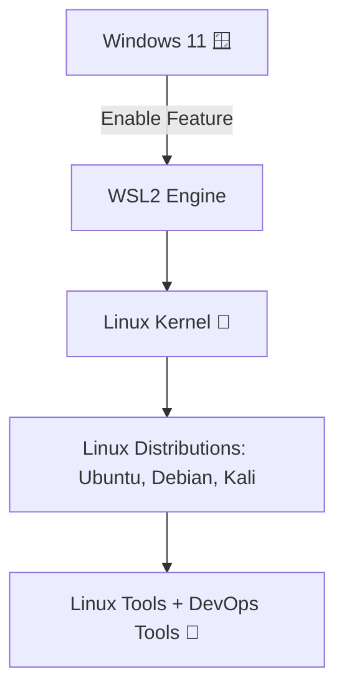

# 🐧 Windows Subsystem for Linux (WSL) – Notes

---

## ✨ What is WSL?
- **WSL = Windows Subsystem for Linux**  
- Allows you to run **Linux environment (Ubuntu, Debian, etc.)** inside Windows  
- No need for **dual boot** or **heavy virtual machines**  

---

## 🎯 Why WSL was Introduced?
- Developers needed **Linux tools** while working on Windows
- Avoid heavy **VMs (Virtual Machines)** and **dual boot**
- Makes it **super easy** to use both Windows 🪟 + Linux 🐧 together
- Perfect for learning **DevOps, Cloud, Scripting, Docker, etc.**

---

## 💻 Can I install on Windows 11 Pro?
✅ Yes! WSL2 comes **pre-enabled** on Windows 11 (Home/Pro).  
Just open **PowerShell (Admin)** and run:

```bash
wsl --install
````

👉 This installs **Ubuntu (default)**, but you can also install other distros from the **Microsoft Store** (Debian, Kali, SUSE, etc.).

---

## 📦 Storage Consumption

* WSL base feature: **\~200–300 MB**
* Linux distribution (Ubuntu, etc.): **1–2 GB**
* Grows as you install more packages (like any Linux system)
* Much lighter than a VM (**20–30 GB**)

---

## 🗑️ Can I Delete WSL Later?

✅ Yes, you can remove it completely.

1. Uninstall Linux distro (Ubuntu) → *Settings → Apps → Installed Apps*
2. Run these commands in PowerShell (Admin):

```powershell
wsl --unregister <DistroName>
dism.exe /online /disable-feature /featurename:Microsoft-Windows-Subsystem-Linux
```

3. Restart your PC → WSL removed

---

## 🛠️ Useful Beginner Commands in WSL

| Command                          | Description                                   |
| -------------------------------- | --------------------------------------------- |
| `wsl --list --verbose`           | Show installed Linux distros                  |
| `wsl --set-default <DistroName>` | Set default Linux distro                      |
| `wsl --shutdown`                 | Shutdown all running distros                  |
| `wsl --update`                   | Update WSL kernel                             |
| `wsl -l -o`                      | List available distros for install            |
| `wsl -d <DistroName>`            | Launch specific distro                        |
| `exit`                           | Exit from Linux shell to Windows              |
| `explorer.exe .`                 | Open current Linux folder in Windows Explorer |

---

## 🪄 WSL + DevOps 🚀

* You can run **Linux commands, Docker, Kubernetes, Ansible, Git, etc.**
* Perfect for **DevOps practice** on a Windows machine

---

## 🌐 Flow of WSL Working



---

## 🎉 Summary

* WSL = Run Linux inside Windows easily
* Easy install with `wsl --install`
* Light on storage (\~2–3 GB)
* Fully removable anytime
* Great for **DevOps beginners** to learn Linux commands

---

