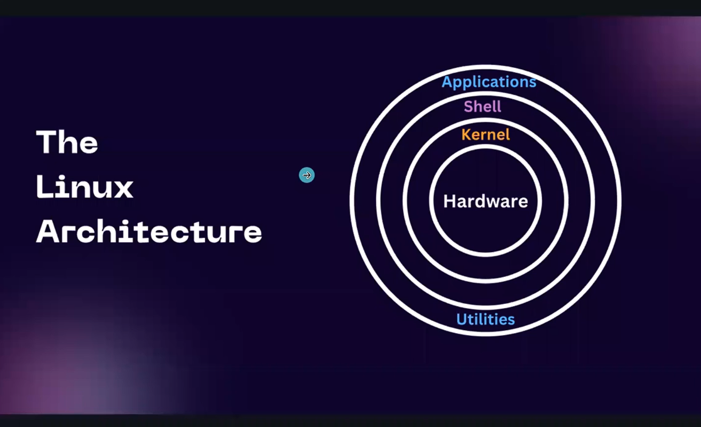

# DevOps Notes – Part 2

# 🐧 Linux & Shell Scripting

---

## 🐧 Linux & Linux Kernel

---

## 🌍 What is Linux?

**Linux** is an **open-source, Unix-like operating system** that allows users to interact with and control computer hardware efficiently.  
It is widely used in **servers, DevOps pipelines, cloud computing, and automation** due to its **stability, security, and flexibility**.

---

### 💡 Quick Definition
> “Linux is an open-source, Unix-like operating system built around the Linux kernel.”

- 🔓 **Open Source:** Anyone can view, modify, and distribute it.  
- ⚙️ **Unix-like:** Follows the design principles of the original Unix OS.  
- 🧰 **Multi-user & Multitasking:** Many users and processes can run simultaneously.  
- 🧩 **Highly Customizable:** Used in servers, desktops, mobile devices, and embedded systems.

---

## ⚙️ What is the Linux Kernel?

The **Linux kernel** is the **core (heart)** of the Linux operating system.  
It acts as a **bridge** between software and hardware.

🧠 **Responsibilities of the Kernel:**
- 🧩 Manages hardware (CPU, RAM, Disk, Network)
- 🔄 Handles process scheduling and memory management
- 🔐 Controls system security and permissions
- 📂 Manages file systems and I/O operations

> The kernel alone is **not** a complete operating system — it’s the **foundation** that other components build upon.

---

## 🧱 Linux vs Linux Kernel

| Concept | Description | Example |
|----------|--------------|----------|
| 🧠 **Linux Kernel** | Core program that interacts with hardware and manages system resources | Version 6.x maintained by Linus Torvalds |
| 💻 **Linux (Operating System)** | Kernel + GNU tools + libraries + shell + UI | Ubuntu, Fedora, CentOS, Debian |
| 🧩 **GNU/Linux** | More accurate name for complete systems using GNU tools with Linux kernel | GNU/Linux Distributions |

---

## 🧑‍💻 Linux in DevOps

In DevOps, Linux is the **foundation for most automation, servers, and containers**.

### 🚀 Why DevOps Engineers Use Linux
- 🖥️ **Server OS:** Most production servers run on Linux
- ⚡ **Automation:** Supports shell scripting, cron jobs, Ansible, and Jenkins
- 🐳 **Containerization:** Docker and Kubernetes are built around Linux kernel features
- ☁️ **Cloud Deployments:** AWS, Azure, and GCP all offer Linux-based instances
- 🧠 **Open Source Tools:** Easy to integrate and customize

---

## 🧩 Components of a Linux System

```

+-----------------------------------------+
| Applications (Chrome, VS Code, etc.)    |
+-----------------------------------------+
| System Libraries & Shell (bash, etc.)   |
+-----------------------------------------+
| Linux Kernel                            |
+-----------------------------------------+
| Hardware (CPU, RAM, Disk, etc.)         |
+-----------------------------------------+

````

---

## 💬 Common Interview Answer

> **Q:** What is Linux?  
> **A:** “Linux is an open-source, Unix-like operating system built around the Linux kernel.  
> It’s widely used in DevOps environments for automation, CI/CD pipelines, and cloud deployments because it’s stable, secure, and highly customizable.”

---

### 🔍 If Asked Technically
> “Technically, Linux refers to the kernel — the core part of the OS.  
> But in practice, we use it as part of a complete distribution (like Ubuntu or CentOS) that includes the Linux kernel, GNU utilities, and system software.”

---

## 🧠 Bonus: Key Terms You Should Know

| Term | Meaning |
|------|----------|
| **Kernel** | The heart of Linux that manages hardware |
| **Shell (Bash)** | Interface to interact with the system |
| **Distro** | Complete version of Linux (Ubuntu, CentOS, etc.) |
| **Daemon** | Background service process |
| **Systemd / systemctl** | Used to manage and control Linux services |
| **Cron** | Used for scheduling repetitive tasks |
| **Package Manager** | Tool for installing/updating software (apt, yum, dnf) |

---

## 🧰 Commands to Check Kernel Info

```bash
# 🧠 Display the kernel version
uname -r

# 🧱 Display all kernel-related information
uname -a

# 💿 Check Linux distribution info
cat /etc/os-release
````

---

## 🧑‍🏫 Summary

| Concept               | Description                                               |
| --------------------- | --------------------------------------------------------- |
| 🐧 **Linux**          | Open-source, Unix-like OS                                 |
| ⚙️ **Kernel**         | Core part that manages hardware                           |
| 💻 **Distro**         | Complete OS built using Linux kernel                      |
| 🧑‍💻 **DevOps Role** | Foundation for automation, servers, containers, and CI/CD |
| 🔐 **Main Features**  | Secure, stable, open-source, customizable                 |

---

## 🎯 Final Takeaway

> 🔹 **Technically:** Linux = Kernel
> 🔹 **Practically:** Linux = Kernel + GNU Tools + System Utilities → Full OS
> 🔹 **In DevOps:** Linux = The backbone of automation, servers, and containers 🚀

---

### ❤️ Created with curiosity & DevOps spirit

**Author:** Ophid’s Linux Learning Notes
**Date:** 2025
**Version:** v1.0

---

```

---


### Popular Linux Flavors (Distributions):
- Ubuntu
- Fedora
- Debian
- CentOS
- Kali Linux
- Arch Linux  

---

## 🏗️ Linux Architecture

```mermaid
graph TD
    A[Applications 👨‍💻] --> B[Shell 🐚]
    B --> C[Kernel ❤️]
    C --> D[Hardware 💻]
````


* **Applications** → Used by the user (e.g., Camera, Browser).
* **Shell** → Interface between applications & kernel.
* **Kernel** → Heart of Linux (written in C). Connects hardware ↔ software.
* **Hardware** → Physical resources (CPU, memory, devices).

### Example:

When you click **Camera App** →
Shell tells Kernel → Kernel tells Hardware → Camera opens.

---

## 👨‍💻 Who Created Linux?

* **Linus Torvalds** wrote the **Linux kernel** in C.
* He also built **Git**, the version control system.

---

## 🧩 Kernel vs Operating System

👉 Linux itself = **Kernel**, not a full OS.

* **Kernel (Linux)**:

  * Core part of the system.
  * Manages CPU, memory, network, and hardware.
* **Operating System (Ubuntu, Fedora, etc.)**:

  * Kernel + GNU tools + package manager + libraries + desktop UI.

💡 Analogy:

* Kernel = Engine 🛠️
* OS = Full Car 🚗

---

## 📂 Linux File System

Everything in Linux is organized into a **filesystem hierarchy** that starts at `/` (root).

```mermaid
graph TD
    ROOT["/ (Root Directory)"] --> BIN["/bin ⚙️ Commands"]
    ROOT --> ROOTDIR["/root 👑 Superuser"]
    ROOT --> HOME["/home 🏠 User Files"]
    ROOT --> ETC["/etc ⚙️ Config Files"]
    ROOT --> VAR["/var 📦 Logs/Data"]
    ROOT --> TMP["/tmp ⚡ Temporary Files"]
```

* `/` → Root directory (base of the system).
* `/bin` → Binary executables (`ls`, `mkdir`, etc.).
* `/root` → Superuser’s personal directory.
* `/home` → Stores user accounts (`/home/username`).
* `/etc` → Configuration files for the system/software.
* `/var` → Logs, cache, spool data.
* `/tmp` → Temporary files.

---

## 👑 Superuser & Permissions

* **Normal user** → Limited access.
* **Superuser (root)** → Full system control.

### Commands:

* Run as root: `sudo command`
* Switch to root: `sudo su`
* Back to normal: `exit`
* Show username: `whoami`

Example:

```bash
sudo apt install nginx
```

---

## 📌 Basic Shell Commands

| Command          | Meaning                   | Example                |
| ---------------- | ------------------------- | ---------------------- |
| `mkdir folder`   | Create folder             | `mkdir project`        |
| `ls`             | List files                | `ls -la`               |
| `cd path`        | Change directory          | `cd /home/aditya`      |
| `pwd`            | Print working directory   | `pwd`                  |
| `touch file.txt` | Create empty file         | `touch notes.txt`      |
| `rm file.txt`    | Remove file               | `rm notes.txt`         |
| `rm -rf folder`  | Delete folder recursively | `rm -rf project`       |
| `cp src dest`    | Copy file/folder          | `cp file1.txt backup/` |
| `cp -r src dest` | Copy folder recursively   | `cp -r dir1 dir2`      |
| `mv src dest`    | Move/Rename file          | `mv old.txt new.txt`   |
| `history`        | Show past commands        | `history`              |

---

## 📖 File Editing in Linux

### Using Vim Editor:

* Open file: `vim file.txt`
* Enter insert mode: `i`
* Save & exit: `Esc + :wq + Enter` may not overrites the content of protected file like /etc/sudoers
* Save & exit + overrites protected file : `Esc + :wq! + Enter`
* Quit without saving: `Esc + :q! + Enter`

---

## 🖨️ Input / Output Redirection

* Print to terminal:

  ```bash
  echo "Hello Linux 🙏"
  ```
* Write to file (overwrite):

  ```bash
  echo "Hello World!" > file.txt
  ```
* Append to file:

  ```bash
  echo "More text" >> file.txt
  ```
* Read file:

  ```bash
  cat file.txt
  ```

---

## ⚡ Multiple Commands

Run commands in one line:

```bash
touch new.txt && echo "Created file" > new.txt
```

---

## 📂 Multiple Files

* Create many at once:

  ```bash
  touch file1 file2 file3
  ```
* Create range:

  ```bash
  touch file{1..10}.txt
  ```
* Move files starting with prefix:

  ```bash
  mv file* Lecture2/
  ```

---

## 🔐 File Permissions

Check permissions:

```bash
ls -la
```

### Breakdown of the ls -la

* `ls` -> list
* `la` -> l means show permission and a means show all hidden files also

Example output:

```
drwxr-xr-x  2 aditya devs  4096 Sep 16 12:00 myfolder
```

### Breakdown:

* `d` → directory (`-` = file, `l` = symlink)
* `rwx` → User (owner) permissions
* `r-x` → Group permissions
* `r-x` → Others permissions

### Permissions Table:

| Permission | Symbol | Number |
| ---------- | ------ | ------ |
| Full       | `rwx`  | 7      |
| Read+Write | `rw-`  | 6      |
| Read+Exec  | `r-x`  | 5      |
| Read only  | `r--`  | 4      |
| Write only | `-w-`  | 2      |
| Exec only  | `--x`  | 1      |
| None       | `---`  | 0      |

So: `drwxr-xr-x` = **755**

---

## 🛠️ System Update & Software

* Update system:

  ```bash
  sudo apt-get update
  ```
* Check kernel:

  ```bash
  uname
  ```
* Check software version:

  ```bash
  java --version
  docker --version
  ```

💡 If software not installed → "command not found".
Commands usually live in `/bin` or `/usr/bin`.

---

## 🐚 Shell as a Programming Language

Shell = Command runner + Scripting language.

Supports:

* Variables
* If/Else
* Loops
* Functions
* Scripts (`.sh` files)

### Example:

```bash
#!/bin/bash
echo "Hello, Linux!"
for i in {1..5}; do
  echo "Count: $i"
done
```

---

✅ With this, you now understand:

* Linux basics
* Architecture
* File system
* Shell commands
* Permissions
* Editing files
* Scripting intro

---

```

---

## 🏠 Linux Home Directory Shortcut (`~`)

### 🔹 What does `~` mean?

* `~` = Your **home directory**
* For user **aditya**, it expands to:

```bash
/home/aditya
```

---

### 📌 Examples

```bash
cd ~            # Same as cd /home/aditya
ls ~/practice1  # Same as ls /home/aditya/practice1
```

---

### 👥 Variations

* `~username` → Go to another user’s home directory
  Example:

  ```bash
  cd ~root   # Goes to /root
  ```

* Just `~` alone in a path works too:

  ```bash
  echo ~
  ```

  → Prints `/home/aditya`

---

### 💡 Why it’s useful?

* Saves typing long paths
* Works in commands, scripts, and anywhere paths are used

---

✅ In short:
`~` is a shortcut to your **home directory** (`/home/aditya` in your case).

--- 

### Some important questions with their Answers 

* Copy a.txt to make a backup named a_backup.txt.
```bash
cp a.txt a_backup.txt

```
