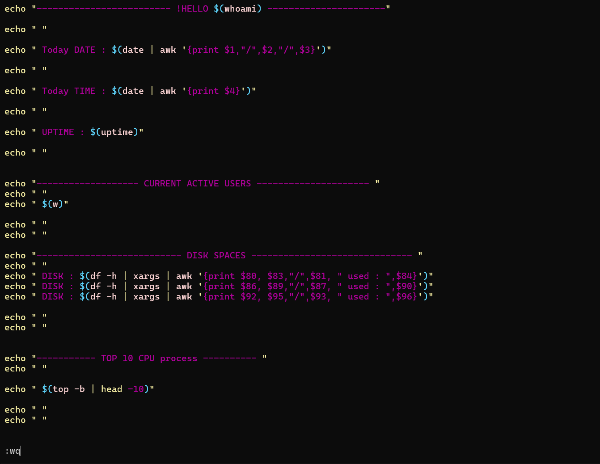
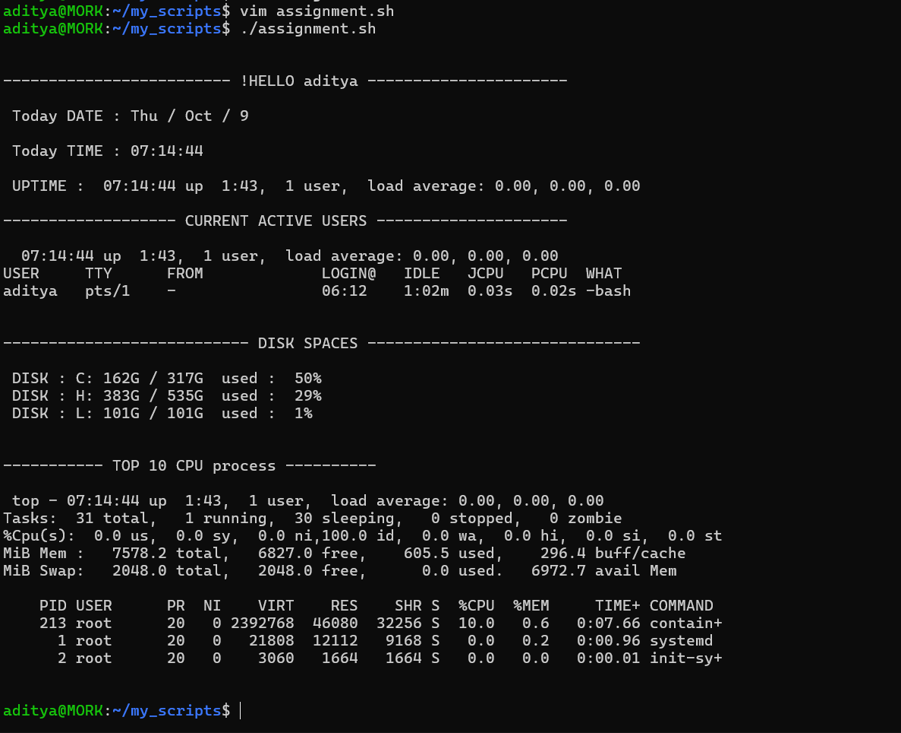

# DEVOPS 4

## Linux and Shell Scripting 3

---

### 🧩 SYSTEM CTL

#### 🔹 Introduction

Before practicing **systemctl**, let’s understand what *System* and *CTL* mean and why they are used.

To start, connect to your **EC2 instance** using SSH.

#### 🔹 Why Services Exist

Services exist for specific tools or processes — for example, Docker, Jenkins, or Kubernetes. When we install such tools, they create their own background **services** (daemons).

Example:

```bash
sudo apt-get update
sudo apt-get install docker.io
```

During installation, you’ll see messages like:

```
Created symlink /etc/systemd/system/multi-user.target.wants/docker.service → /usr/lib/systemd/system/docker.service.
Created symlink /etc/systemd/system/sockets.target.wants/docker.socket → /usr/lib/systemd/system/docker.socket.
```

This means `systemd` manages these services.

---

### 🔧 What is systemd?

`systemd` is the **init system and service manager** in most modern Linux distributions (Ubuntu, Fedora, Debian, etc.).

* It is the **first process** started at boot (PID 1).
* Responsible for:

  * Starting/stopping services
  * Managing daemons
  * Handling system startup/shutdown
  * Logging (`journalctl`)
  * Managing mounts, timers, etc.

Think of `systemd` as the **manager of all background processes (daemons)**.

---

### ⚙️ What is systemctl?

`systemctl` is the **command-line tool** used to control and manage `systemd`.

#### Common Commands

| Action            | Command                               |
| ----------------- | ------------------------------------- |
| Start a service   | `sudo systemctl start docker`         |
| Stop a service    | `sudo systemctl stop docker`          |
| Restart a service | `sudo systemctl restart docker`       |
| Enable on boot    | `sudo systemctl enable docker`        |
| Disable on boot   | `sudo systemctl disable docker`       |
| Check status      | `sudo systemctl status docker`        |
| List all services | `systemctl list-units --type=service` |

Example:

```bash
systemctl status docker
```

Shows Docker’s service details like PID, memory, uptime, and logs.

You can also check the SSH service:

```bash
systemctl status sshd
```

---

### ⚖️ Difference Between `service` and `systemctl`

| Feature             | `service`      | `systemctl`            |
| ------------------- | -------------- | ---------------------- |
| Init System         | SysVinit (old) | systemd (modern)       |
| Boot Management     | ❌ No           | ✅ Yes (enable/disable) |
| Dependency Handling | ❌ No           | ✅ Yes                  |
| Access to Logs      | ❌ No           | ✅ Yes (`journalctl`)   |
| Unit File Support   | ❌ No           | ✅ Yes                  |
| Restart Policies    | ❌ No           | ✅ Yes                  |
| Recommended         | ⚠️ Legacy      | ✅ Modern               |

✅ **Summary:**

* `service` = older command (temporary)
* `systemctl` = modern, powerful command (persistent)

---

### 🧩 Understanding Daemons

A **daemon** is a background process that runs continuously without user interaction.

| Daemon  | Description             |
| ------- | ----------------------- |
| sshd    | Handles SSH connections |
| nginx   | Web server              |
| cron    | Task scheduler          |
| mysqld  | MySQL server            |
| systemd | Manages all daemons     |

---

### 🧾 .service Files

Each service has a corresponding **unit file**, stored in:

```
/etc/systemd/system/
/lib/systemd/system/
```

Example (`nginx.service`):

```ini
[Unit]
Description=A high performance web server
After=network.target

[Service]
ExecStart=/usr/sbin/nginx -g 'daemon off;'
Restart=always

[Install]
WantedBy=multi-user.target
```

---

### 🐚 Shell Scripting Basics

* Linux scripting language → **Shell Script**.
* A shell script = file containing Linux commands executed sequentially.

**Example Script Execution:**

```bash
bash firstScript.sh
# or
./firstScript.sh
```

**Shebang line:**

```bash
#!/bin/bash
```

Tells the system to execute the file using Bash shell.

---

### 🧠 Variables in Shell Script

```bash
name="Aditya"
echo "Namaste Shell Script My name is $name"
echo "Today date is $(date)"
```

To list environment variables:

```bash
printenv
```

---

### 📅 Example: Print Day, Month, and Date

```bash
#!/bin/bash
echo "Day : "
date | awk '{print $1}'
echo "Month : "
date | awk '{print $2}'
echo "Date : "
date | awk '{print $3}'
```

---

### 📁 Automation Example: Create Folder & File

```bash
#!/bin/bash
mkdir new_folder
cd new_folder
touch new_file.txt
echo "This file is created using a Script" > new_file.txt
```

---

### ⚙️ If-Else Statement

```bash
#!/bin/bash
echo "Enter the file name:"
read filename
if [ -f $filename ]; then
  echo "$filename Exists"
else
  echo "$filename does Not Exist"
fi
```

---

### 🧩 Arguments in Shell Script

```bash
#!/bin/bash
if [ -f $1 ]; then
  echo "$1 exists"
else
  echo "$1 does not exist"
fi

echo "Total number of arguments: $#"
echo "All arguments: $@"
```

---

### 🔁 For Loop

```bash
for (( i=1; i<=$1; i++ ))
do
  echo "$i"
done
```

---

### 💾 Disk and Memory Commands

| Task              | Command   |        |                             |
| ----------------- | --------- | ------ | --------------------------- |
| Check disk space  | `df -H`   |        |                             |
| Show as arguments | `df -H    | xargs` |                             |
| Check RAM usage   | `free -h` |        |                             |
| Combine with awk  | `free -h  | xargs  | awk '{print $10, "/", $8}'` |

Output Example:

```
The available RAM is:
6.7Gi / 7.4Gi
```

---

### 🧠 Summary

| Concept       | Description                       |
| ------------- | --------------------------------- |
| systemd       | Manages all daemons (PID 1)       |
| systemctl     | Controls systemd and its services |
| service       | Legacy command for old systems    |
| Daemon        | Background process/service        |
| .service File | Defines how a daemon runs         |
| Shell Script  | Automation using Linux commands   |
| uptime        | get how many users are active now |
| who -H        | names of the user active now      |
| top           | show background process of cpu    |
| top -b        | list background process of cpu    |
| top -b|head   | list top background process       |

💡 **Key Takeaways:**

* Prefer `systemctl` over `service`.
* Use `enable` to start services automatically.
* Shell scripting automates daily Linux tasks.
* Daemons = background processes managed by systemd.

## ASSIGNMENT 1 SHELL SCRIPT FILE


### OUTPUT OF ASSIGNMENT 1 SCRIPT FILE
