# 🐧 WSL Notes – Bashrc & Default Directory Setup

---

## ✨ What is `.bashrc`?
- **`.bashrc`** = A hidden script file that runs **every time a new shell session starts**.
- Location: `~/.bashrc` (inside your Linux home folder).
- Purpose:
  - Customize your **prompt**
  - Add **aliases** (shortcuts for commands)
  - Set **environment variables**
  - Automatically **cd into a folder** when Ubuntu starts

💡 Think of `.bashrc` as your **personal shell startup settings**.

---

## 🔧 Editing `.bashrc`
To edit `.bashrc`:
```bash
nano ~/.bashrc
````

* Use **Nano editor** (easy for beginners).
* Scroll to bottom → add your custom commands.
* Save: `Ctrl + O`, then press **Enter**
* Exit: `Ctrl + X`
* Apply changes without restart:

```bash
source ~/.bashrc
```

---

## 📂 Change Default Directory to H: Drive

By default, Ubuntu opens at:

```
/mnt/c/Users/YourName
```

But we want to start in **H:\UbuntuWorkspace**.

### Steps:

1. Go to H drive in WSL:

   ```bash
   cd /mnt/h
   mkdir UbuntuWorkspace
   cd UbuntuWorkspace
   ```
2. Open `.bashrc`:

   ```bash
   nano ~/.bashrc
   ```
3. At the bottom, add:

   ```bash
   cd /mnt/h/UbuntuWorkspace
   ```
4. Save + exit, then reload:

   ```bash
   source ~/.bashrc
   ```

✅ Now, every time Ubuntu starts, it will directly open in your **H:\UbuntuWorkspace** folder.

---

## 🛠️ Extra: Useful `.bashrc` Customizations

| Customization        | Example                      | Purpose                      |
| -------------------- | ---------------------------- | ---------------------------- |
| Change prompt        | `PS1='🔥DevOpsShell: \w ➜ '` | Makes terminal look cool     |
| Alias for clear      | `alias cls='clear'`          | Shortcut for clearing screen |
| Alias for ls         | `alias ll='ls -la'`          | Easier file listing          |
| Environment variable | `export EDITOR=nano`         | Set default text editor      |

---

## 🔄 Flow of `.bashrc` Execution

```mermaid
flowchart TD
A[Start Ubuntu 🐧] --> B[Shell Loads Bashrc ⚡]
B --> C[Apply Custom Prompt 🎨]
B --> D[Run Aliases/Exports 🔧]
B --> E[Change Directory 📂]
C --> F[Ready to Use Terminal 🚀]
D --> F
E --> F
```



---

## 🎯 Summary

* `.bashrc` runs every time you open Ubuntu shell
* You can use it to **customize your environment**
* Add `cd /mnt/h/UbuntuWorkspace` to start in your H drive folder
* Use `source ~/.bashrc` after edits to apply changes instantly

---
