---

# DevOps Notes – Part 2

## 🐧 Linux & Shell Scripting

---

## 🔹 Why Learn Linux?

* **Linux** = Open-source operating system kernel.
* Used by **91% of applications on the internet**.
* Supports **multi-user** & **multi-tasking**.
* Comes with a **powerful shell** for automation & scripting.
* Has **multiple flavors (distributions)**:

  * Ubuntu, Fedora, Kali Linux, CentOS, Arch, etc.
* **High security** → No need for antivirus.
* Even **Android OS is built on Linux**.

---

## 🏗️ Linux Architecture

```mermaid
graph TD
    A[Applications 👨‍💻] --> B[Shell 🐚]
    B --> C[Kernel ❤️]
    C --> D[Hardware 💻]
```




* **Kernel (Heart of Linux)**

  * Core of the OS → written in C.
  * Connects hardware ↔ applications.
  * Created by *Linus Torvalds* (also created Git).

* **Shell (Interface)**

  * Communicates between **application** & **kernel**.
  * Example: When you click Camera app → Shell tells Kernel → Kernel talks to hardware → Camera opens.

---

## 🧩 Kernel vs Operating System

👉 Linux is a **Kernel**, not a full OS.

* **Kernel (Linux)**

  * Core part of OS.
  * Manages CPU, memory, disks, network.

* **Operating System (Ubuntu, Fedora, etc.)**

  * Kernel + GNU tools + package manager + UI.

💡 Analogy: Kernel = Engine, OS = Full Car 🚗

---

## 📂 Linux File System

```mermaid
graph TD
    ROOT["/ (Root Directory)"] --> BIN["/bin ⚙️ Commands"]
    ROOT --> ROOTDIR["/root 👑 Superuser"]
    ROOT --> HOME["/home 🏠 User Files"]
    HOME --> USER["/home/username"]
```



* `/` → Root directory (everything starts here).
* `/bin` → Binary commands (`ls`, `mkdir`, `rm`, etc.).
* `/root` → Superuser’s directory (restricted access).
* `/home` → Stores all user directories.

---

## 👑 Superuser & Permissions

* `sudo` = **Super User Do**

  * Example: `sudo apt install package-name`
* Switch to superuser: `sudo su`
* Exit superuser: `exit`
* `whoami` → Shows your current username

---

## 📌 Basic Commands

| Command          | Meaning                   | Example                |
| ---------------- | ------------------------- | ---------------------- |
| `mkdir folder`   | Create folder             | `mkdir test`           |
| `ls`             | List files                | `ls -la`               |
| `cd path`        | Change directory          | `cd /home/user`        |
| `pwd`            | Show current directory    | `pwd`                  |
| `touch file.txt` | Create file               | `touch hello.txt`      |
| `rm file.txt`    | Remove file               | `rm hello.txt`         |
| `rm -rf folder`  | Delete folder recursively | `rm -rf mydir`         |
| `cp src dest`    | Copy file                 | `cp file1.txt backup/` |
| `mv src dest`    | Move/Rename file          | `mv old.txt new.txt`   |
| `history`        | Show past commands        | `history`              |

---

## 📖 File Editing

* Open with Vim: `vim file.txt`
* Press `i` → Insert mode
* Save & exit: `Esc + :wq + Enter`
* Quit without saving: `Esc + :q! + Enter`

---

## 🖨️ Input / Output Redirection

* Print text: `echo "Hello Linux 🙏"`
* Redirect output to file:

  ```bash
  echo "Hello World!" > new_file.txt
  cat new_file.txt
  ```
* Append instead of overwrite:

  ```bash
  echo "More text" >> new_file.txt
  ```

---

## ⚡ Multiple Commands

Run multiple commands on one line:

```bash
touch file.txt && echo "Created!" > file.txt
```

---

## 📂 Multiple Files

* Create many at once:

  ```bash
  touch file1 file2 file3
  ```
* Create range:

  ```bash
  touch file{1..10}.txt
  ```
* Move files starting with “file”:

  ```bash
  mv file* Lecture2/
  ```

---

## 🔐 File Permissions

* `ls -la` shows permissions like:

  ```
  drwxr-xr-x
  ```

  * `d` → directory
  * `r` → read
  * `w` → write
  * `x` → execute

---

## 🛠️ System Update & Software

* Update system:

  ```bash
  sudo apt-get update
  ```
* Check Kernel:

  ```bash
  uname
  ```
* Check installed software:

  ```bash
  java --version
  docker --version
  ```

💡 If software not installed → command not found.

---

## 🐚 Shell as a Programming Language

Shell supports:

* Variables
* If/Else, Loops
* Functions
* Input/Output redirection
* Scripts (`.sh` files)

➡️ So, Shell = **Command runner + Scripting language**

---

