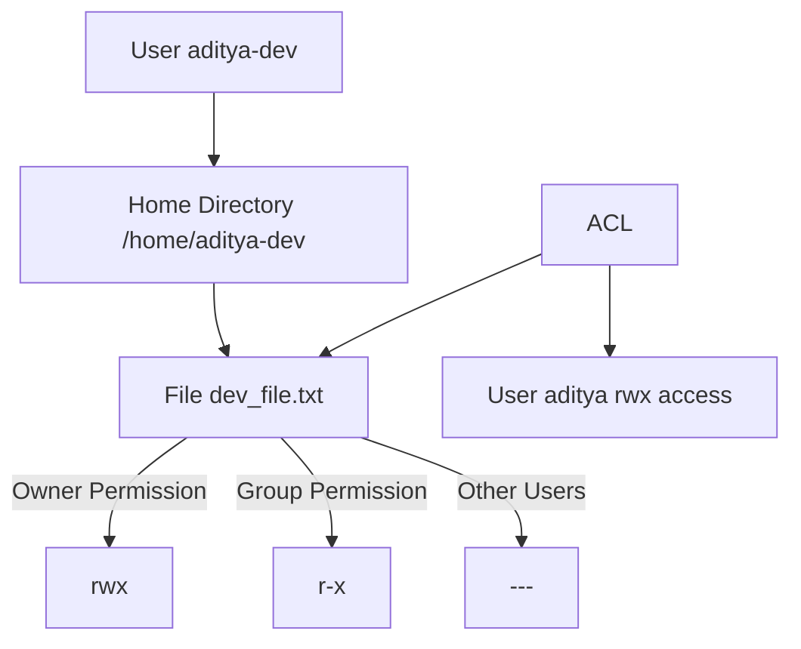

# 🌟 DEVOPS NOTES – Linux & Shell Scripting (Part 2, 3 & 4)

Comprehensive notes covering Linux, Shell Scripting, User Management, ACL, `systemctl`, and automation scripting for DevOps.

---

## 📘 Table of Contents

1. [Introduction to Linux](#introduction-to-linux)
2. [Linux File System](#linux-file-system)
3. [Basic Linux Commands](#basic-linux-commands)
4. [File Permissions](#file-permissions)
5. [User and Group Management](#user-and-group-management)
6. [Package Management](#package-management)
7. [Process Management](#process-management)
8. [System Monitoring](#system-monitoring)
9. [Shell Scripting](#shell-scripting)
10. [Environment Variables](#environment-variables)
11. [Crontab & Automation](#crontab--automation)
12. [Networking Commands](#networking-commands)
13. [Useful Shortcuts](#useful-shortcuts)
14. [User Management (Advanced)](#user-management-advanced)
15. [Groups, Sudo & ACL](#groups-sudo--acl)
16. [grep, find & awk](#grep-find--awk)
17. [systemctl & Daemons](#systemctl--daemons)
18. [Shell Scripting Advanced](#shell-scripting-advanced)
19. [Assignments & Output](#assignments--output)
20. [Summary](#summary)

---

# 🧩 DEVOPS 2 – Linux & Shell Scripting (Core)

---

## 🧠 Introduction to Linux
- Linux is a **Unix-like open-source operating system** kernel.
- Used in **servers, DevOps tools, Docker, Kubernetes, and cloud systems**.
- Key feature: **Everything in Linux is a file.**

---

## 📂 Linux File System
| Directory | Purpose |
|------------|----------|
| `/` | Root directory |
| `/home` | User directories |
| `/bin` | Basic binaries |
| `/etc` | Configuration files |
| `/var` | Variable data/logs |
| `/usr` | User applications |
| `/tmp` | Temporary files |
| `/root` | Root user home |
| `/dev` | Device files |
| `/proc` | Kernel info |

---

## ⚙️ Basic Commands

```bash
pwd                 # Show current directory
ls -l               # Detailed listing
cd /path/to/folder  # Change directory
mkdir test          # Create directory
rm -rf test         # Delete directory
cp file1 file2      # Copy file
mv file1 folder/    # Move file
cat file.txt        # Display file
less file.txt       # Paginated view
head -n 5 file.txt  # First 5 lines
tail -n 5 file.txt  # Last 5 lines
````

---

## 🔐 File Permissions

| Symbol | Meaning | Octal |
| ------ | ------- | ----- |
| r      | Read    | 4     |
| w      | Write   | 2     |
| x      | Execute | 1     |

```bash
chmod 755 file.sh
chmod u+x script.sh
chown user:group file.txt
```

---

# 🌟 DEVOPS 3 – Linux & Shell Scripting (User Management & ACL)

---

## 👤 User Management

```bash
sudo useradd ayush-dev -m
sudo passwd ayush-dev
su ayush-dev
whoami
exit
```

* `-m` → Creates home directory
* `su` → Switch user
* `/etc/passwd` → Stores user details

### Creating Multiple Users

```bash
sudo useradd aditya-dev
sudo passwd aditya-dev
sudo useradd aditya-tester
sudo passwd aditya-tester
```

---

## 👥 User Groups

```bash
sudo groupadd devops
sudo gpasswd -a aditya-dev devops
sudo gpasswd -M aditya-devops,ayush-dev devops
sudo cat /etc/group
```

* `%devops ALL=(ALL) ALL` → Grants group sudo access

---

## 🛡️ Sudo Configuration

Edit sudoers file:

```bash
sudo visudo
```

Add:

```bash
%devops ALL=(ALL) ALL
```

Reboot:

```bash
sudo reboot
```

---

## 🔑 ACL (Access Control List)

```bash
sudo apt-get install acl
sudo setfacl -m u:aditya:rwx dev_file.txt
getfacl dev_file.txt
```

Allows user-specific permissions without ownership changes.

---

## 🔍 grep

```bash
grep "devops" file.txt
grep -r "error" /var/log/
grep -ri "ssh" /etc/
sudo grep aditya /etc/passwd
```

* `-r` = recursive
* `-i` = ignore case

---

## 🔎 find Command

```bash
find /home -type f -name "*.log"
find / -type f -perm 777
find /var/log -mtime -1 -name "*.log"
```

---

## 📄 awk Command

```bash
awk '/ERROR/ {print NR,$1,$2,$4}' log.txt
awk 'NR>1 && NR<10 && /WARN/ {print NR,$3,$5}' syslog
awk 'NR<51 && /ERROR/ {print NR,$1,$2,$4}' log.txt > Error_upto_50.txt
```

---

### 🧩 Diagram: User & Group Permissions



---

# ⚙️ DEVOPS 4 – Linux & Shell Scripting 3 (systemctl & Scripting)

---

## 🧩 systemctl – Service Management

### 🔹 Common Commands

```bash
sudo systemctl start docker
sudo systemctl stop docker
sudo systemctl restart docker
sudo systemctl enable docker
sudo systemctl disable docker
sudo systemctl status docker
```

List all:

```bash
systemctl list-units --type=service
```

---

### 🧠 systemd Overview

* Manages **services, daemons, startup, and shutdown**
* PID 1 → first process on boot
* Stores `.service` files in `/etc/systemd/system` or `/lib/systemd/system`

---

### 🧾 Example `.service` File

```ini
[Unit]
Description=A high performance web server
After=network.target

[Service]
ExecStart=/usr/sbin/nginx -g 'daemon off;'
Restart=always

[Install]
WantedBy=multi-user.target
```

---

### 🧩 Daemons

| Daemon  | Function             |
| ------- | -------------------- |
| sshd    | SSH connections      |
| cron    | Task scheduling      |
| nginx   | Web server           |
| mysqld  | MySQL service        |
| systemd | Core service manager |

---

## 🐚 Shell Scripting Basics

### Example Script

```bash
#!/bin/bash
echo "Hello, $(whoami)! Welcome to DevOps!"
```

Make executable:

```bash
chmod +x script.sh
./script.sh
```

---

### 🧠 Variables

```bash
name="Aditya"
echo "Hello $name"
date=$(date)
echo "Today is $date"
```

---

### 📅 Print Date Components

```bash
#!/bin/bash
echo "Day: $(date | awk '{print $1}')"
echo "Month: $(date | awk '{print $2}')"
echo "Date: $(date | awk '{print $3}')"
```

---

### 📁 Automation Example

```bash
#!/bin/bash
mkdir new_folder
cd new_folder
touch new_file.txt
echo "This file is created using a script" > new_file.txt
```

---

### ⚙️ If-Else Example

```bash
#!/bin/bash
echo "Enter file name:"
read filename
if [ -f "$filename" ]; then
  echo "$filename exists"
else
  echo "$filename does not exist"
fi
```

---

### 💡 Arguments Example

```bash
#!/bin/bash
if [ -f $1 ]; then
  echo "$1 exists"
else
  echo "$1 not found"
fi

echo "Arguments count: $#"
echo "All arguments: $@"
```

---

### 🔁 For Loop Example

```bash
for (( i=1; i<=$1; i++ ))
do
  echo "Number $i"
done
```

---

### 💾 Disk & Memory Commands

```bash
df -H                 # Disk space
free -h               # Memory usage
df -H | xargs         # As arguments
free -h | xargs | awk '{print $10, "/", $8}'
```

Output:

```
Available RAM: 6.7Gi / 7.4Gi
```

---

## 🧠 Summary

| Concept       | Description               |               |
| ------------- | ------------------------- | ------------- |
| systemd       | Manages daemons (PID 1)   |               |
| systemctl     | Controls systemd services |               |
| service       | Legacy command            |               |
| Daemon        | Background process        |               |
| .service File | Unit file for service     |               |
| Shell Script  | Automation file           |               |
| uptime        | Active users uptime       |               |
| who -H        | List logged-in users      |               |
| top           | CPU process list          |               |
| top -b        | Background process mode   |               |
| top -b        | head                      | Top processes |

---

## 🧩 Assignments & Output

### ASSIGNMENT 1 – Script File


### OUTPUT OF ASSIGNMENT 1 SCRIPT FILE


---

## ✅ Final Summary Tips

* **User management:** `useradd`, `passwd`, `su`
* **Groups:** `groupadd`, `gpasswd`
* **Sudo:** `/etc/sudoers`
* **Permissions:** `chmod`, `chown`
* **ACL:** `getfacl`, `setfacl`
* **Logs & search:** `grep`, `find`, `awk`
* **Services:** `systemctl`, `journalctl`
* **Scripting:** Automate repetitive DevOps tasks
* **Reboot:** `sudo reboot` after configuration changes

---

### ✍️ Author

**Ophid**
*DevOps & Backend Engineer – Linux | Cloud | Automation*

```
