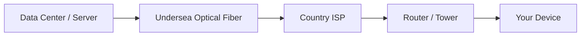
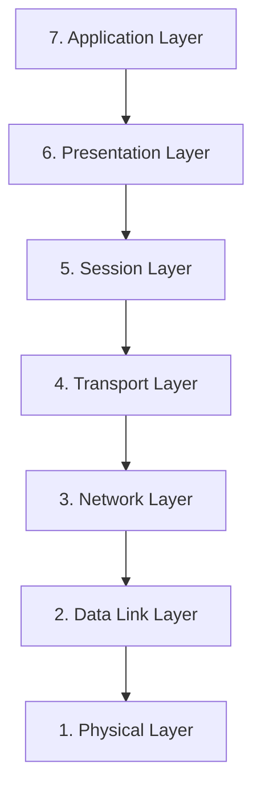
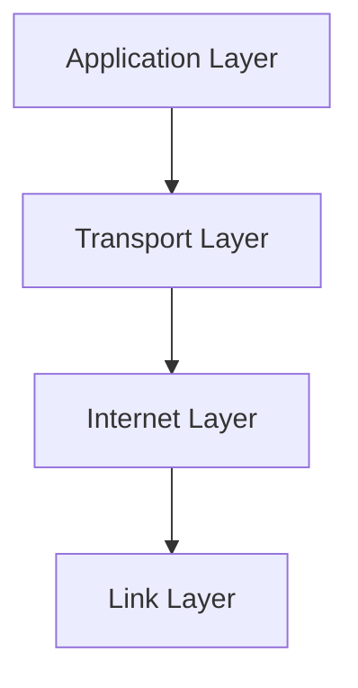
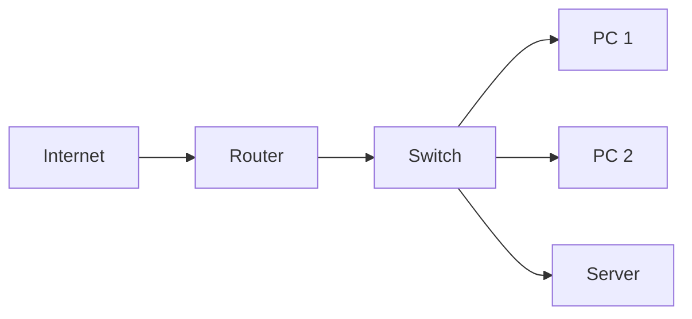
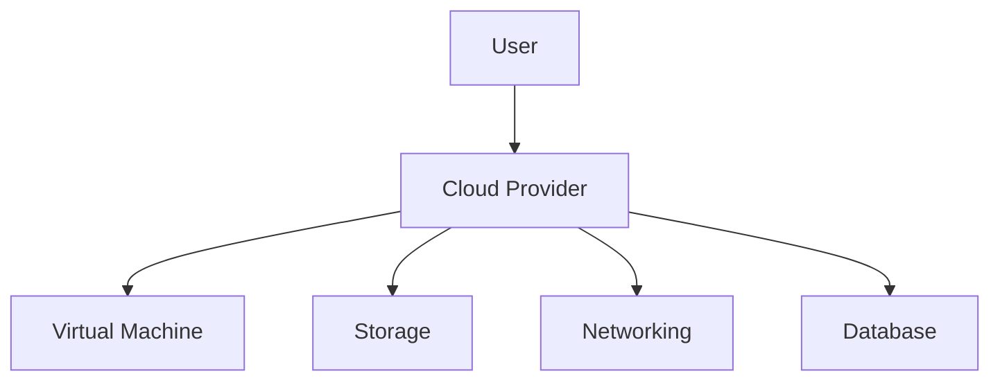

# 🌐 Networking Notes for DevOps

> Beginner Friendly Notes for Understanding Networking in DevOps & Cloud

---

# 📚 Table of Contents

1. What is Internet?
2. How Internet Works
3. Types of Internet Providers
4. Types of Networks
5. OSI Model
6. TCP/IP Model
7. OSI vs TCP/IP
8. Application Layer Protocols
9. Transport Layer (TCP & UDP)
10. Internet Layer (IP)
11. Link Layer
12. Ports in Networking
13. IP Addressing (IPv4 & IPv6)
14. Subnet, Private Networks, VPN & VPC
15. MAC Address
16. Routers & Switches
17. Servers & Common Terms
18. On-Premise vs Cloud
19. Firewall & SSH
20. DevOps Networking Flow

---

# 🌍 1. What is Internet?

The **Internet** is a worldwide network of interconnected computers and devices.

It allows:

* Communication 📩
* Browsing websites 🌐
* Watching videos 🎥
* Sending emails 📧
* Cloud computing ☁️
* File sharing 📂

Simple Meaning:

> Internet = Billions of devices connected together globally.

---

# 🌊 2. How Internet Works

The internet mainly works through:

* Optical Fiber Cables
* Satellites
* Towers
* Routers & Networking Devices

Most internet traffic travels through **undersea optical fiber cables**.

These cables connect countries and continents.

---

## 🗺️ Internet Connection Flow



---

# 🏢 3. Types of Internet Companies

## 🥇 Tier 1 Companies

These companies own the actual internet infrastructure and optical fiber cables.

Examples:

* Tata Communications
* AT&T
* Verizon

---

## 🥈 Tier 2 Companies

These companies purchase bandwidth from Tier 1 companies and provide internet services.

Examples:

* Jio
* Airtel
* Vodafone Idea (VI)

---

## 🥉 Tier 3 Companies

These companies provide local internet services to users.

Examples:

* Jio Fiber
* Airtel Fiber
* Local Broadband Providers

---

# 🌐 4. Types of Networks

## 🌍 WAN (Wide Area Network)

Connects:

* Countries
* Continents
* Large geographical areas

Uses:

* Optical fibers
* Satellites

---

## 🏙️ MAN (Metropolitan Area Network)

Connects:

* Multiple areas inside a city or metropolitan region

Example:

* City-wide internet networks

---

## 🏠 LAN (Local Area Network)

Connects devices within a small area.

Examples:

* Office network
* Home WiFi
* College lab

---

## 📱 PAN (Personal Area Network)

Small personal network around a single user.

Examples:

* Mobile hotspot
* Bluetooth devices
* Smart watch connection

---

# 🧠 5. OSI Model

The **OSI Model (Open Systems Interconnection Model)** is a theoretical framework that explains how networking communication happens.

It contains **7 layers**.

---

## 📦 OSI Layers



---

## 🔍 Simple Understanding of OSI Layers

| Layer        | Purpose                            |
| ------------ | ---------------------------------- |
| Application  | User interaction with applications |
| Presentation | Data formatting & encryption       |
| Session      | Creates communication sessions     |
| Transport    | Reliable data transfer             |
| Network      | Routing using IP address           |
| Data Link    | MAC address communication          |
| Physical     | Cables, signals, hardware          |

---

# 🌐 6. TCP/IP Model

The **TCP/IP Model** is the practical networking model used on the internet today.

Unlike OSI, TCP/IP is simpler and used in real-world networking.

---

# 🧩 Why TCP/IP Exists?

The OSI model is theoretical and detailed.

TCP/IP was created to provide:

* Simplicity
* Practical implementation
* Efficient communication

---

# 📚 TCP/IP Layers



---

# ⚔️ 7. OSI vs TCP/IP

| OSI Model                | TCP/IP Model          |
| ------------------------ | --------------------- |
| 7 Layers                 | 4 Layers              |
| Theoretical              | Practical             |
| Complex                  | Simpler               |
| Mainly for understanding | Used in real internet |

---

# 🖥️ 8. Application Layer Protocols

The Application Layer handles communication between user applications and the network.

---

## 🌐 HTTP / HTTPS

### HTTP

* HyperText Transfer Protocol
* Used to load websites
* Default Port: **80**

### HTTPS

* Secure version of HTTP
* Encrypted communication
* Default Port: **443**

---

## 📧 SMTP

* Simple Mail Transfer Protocol
* Used for sending emails

---

## 📂 FTP

* File Transfer Protocol
* Used for transferring files

---

# 🚚 9. Transport Layer

The Transport Layer manages communication between devices.

Main protocols:

* TCP
* UDP

---

## 📦 TCP (Transmission Control Protocol)

TCP ensures:

✅ Reliable communication
✅ No data loss
✅ Correct order of packets

Used in:

* Website loading
* File download
* Banking apps
* Email

---

## ⚡ UDP (User Datagram Protocol)

UDP focuses on speed.

Some packet loss is acceptable.

Used in:

* Video calls
* Live streaming
* Online gaming
* Voice chats

---

## ⚔️ TCP vs UDP

| TCP                     | UDP                     |
| ----------------------- | ----------------------- |
| Reliable                | Faster                  |
| Slower                  | Less reliable           |
| No packet loss          | Packet loss possible    |
| Used for important data | Used for real-time data |

---

# 🌍 10. Internet Layer (IP)

The Internet Layer uses the **IP (Internet Protocol)**.

IP helps data travel from source to destination.

Think of it like:

> A postal address system for the internet 📮

Every device connected to a network gets an IP address.

---

# 🔗 11. Link Layer

The Link Layer handles:

* Physical transmission of data
* Communication using MAC addresses
* Device-to-device connection inside a network

It works closely with:

* Ethernet
* WiFi
* Switches

---

# 🚪 12. Ports in Networking

Ports are logical communication endpoints.

Different services use different ports.

---

## 📌 Common Ports

| Service | Port |
| ------- | ---- |
| HTTP    | 80   |
| HTTPS   | 443  |
| SSH     | 22   |
| MySQL   | 3306 |
| FTP     | 21   |
| SMTP    | 25   |

---

# 🌐 13. IP Addressing (IPv4 & IPv6)

## 📍 What is an IP Address?

An IP address uniquely identifies a device on a network.

Example:

```bash
192.168.1.10
```

---

## 🌎 Public IP

Public IP is assigned by ISP.

You can check it by searching:

```text
MY IP
```

on a browser.

---

## 🏠 Private IP

Private IP is used inside local/private networks.

Example:

```text
192.168.x.x
10.x.x.x
172.16.x.x
```

---

## 🔢 IPv4

IPv4 uses:

```text
32-bit addressing
```

Total addresses:

genui{"math_block_widget_always_prefetch_v2":{"content":"2^{32} = 4,294,967,296"}}

Because devices became too many, IPv4 addresses started running out.

---

## 🚀 IPv6

IPv6 was introduced to solve the IP shortage problem.

It uses:

```text
128-bit addressing
```

Which provides a massive number of addresses.

---

# 🌐 14. Subnet, VPN & VPC

## 🧩 Subnet

A large network is divided into smaller networks called:

> Subnets

This improves:

* Organization
* Security
* Performance

---

## 🔐 VPN (Virtual Private Network)

VPN creates a secure private connection over the public internet.

Used for:

* Privacy
* Secure remote access
* Office connections

---

## ☁️ VPC (Virtual Private Cloud)

A VPC is a private virtual network inside cloud providers like:

* AWS
* Azure
* GCP

It allows companies to create their own isolated cloud network.

---

# 🏷️ 15. MAC Address

MAC Address stands for:

> Media Access Control Address

It is a unique hardware address assigned to a device.

---

## 📌 Important Points

| IP Address                  | MAC Address                |
| --------------------------- | -------------------------- |
| Can change                  | Usually permanent          |
| Identifies network location | Identifies device hardware |
| Works across networks       | Works mainly inside LAN    |

---

# 📡 16. Routers & Switches

## 📶 Router

A Router:

* Connects networks together
* Receives internet from ISP
* Shares internet with devices
* Uses IP addresses for routing

Example:

* Home WiFi router

---

## 🔀 Switch

A Switch connects multiple devices inside the same local network using Ethernet cables.

Used in:

* Offices
* Server rooms
* Data centers

Switches help provide:

✅ Stable connection
✅ Faster local communication

---

## 🖼️ Router vs Switch

| Router                      | Switch                               |
| --------------------------- | ------------------------------------ |
| Connects different networks | Connects devices inside same network |
| Uses IP address             | Uses MAC address                     |
| Provides internet access    | Expands local connections            |

---

## 🌐 Basic Network Diagram



---

# 🖥️ 17. Servers & Common Terms

In DevOps, these terms are often used similarly:

| Term           | Meaning                          |
| -------------- | -------------------------------- |
| Server         | Machine providing services       |
| Host           | System hosting applications      |
| Node           | Machine inside a cluster/network |
| Instance       | Cloud virtual server             |
| VM             | Virtual Machine                  |
| Compute Engine | Cloud compute service            |

---

# ☁️ 18. On-Premise vs Cloud

## 🏢 On-Premise Infrastructure

Your own physical infrastructure.

You manage:

* Servers
* Cooling
* Electricity
* Networking
* Storage
* Security

Examples:

* Banks
* Colleges
* Private organizations

---

## ☁️ Cloud Infrastructure

Cloud providers manage the infrastructure.

Examples:

* AWS
* Google Cloud (GCP)
* Microsoft Azure
* DigitalOcean

Users only rent resources.

---

## ⚔️ On-Premise vs Cloud

| On-Premise                    | Cloud                   |
| ----------------------------- | ----------------------- |
| Self-managed                  | Provider-managed        |
| Expensive setup               | Pay-as-you-use          |
| Physical maintenance required | No physical maintenance |
| Limited scalability           | Easy scalability        |

---

## ☁️ Cloud Architecture Simple View



---

# 🔥 19. Firewall & SSH

## 🛡️ Firewall

A Firewall controls incoming and outgoing traffic.

It protects servers from unauthorized access.

Example:

* Blocking unwanted ports
* Allowing only trusted IPs

---

## 🔐 SSH (Secure Shell)

SSH allows secure remote connection to servers.

Default Port:

```text
22
```

Example:

```bash
ssh ubuntu@server-ip
```

---

# 🚀 20. Complete DevOps Networking Flow


---

# 🎯 Final DevOps Networking Understanding

## ✅ Important Things You Should Remember

* Internet is a global network
* TCP/IP is the real-world networking model
* IP identifies network location
* MAC identifies hardware device
* Routers connect networks
* Switches connect local devices
* Ports allow services to communicate
* Firewalls secure servers
* SSH securely connects to servers
* Cloud providers give infrastructure over internet

---

# 💡 DevOps Real World Connection

Networking is extremely important in DevOps because:

* Docker containers communicate over networks
* Kubernetes uses networking heavily
* Cloud infrastructure depends on VPCs and subnets
* CI/CD servers communicate using ports and protocols
* Security groups and firewalls protect infrastructure

---

# 🏁 Conclusion

These notes provide a beginner-friendly foundation of networking for DevOps.

After mastering these concepts, the next important topics are:

* DNS
* Load Balancer
* Reverse Proxy
* Docker Networking
* Kubernetes Networking
* SSL/TLS
* Nginx
* VPN & Security

---

# 📘 Quick Revision Cheatsheet

| Concept     | Simple Meaning               |
| ----------- | ---------------------------- |
| Internet    | Global network               |
| WAN         | Large area network           |
| LAN         | Local network                |
| TCP         | Reliable communication       |
| UDP         | Fast communication           |
| IP Address  | Device network address       |
| MAC Address | Device hardware address      |
| Router      | Connects networks            |
| Switch      | Connects local devices       |
| Firewall    | Network security             |
| SSH         | Secure server access         |
| Cloud       | Infrastructure over internet |

---

# 🎉 End of Notes

Happy Learning DevOps 🚀
